# 低功耗节点实验箱

本教程所描述的iot实验系统包含如下几个部分，基本涵盖了iot领域的主要技术内容。

- 节点设备
    - ESP-WROVER-KIT
    - B-L475-IOT01A
- LoRa网关
- iot平台

涉及到的主要Iot技术包含：

- 感知层：涉及温度，湿度，3轴磁力计，3D加速度计，3D陀螺仪，数字气压计，浓度时间和姿势检测，手势识别，运动检测等十余种传感器数据采集
- 识别层：NFC
- 网络层：WiFi，Bluetooth，BLE，lora，nb-iot，
- 平台：emqx，chirpstack，TTN，thingsboard。
- 支持接入协议：mqtt，coap，http

实验系统的架构如下图所示：

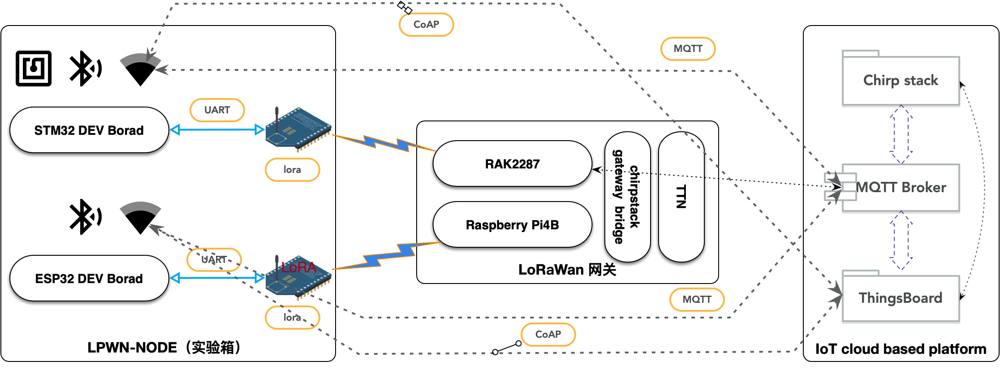

## 1  节点设备-实验箱

节点设备由两个MCU为主线，分别包含其各自的外围设备，具体包括如下几个部分。

- B-L475E-IOT01A

| MUC | STM32BL475E | 板载 |
| --- | --- | --- |
| Bluetooth | SPBTLE-RF | 板载 |
| WiFi | INVENTEK | 板载 |
| NFC | M24SR | 板载 |
| microphone | MP34DT01 | 板载 |
| sensors | 若干 | 板载 |
| 接口 | arduino，PMOD，micro usb | 板载 |
| debuge | ST Link | 板载 |
| LoRA | RAK3172 | 外置，UART |
| IDE | STM32CUBE, Keil，IAR，Arm Mbed |  |
- ESP-WROVER-KIT

| MCU | ESP32 | 板载 |
| --- | --- | --- |
| Bluetooth | on chip | 板载 |
| WiFi | on chip | 板载 |
| SD卡 |  | 板载 |
| 摄像头 |  | 外置 |
| LCD | 3.2“ SPI | 板载 |
| 接口 | micro usb， | 板载 |
| JTAG | JTAG PROG | 板载 |
| LoRA | RAK3172 | 外置 |

节点设备概念图如下：

### 1.1 ESP-WROVER-KIT

[ESP-WROVER-KIT](https://docs.espressif.com/projects/esp-idf/zh_CN/latest/esp32/hw-reference/esp32/get-started-wrover-kit.html) 是 [乐鑫](https://espressif.com/)的一款基于 [ESP32](https://www.espressif.com/zh-hans/products/socs/esp32) 芯片的开发板。ESP-WROVER-KIT 开发板已集成了如下组件：

- ESP32-WROVER-E 模组
- LCD 屏
- microSD 卡槽
- 双USB, 一个用于通信，一个用于debug
- 内置调试器

**实物图：**

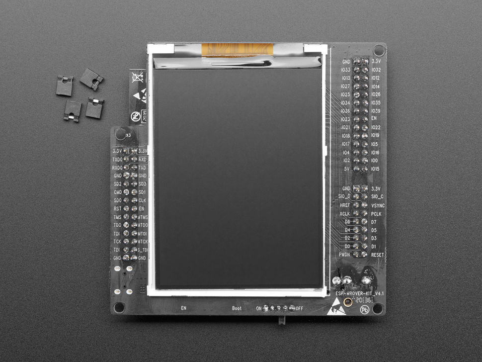

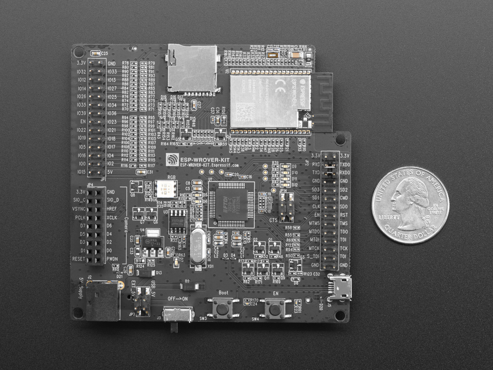

**布局**

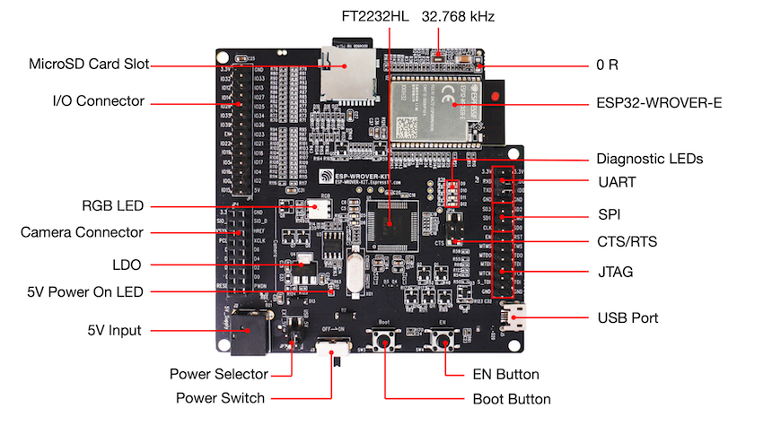

**功能框图**

**电路原理图：**

[ESP-WROVER-KIT_V4_1-3.pdf](./img/sch.pdf)

功能说明请参见[官方网页](https://docs.espressif.com/projects/esp-idf/zh_CN/latest/esp32/hw-reference/esp32/get-started-wrover-kit.html)

**开发环境**

- 官方环境：eclipse based  ide
- VS Code + esp-idf plugin
- VS Code + platformio
- Clion

### 1.2 B-L475E-IOT01A

**描述**

[B-L475E-IOT01A](https://www.st.com/zh/evaluation-tools/b-l475e-iot01a.html)物联网节点探索套件允许用户开发与云服务器直接连接的应用程序。

该探索套件利用低功耗通信、多路传感和基于Arm® Cortex® -M4内核的STM32L4系列功能，支持广泛的应用。
它可支持Arduino Uno V3和PMOD连接，借助大量可选的专用附加板，能够实现无限扩展功能。

**所有功能**

- 超低功耗STM32L4系列MCU基于Arm® Cortex®-M4内核，具有1 MB的Flash存储器和128 KB的RAM，并采用LQFP100封装
- 64 Mbit的Quad-SPI（Macronix）闪存
- Bluetooth® V4.1模块（SPBTLE-RF）
- Sub-GHz（868 MHz或915 MHz）低功耗可编程RF模块（SPSGRF-868或SPSGRF-915）
- 符合802.11 b/g/n规范的Wi-Fi®模块来自Inventek Systems（ISM43362-M3G-L44）
- 基于M24SR及其印刷NFC天线的动态NFC标签
- 2个全向数字麦克风(MP34DT01)
- 用于相对湿度和温度测量的电容式数字传感器（HTS221）
- 高性能3轴磁力计（LIS3MDL）
- 3D加速度计和3D陀螺仪（LSM6DSL）
- 260-1260 hPa绝对数字输出气压计（LPS22HB）
- 渡越时间和姿势检测传感器（VL53L0X）
- 2个按钮(用户和复位按钮)
- 带有Micro-AB连接器的USB OTG FS
- 扩展连接器：
    - Arduino™ Uno V3
    - PMOD
- 灵活的电源选项：
    - ST LINK USB VBUS或外部电源
- 具有USB重新枚举功能的板上ST-LINK/V2-1调试器/编程器：大容量存储器、虚拟COM端口和调试端口
- 作为STM32Cube MCU软件包的一部分，提供全面的免费软件HAL库（包括大量示例）
- 支持广泛的集成开发环境（IDE），包括IAR™、Keil®、基于GCC的IDE、Arm® Mbed Enabled™
- Arm® Mbed™在线工具（参见[http://mbed.org](http://mbed.org/)）

开发板结构框图

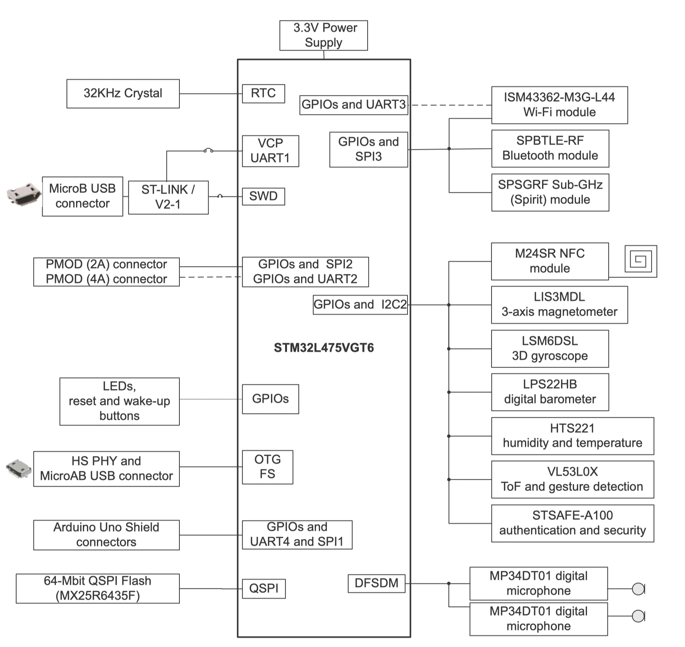

开发板布局

`**正面布局**`

**`背部布局`**

**开发环境**

- STM32CUBE IDE
- keil
- IAR
- STM32CUBEMX+Clion

开发者技术手册

[um2153-discovery-kit-for-iot-node-multichannel-communication-with-stm32l4-stmicroelectronics.pdf](./img/stm-bl-475-data-sheet.pdf)

### 1.3 LoRa节点-RAK3172

**模块概述**

[RAK3172](https://docs.rakwireless.com.cn/Product-Categories/WisDuo/RAK3172-Module/Overview/)模块集成了STM32WLE5CC MCU芯片，是一款低功耗、远距离、易用、小巧的无线数据应用LoRa®收发模块。该模块遵循LoRaWAN® 1.0.3协议，支持Class A、Class B、Class C三种工作模式，易于连接到不同的LoRaWAN服务器平台，如TTN、Chirpstack、Activity、腾讯云等等。该模块还支持LoRa® P2P（点对点）通信，可帮助用户快速实现自己的远距离LoRa®网络。

用户可通过UART接口使用AT命令来配置模式和控制模块工作。RAK3172特别适合需要低功耗、电池供电的各种应用。

**电路板图**

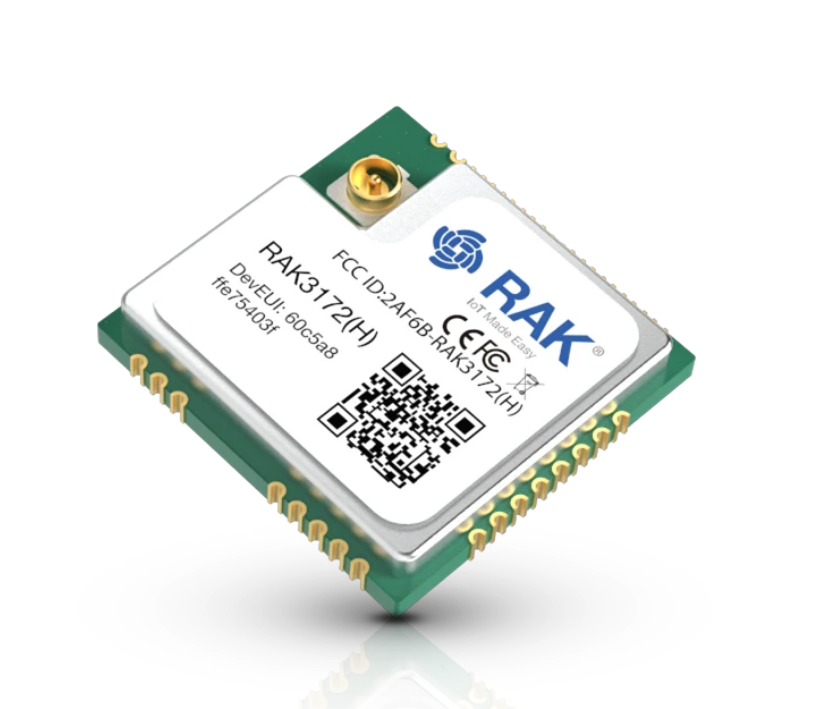

**系统框图**

RAK3172模块的内部组成和主要外部接口如下图所示。

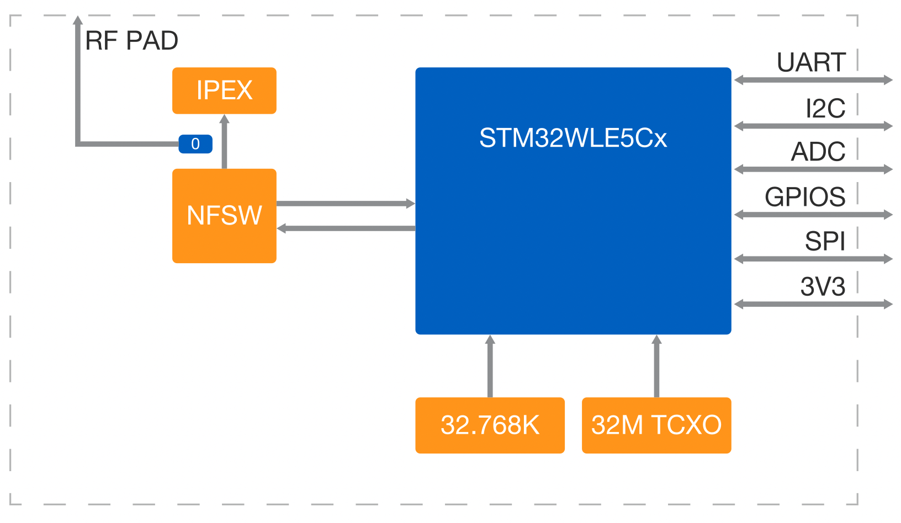

**产品特性**

- 集成STM32WLE5CC芯片
- 遵循LoRaWAN® 1.0.3协议
- 支持的频段：EU433、CN470、IN865、EU868、AU915、US915、KR920、RU864、AS923-1/2/3/4
- LoRaWAN激活模式：OTAA、ABP
- 支持LoRa® P2P（点对点）通信
- 具有简单易用的AT命令功能
- 支持通过UART接口发送AT命令
- 使用优化过的天线，通信距离可超过15 km
- CPU核：ARM 32-bit Cortex-M4
- 内置带ECC的256 KB闪存
- 64 KB RAM
- 超低功耗，睡眠模式下功耗低至1.69 μA
- 温度范围：-40 °C ~ +85 °C
- 供电电压：2.0 V ~ 3.6 V

**引脚定义**

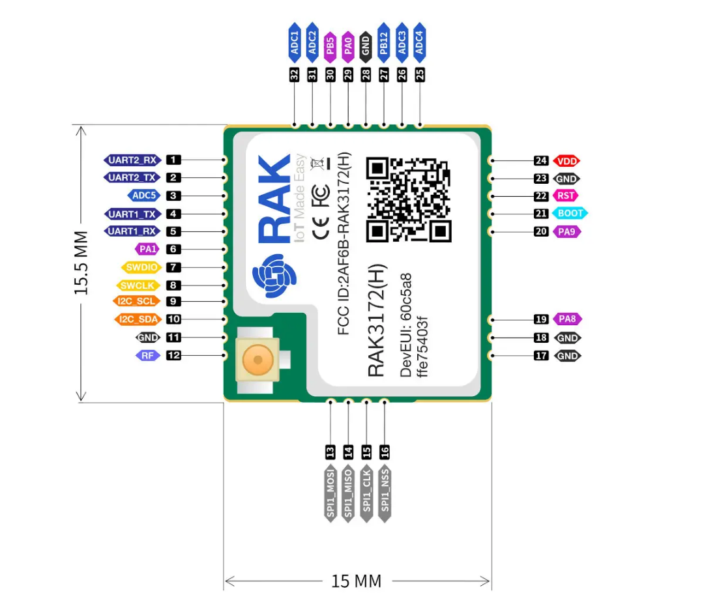

**与MCU的连接**

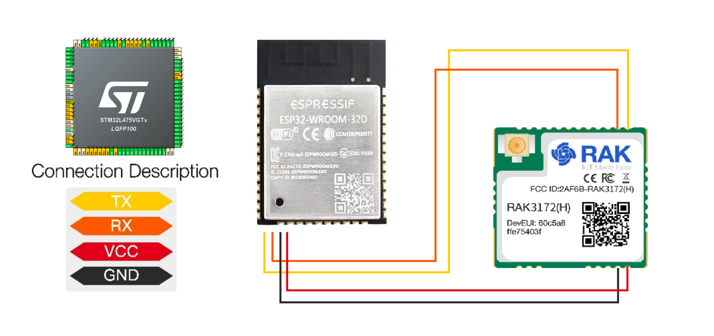

### 1.4 NB-IOT节点

待更新

## 2 LoRaWAN网关

LoRaWAN®是一种低功耗广域（LPWA）网络协议，旨在以无线方式将电池操作的“things”连接到区域、国家或全球网络中的互联网，致力于解决关键的物联网（IoT）要求，如双向通信、端到端安全、移动性和本地化服务。

lora网关包含硬件部分和软件支持。硬件部分包括LoRA Wan 集中器与宿主机，软件运行在宿主机上。

- LoraWan集中器
- Raspberry Pi 4B+
- chirpstack

相关规范与国际组织

- [LoRa Alliance](https://www.lora-alliance.org/)
- [LoRaWAN specification](https://lora-alliance.org/lorawan-for-developers)

### 2.1 LoraWan集中器：RAK2287

**概述**

RAK2287是一款LPWAN集中器模块，易于集成到现有的路由器或其它网络设备中，为其添加LPWAN网关功能。主要功能特点如下。

- 基于Semtech SX1302
- 支持SPI接口，具有Mini PCI-e标准插槽的嵌入式平台
- 集成了ZOE-M8Q GPS芯片
- 提供多达10条可编程并行解调路径
- 中等干扰环境下，每平方公里最多可覆盖500个节点

**特性**

- 基于Mini PCI-e外形尺寸而设计，带散热片。
- SX1302基带处理器，实现了8 x 8通道LoRa数据包检测器，8 x SF5-SF12 LoRa解调器，8 x SF5- SF10 LoRa解调器，一个125/250/500 kHz高速LoRa解调器和一个（G）FSK解调器。
- Mini PCI-e接口，电压为3.3 V
- 兼容Mini PCI-e类型的3G/LTE卡
- 发射功率最大可达27 dBm，接收灵敏度低至-139 dBm@SF12，带宽125 kHz
- 支持最新的LoRaWAN 1.0.3协议
- 支持全球免许可证频段：EU868, CN470, US915, AS923, AU915, KR920, IN865, AS920
- 支持SPI接口
- 内置ZOE-M8Q GPS模块

**电路板**

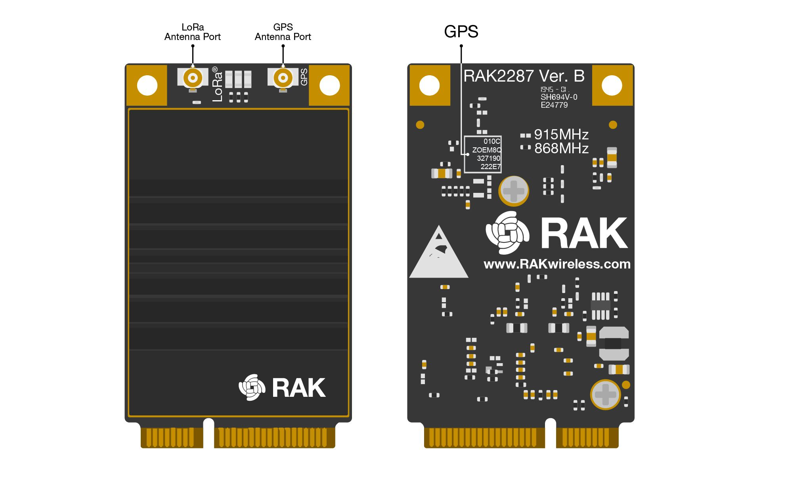

RAK2287主电路板

**系统框图**

RAK2287板卡配备了一个[SX1302芯片](https://www.semtech.com/products/wireless-rf/lora-core/sx1302#documentation)和两个SX1250。第一个芯片用于射频信号，是设备的核心。后者提供了相关的LoRa调制解调器和处理功能。该模块实现了符合PCI Express Mini Card要求的附加信号调整电路，并且提供了一个UFL连接器，可用于集成外部天线。

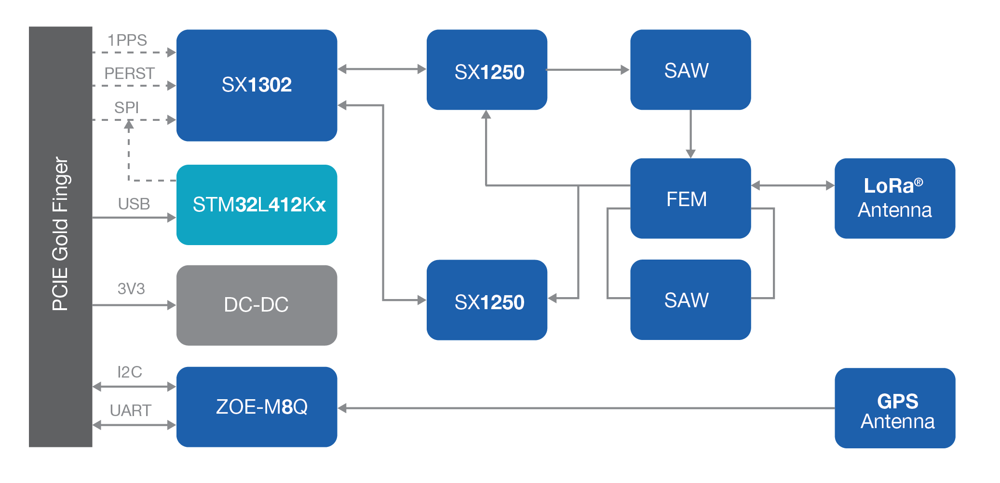

RAK2287系统框图

**引脚定义**

**原理图**

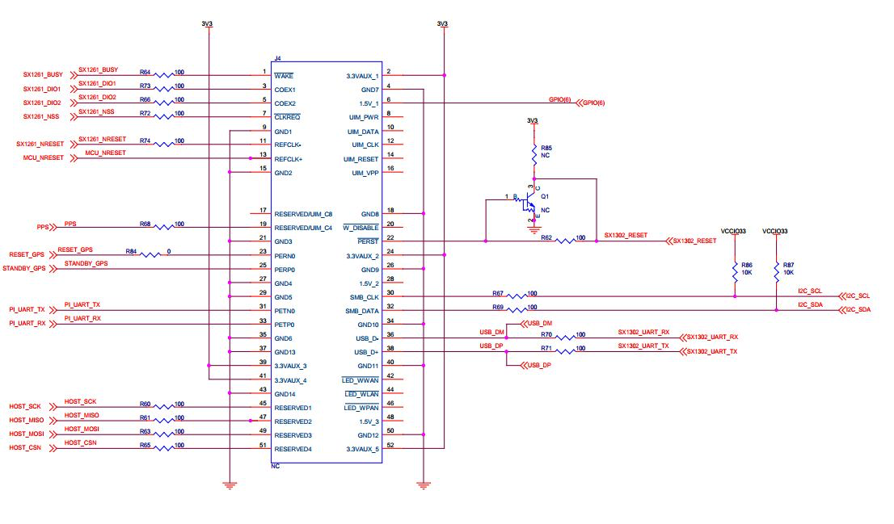

更多内容请参考[数据手册](https://docs.rakwireless.com.cn/Product-Categories/WisLink/RAK2287/Datasheet/)

### 2.2 宿主机：Raspberry Pi 4B+

**技术参数**

- Broadcom BCM2711, Quad core Cortex-A72 (ARM v8) 64-bit SoC @ 1.5GHz
- 1GB, 2GB, 4GB or 8GB LPDDR4-3200 SDRAM (depending on model)
- 2.4 GHz and 5.0 GHz IEEE 802.11ac wireless, Bluetooth 5.0, BLE
- Gigabit Ethernet
- 2 USB 3.0 ports; 2 USB 2.0 ports.
- Raspberry Pi standard 40 pin GPIO header (fully backwards compatible with previous boards)
- 2 × micro-HDMI ports (up to 4kp60 supported)
- 2-lane MIPI DSI display port
- 2-lane MIPI CSI camera port
- 4-pole stereo audio and composite video port
- H.265 (4kp60 decode), H264 (1080p60 decode, 1080p30 encode)
- OpenGL ES 3.1, Vulkan 1.0
- Micro-SD card slot for loading operating system and data storage
- 5V DC via USB-C connector (minimum 3A*)
- 5V DC via GPIO header (minimum 3A*)
- Power over Ethernet (PoE) enabled (requires separate PoE HAT)
- Operating temperature: 0 – 50 degrees C ambient

**产品图**

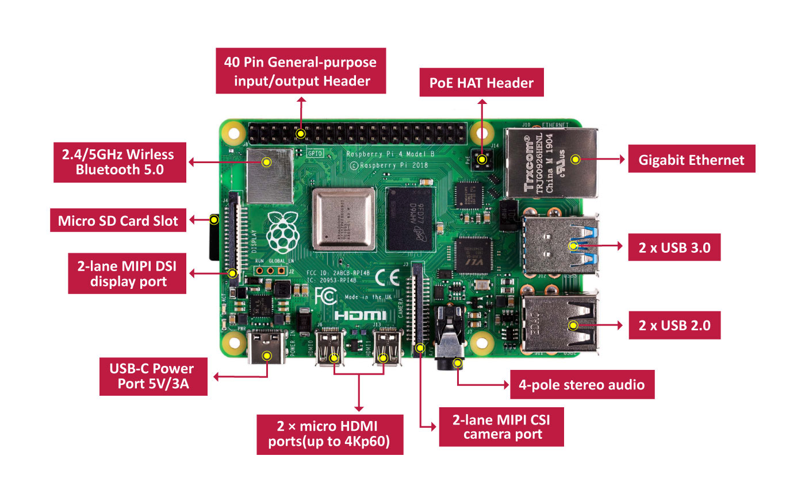

RaspberryPi 40 PIN 接口定义

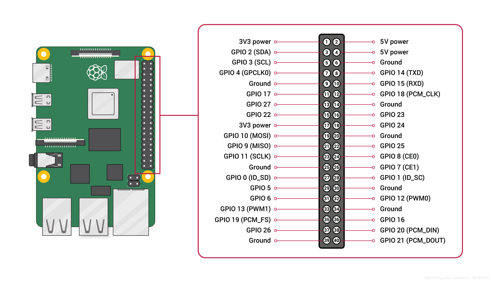

### 1.2.2 LoraWan 软件：ChripStack

ChirpStack是一个开源的LoRaWAN网络服务器。主要功能包括：

- 可用于设置私有或公共LoRaWAN网络。
- ChirpStack提供了一个Web界面，用于管理网关、设备和租户，
- 与主要云提供商、数据库和通常用于处理设备数据的服务进行数据集成。
- ChirpStack提供了一个基于gRPC的API，可用于集成或扩展ChirpStack。

**ChirpStack架构**

ChirpStack包含如下几个主要部分

- chirpstack gateway bridge：处理与网关集中器之间的通信
- chirpstack network server
- chirpstack application server

chirpstack 部署如图所示：

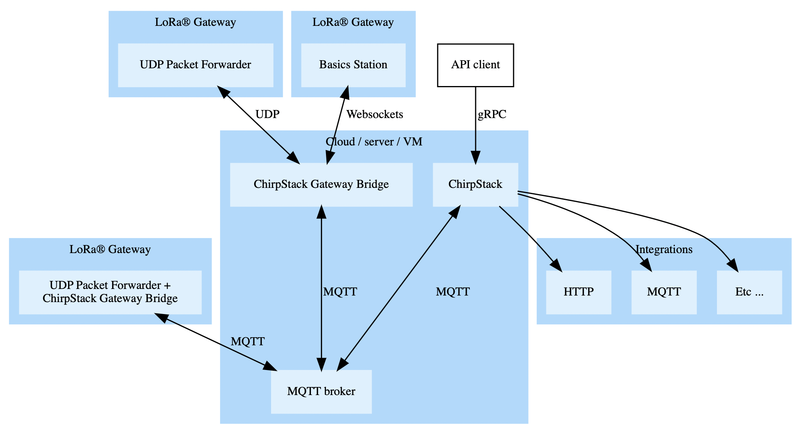

<aside>
💡 我们的项目部署方案：chirpstack gateway bridge部署在网关侧，即树莓派上。而network server 以及 application server 都部署在cloud server上，即阿里云。

</aside>

## 3 IoT 平台

本项目的IoT云平台集成了众多优秀的开源项目，经过优化，整合了各自的优点，主要包括如下三个开源项目：

- ChirpStack
- ThingsBoard
- EMQX

本项目中平台功能以ThingsBoard为核心，以EMQX取代其他两个项目的内置的MQTT Broker，ChirpStack则主要用于来自LoRaWAN的信息。平台结构如下图：

### 3.1 ThingsBoard

[ThingsBoard](https://thingsboard.io)是一个开源物联网平台，可以快速开发、管理和扩展物联网项目。他可以提供开箱即用的物联网云或本地解决方案，为物联网应用程序启用服务器端基础设施。我们的平台构建于其之上，并对其中mqtt的海量并发进行了优化。

**特点**

- 配置设备、资产和客户，并定义它们之间的关系。
- 从设备和资产收集数据并使之可视化。
- 分析传入的遥测数据和警报触发信息。
- 使用远程过程调用（RPC）控制设备。
- 根据设备的生命周期事件、REST API事件、RPC请求等构建工作流程。
- 提供响应敏捷的动态仪表板，向客户展示设备或资产遥测信息。
- 使用自定义的规则链实现特定功能。
- 与其他iot平台或系统集成。

平台总体框架如下图所示：

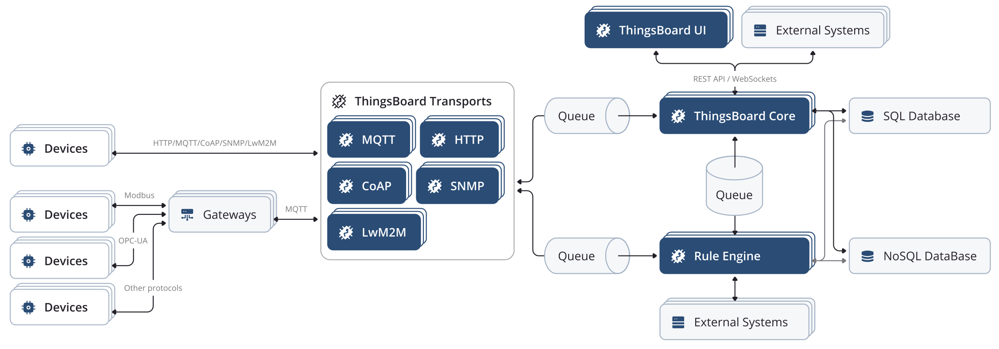

系统实际使用架构包含两种模式，整体模式架构和基于微服务的架构。

**1 整体模式架构**

在[整体模式](https://thingsboard.io/docs/reference/monolithic/)下，所有ThingsBoard组件都在单个Java虚拟机（JVM）中启动，并共享相同的操作系统资源。由于ThingsBoard是用Java编写的，整体架构的明显优势是最大限度地减少了运行ThingsBoard所需的内存。这样就可以在受限环境中使用256或512 MB的RAM启动和运行ThingsBoard进程。但他也有明显的缺点，如果某个组建的消息过载，例如MQTT传输，它也可能影响其他组件。例如，如果ThingsBoard进程的操作系统限制为4096文件描述符，则无法同时从设备和websocket用户会话中打开超过4096个MQTT会话。

整体模式架构如下图所示：

架构个组件描述请参见[官方说明](https://thingsboard.io/docs/reference/monolithic/)。

**2 微服务架构**

ThingsBoard v2.2，该平台支持[微服务部署模式](https://thingsboard.io/docs/reference/msa/)。微服务选项更适合高可用性和可扩展的场景。

其具体架构如下图所示：

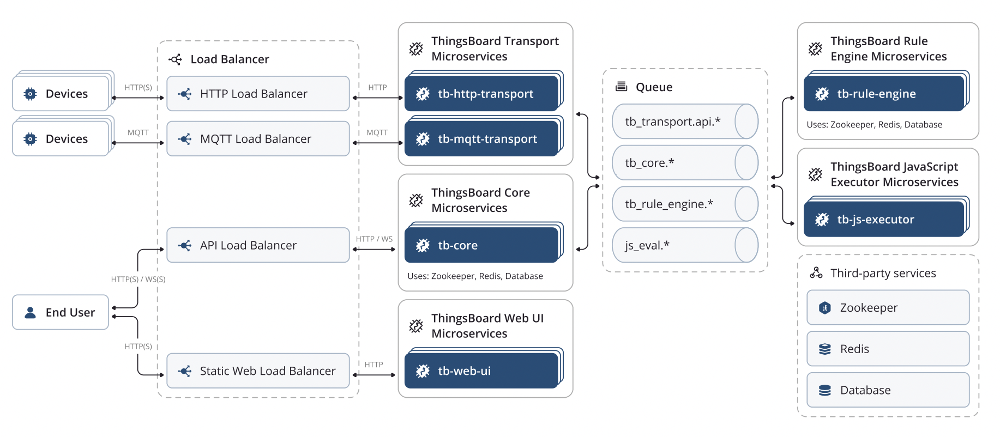

**3 iot gateway**

ThingsBoard 支持的iot协议有mqtt, coap以及http， 对于其他协议，可以采用[iot gateway](https://thingsboard.io/docs/iot-gateway/what-is-iot-gateway/) 组件来实现。

iot gateway框架如图所示：



### 3.2 ChirpStack

如上所述，本项目中，chirpstack的部署在两个物理位置，gateway bridge 在lora网关中部署，而iot 平台中，则部署chirpstack network server以及 application server。

chirpstack network server 作为mqtt客户端，用MQTT Broker 发布和订阅消息。本项目中由emqx取代了原来项目中的默认MQTT Broker Mosquito。

application server将遥测数据以及交换信息于Thethingsboard集成。

### 3.3 EMQX

EMQX 是一款大规模可弹性伸缩的云原生分布式物联网 MQTT 消息服务器。

目前emqx已经成为全球最具扩展性，github上活跃度最高的 MQTT 消息服务器，EMQX 提供了高效可靠海量物联网设备连接，能够高性能实时移动与处理消息和事件流数据，可快速构建关键业务的物联网平台与应用。

**优势**

- **开放源码**：基于 Apache 2.0 许可证完全开源，自 2013 年起 200+ 开源版本迭代。
- **MQTT 5.0**：100% 支持 MQTT 5.0 和 3.x 协议标准，更好的伸缩性、安全性和可靠性。
- **海量连接**：单节点支持 500 万 MQTT 设备连接，集群可扩展至 1 亿并发 MQTT 连接。
- **高性能**：单节点支持每秒实时接收、移动、处理与分发数百万条的 MQTT 消息。
- **低时延**：基于 Erlang/OTP 软实时的运行时系统设计，消息分发与投递时延低于 1 毫秒。
- **高可用**：采用 Masterless 的大规模分布式集群架构，实现系统高可用和水平扩展。

**用法**

本项目中emqx作为唯一开放的mqtt代理服务。与平台外部直接连接，而在平台内部，对于chirpstack network server，直接连接。而对于the things network，由于tb有自己的mqtt broker，因此需要使用emqx的mqtt桥接功能，具体如下所示：

1 入方向

2 出方向

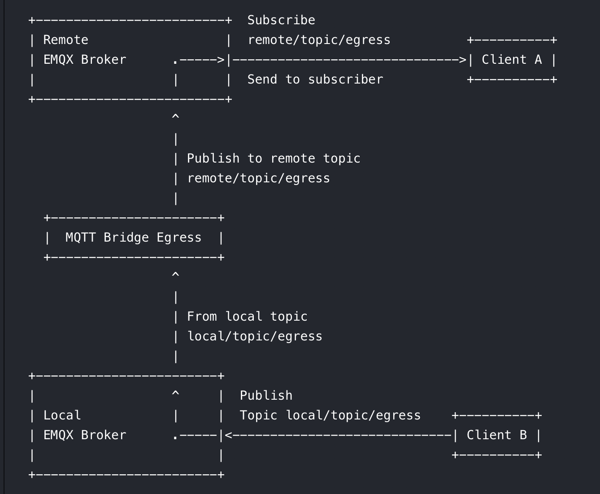