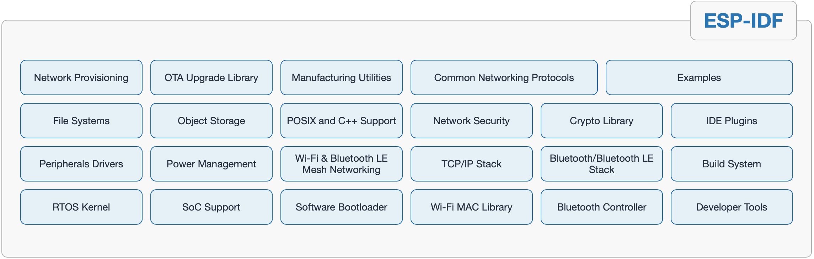

# ESP-IDF SDK 基础

ESP-IDF 是乐鑫官方的物联网开发框架，适用于 ESP32、ESP32-S、ESP32-C 和 ESP32-H 系列 SoC。它基于 C/C++ 语言提供了一个自给自足的 SDK，方便用户在这些平台上开发通用应用程序。ESP-IDF 目前已服务支持数以亿计的物联网设备，并已开发构建了多种物联网产品，例如照明、消费电子大小家电、支付终端、工控等各类物联网设备。

## 特点

### 免费开源

ESP-IDF 相关资源已在 GitHub 上免费开放。用户可在 Apache 2.0 许可下以源代码形式获取 ESP-IDF 的大多数组件，或通过兼容许可证获取第三方组件。

### 功能丰富的软件组件

ESP-IDF 集成了大量的软件组件，包括 RTOS、外设驱动程序、网络栈、多种协议实现技术以及常见应用程序的使用助手。它提供了典型应用程序所需的大部分构建块，用户在开发应用时只需专注于业务逻辑即可。 ESP-IDF 不仅具有免费开源的开发工具，还支持 Eclipse 和 VSCode 等 IDE，确保其易于开发人员使用。

### 丰富的文档和示例资源

ESP-IDF 提供详尽的软件组件使用和设计文档，有助于开发人员充分理解 ESP-IDF 功能，并从中挑选最适合构建其应用程序的模块。ESP-IDF 包含 100 多个示例，详细说明了其组件及硬件外设的功能和用法。它们经过了严格的测试和维护，是用户开启应用开发的有效参考。

## 软件组件及功能

ESP-IDF在FreeRTOS的基础上进行了深度的定制，增加了wifi 以及 bluetooth的能力，同时继承了网络协议栈，文件系统，外设驱动，安全加密并提供了用于开发的API应用接口。以下是esp-idf的软件组件和功能图

### RTOS内核

FreeRTOS 内核已进行优化，可支持多核，具有基于功能的堆分配器。

### 标准编程接口

包含 POSIX 线程和其他 POSIX API、BSD 套接字、线程安全的 C/C++ 标准库，支持虚拟文件系统。

### 外设驱动程序

包含 SPI，I2C，UART，GPIO，I2S，ADC，DAC，电容触摸板，定时器，LED 和电机 PWM，RMT，脉冲计数器，CAN/TWAI，SD/eMMC/SDIO 主机和 SDIO 从机，以太网驱动器。

### wi-fi

Wi-Fi 驱动程序已通过 Wi-Fi Alliance 认证，支持 WPA3、Wi-Fi Mesh 协议、ESP-NOW 点对点协议、ESP-LR 远程协议、嗅探模式和 SmartConfig 配置协议。

### 经典蓝牙和低功耗蓝牙

包含蓝牙控制器和两个主机栈：Bluedroid（双模）和 NimBLE（仅低功耗蓝牙），支持符合标准的 Bluetooth LE Mesh，所有组件均通过蓝牙 SIG 认证。

### 网络协议栈

用于 IPv4 和 IPv6 连接的 LwIP TCP/IP 栈，DHCP 客户端和服务器，TLS 客户端和服务器（最高 1.2 版本），HTTP 客户端和服务器，HTTP2 客户端，WebSocket 客户端，MQTT，mDNS，CoAP，ModBus，SNTP，SMTP。

### 电源管理

适用于 MCU 低功耗模式以及 Wi-Fi、蓝牙低功耗模式的电源管理框架；动态频率调节，支持 ULP（超低功耗）协处理器。

### 存储

具备分区管理器、容错和日志结构的键值存储 (NVS)，支持加密、FAT 和 SPIFFS 文件系统

### 安全性

具备受硬件支持的安全性能，如 Flash 加密和安全启动，为 RSA、SHA 和 AES 提供加密加速器支持、以及 libsodium 和 micro-ecc 加密库。

### 网络配置

使用 Bluetooth LE、Wi-Fi 和其他带外机制的设备加载统一配置框架。

### 构建系统

基于 CMake 的构建系统，支持外部组件和外部应用项目。

### 开发工具

包含 GCC 交叉工具链、基于 OpenOCD 的 JTAG 调试器、静态和动态足迹分析、内存泄漏检测器、核心转储崩溃分析器、兼容 Segger SystemView 工具的实时跟踪、Flash 和 eFuse 编程器、设备制造工具。

### IDE支持

ESP-IDF 项目支持 Microsoft VS Code 插件和 Eclipse IDE 插件。本手册采用terninal+Clion开发。

## 接口API开发的必备基础知识

- [存储器类型](https://docs.espressif.com/projects/esp-idf/zh_CN/latest/esp32/api-guides/memory-types.html)
- [片外RAM](https://docs.espressif.com/projects/esp-idf/zh_CN/latest/esp32/api-guides/external-ram.html)
- [分区表](https://docs.espressif.com/projects/esp-idf/zh_CN/latest/esp32/api-guides/partition-tables.html)
- [应用程序启动流程](https://docs.espressif.com/projects/esp-idf/zh_CN/latest/esp32/api-guides/startup.html)
- [引导加载程序](https://docs.espressif.com/projects/esp-idf/zh_CN/latest/esp32/api-guides/bootloader.html)
- [构建系统](https://docs.espressif.com/projects/esp-idf/zh_CN/latest/esp32/api-guides/build-system.html)

更多内容请参看：

## API开发参考

- [API 指南](https://docs.espressif.com/projects/esp-idf/zh_CN/latest/esp32/api-guides/index.html)
- [API参考](https://docs.espressif.com/projects/esp-idf/zh_CN/latest/esp32/api-reference/index.html)
