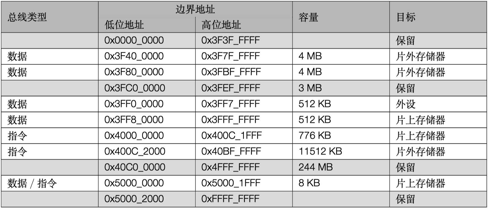

# ESP32 基础

ESP32 是我国物联网芯片企业乐鑫的主力产品，在 IOT 芯片低功耗领域全球出货量第一。不同于传统的 RF 芯片和 MCU，它专为低功耗 IoT 领域设计，提出了专用解决方案。

以下为 ESP32 功能框图

## 特点

ESP32 是集成 2.4GHz Wi-Fi 和蓝牙双模的单芯片方案，采用台积电(TSMC)低功耗 40 纳米工艺，具有超高的射频性能、稳定性、通用性和可靠性，以及超低的功耗，满足不同的功耗需求，适用于各种应用场景。

### 超低功耗

ESP32 专为移动设备、可穿戴电子产品和物联网(IoT)应用而设计。作为业内领先的低功耗芯片，ESP32 具有精细的时钟门控、省电模式和动态电压调整等特性。具体参见技术手册的 RTC 和低功耗管理。

### 高集成度

ESP32 外部元器件只需大约 20 个。ESP32 集成了天线开关、射频 Balun、功率放大器、低噪声放大器、滤波器以及电源管理模块，极大减少了印刷电路板(PCB)的面积。

### WiFi 功能

- 802.11b/g/n
- 802.11n (2.4 GHz) 速度高达 150 Mbps
- 无线多媒体 (WMM)
- 帧聚合 (TX/RX A-MPDU, RX A-MSDU)
- 立即块确认 (Immediate Block ACK)
- 重组 (Defragmentation)
- Beacon 自动监测（硬件 TSF）
- 4 × 虚拟 Wi-Fi 接口
- 同时支持基础结构型网络 (Infrastructure BSS) Station 模式/SoftAP 模式/混杂模式 请注意 ESP32 在 Station 模式下扫描时，SoftAP 信道会同时改变
- 天线分集

### BlueTooth 功能

- 蓝牙 v4.2 完整标准，包含传统蓝牙 (BR/EDR) 和低功耗蓝牙 (Bluetooth LE)
- 支持标准 Class-1、Class-2 和 Class-3，且无需外部功率放大器
- 增强型功率控制 (Enhanced Power Control)
- 输出功率高达 +9 dBm
- NZIF 接收器具有–94 dBm 的 BLE 接收灵敏度
- 自适应跳频 (AFH)
- 基于 SDIO/SPI/UART 接口的标准 HCI
- 高速 UART HCI，最高可达 4 Mbps
- 支持蓝牙 4.2 BR/EDR 和 Bluetooth LE 双模 controller
- 同步面向连接/扩展同步面向连接 (SCO/eSCO)
- CVSD 和 SBC 音频编解码算法
- 蓝牙微微网 (Piconet) 和散射网 (Scatternet)
- 支持传统蓝牙和低功耗蓝牙的多设备连接
- 支持同时广播和扫描

### MCU 功能

ESP32 采用著名的 EDA 设计公司 Cadence® 的 Tensilica® Xtensa® 处理器 IP 授权，该 MCU 架构侧重高性能，低功耗的实时处理器芯片。乐鑫公司在此基础上集成了 WIFI 和 BT 基带，成为完整的 ESP32。该处理器性能强大，外设丰富，主要表现在：

#### CPU 与存储

- Xtensa ® 32-bit LX6 双核处理器
- CoreMark ® 得分：主频 240 MHz：994.26 CoreMark；4.14 CoreMark/MHz
- 448 KB ROM
- 520 KB SRAM
- 16 KB RTC SRAM
- QSPI 支持多个 Flash/SRAM

#### 时钟与定时器

- 内置 8MHz 振荡器，支持自校准
- 内置 RC 振荡器，支持自校准
- 支持外置 2MHz 至 60MHz 的主晶振（如果使用 Wi-Fi/蓝牙功能，则目前仅支持 40MHz 晶振）
- 支持外置 32kHz 晶振，用于 RTC，支持自校准
- 2 个定时器群组，每组包括 2 个 64-bit 通用定时器和 1 个主系统看门狗
- 1 个 RTC 定时器
- RTC 看门狗

#### 外设接口

- 34 个 GPIO 口
- 12-bit SAR ADC，多达 18 个通道
- 2 个 8-bit D/A 转换器
- 10 个触摸传感器
- 4 个 SPI
- 2 个 I2S
- 2 个 I2C
- 3 个 UART
- 1 个 Host SD/eMMC/SDIO
- 1 个 Slave SDIO/SPI
- 带有专用 DMA 的以太网 MAC 接口，支持 IEEE 1588
- TWAI ® ，兼容 ISO 11898-1（CAN 规范 2.0）
- RMT (TX/RX)
- 电机 PWM
- LED PWM，多达 16 个通道

#### 安全

- 安全启动
- flash 加密
- 1024-bit OTP，用户可用的高达 768 bit
- 加密硬件加速器：
  - AES
  - Hash (SHA-2)
  - RSA
  - ECC
  - 随机数生成器 (RNG)

##  系统与存储

完整技术资料请见[参考文档](../reference.md)。由于系统与存储是 ESP32 的核心部分，这里重点介绍，其他外设以及低功耗协处理器等内容请参见[ESP32 技术参考手册](https://www.espressif.com/sites/default/files/documentation/esp32_technical_reference_manual_cn.pdf)

ESP32 采用两个哈佛结构 Xtensa LX6 CPU 构成双核系统。所有的片上存储器、片外存储器以及外设都分布在 两个 CPU 的数据总线和／或指令总线上。 除下文列出的个别情况外，两个 CPU 的地址映射呈对称结构，即使用相同的地址访问同一目标。系统中多个外 设能够通过 DMA 访问片上存储器。 两个 CPU 的名称分别是“PRO_CPU”和“APP_CPU”。PRO 代表“protocol（协议）”，APP 代表“application （应用）”。在大多数情况下，两个 CPU 的功能是相同的。

### 主要特性

- 地址空间
  - 对称地址映射
  - 数据总线与指令总线分别有 4 GB (32-bit) 地址空间
  - 1296 KB 片上存储器地址空间
  - 19704 KB 片外存储器地址空间
  - 512 KB 外设地址空间
  - 部分片上存储器与片外存储器既能被数据总线也能被指令总线访问
  - 328 KB DMA 地址空间
- 片上存储器
  - 448 KB Internal ROM
  - 520 KB Internal SRAM
  - 8 KB RTC FAST Memory
  - 8 KB RTC SLOW Memory
- 片外存储器 片外 SPI 存储器可作为片外存储器被映射到可用的地址空间。部分片上存储器可用作片外存储器的 Cache。
  - 最大支持 16 MB 片外 SPI Flash
  - 最大支持 8 MB 片外 SPI SRAM
- 外设
  - 41 个外设模块
- DMA
  - 13 个具有 DMA 功能的模块

下图为系统与存储空间结构关系

下图为地址映射结构

### 功能描述

#### 地址映射

同构双核系统由两个哈佛结构 Xtensa LX6 CPU 构成，每个 CPU 都具有 4 GB（32-bit）的地址空间。两个 CPU 的地址映射是对称的。

地址 0x4000_0000 以下的部分属于数据总线的地址范围，地址 0x4000_0000 ~ 0x4FFF_FFFF 部分为指令总线的地址范围，地址 0x5000_0000 及以上的部分是数据总线与指令总线共用的地址范围。

CPU 的数据总线与指令总线都为小端序。即字节地址 0x0、0x1、0x2、0x3 访问的字节分别是 0x0 访问的 32-bit 字中的最低、次低、次高、最高字节。CPU 可以通过数据总线按照字节、半字、字进行对齐与非对齐的数据访问。CPU 可以通过指令总线进行数据访问，但必须是**字对齐方式**；非对齐数据访问会导致 CPU 工作异常。

两个 CPU 都能够使用数据总线与指令总线直接访问片上存储器、使用 Cache 和 MMU 直接访问映射到地址空间的片外存储器、使用指令总线直接访问外设。当两个 CPU 访问同一目标时，其使用相同的地址，整个系统的地址映射呈对称结构。表 [1-1]描述了两个 CPU 的数据总线与指令总线中的各段地址所能访问的目标。

系统中部分片上存储器与部分片外存储器既可以被数据总线访问也可以被指令总线访问，这种情况下，两个 CPU 都可以用多个地址访问到同一目标。

**表** 1­. **地址映射**

#### 片上存储器

片上存储器分为 Internal ROM、Internal SRAM、RTC FAST Memory、RTC SLOW Memory 四个部分，其容量分别为 448 KB、520 KB、8 KB、8 KB。其中 448 KB Internal ROM 分为 384 KB Internal ROM 0、64 KB Internal ROM 1 两部分；520 KB Internal SRAM 分为 192 KB Internal SRAM 0、128 KB Internal SRAM 1、200 KB Internal SRAM 2 三部分。

RTC FAST Memory 与 RTC SLOW Memory 都为 SRAM。

下表列出了所有片上存储器以及片上存储器的数据总线与指令总线地址段。

##### Internal ROM 0

Internal ROM 0 的容量为 384 KB，可以被两个 CPU 通过指令总线 0x4000_0000 ~ 0x4005_FFFF 读取。

访问 ROM 0 的头 32 KB 的地址（0x4000_0000 ~ 0x4000_7FFF）可以被重新映射到 Internal SRAM 1 中的一部分，这部分原本被地址 0x400B_0000 ~ 0x400B_7FFF 访问。重映射时，这 32 KB SRAM 不能再被地址 0x400B_0000 ~ 0x400B_7FFF 访问，但是可以被数据总线 (0x3FFE_8000 ~ 0x3FFE_FFFF）访问。实现方式是分别为两个 CPU 配置一个寄存器，即为 PRO_CPU 置位 DPORT_PRO_BOOT_REMAP_CTRL_REG 寄存器的 bit 0 或者为 APP_CPU 置位 DPORT_APP_BOOT_REMAP_CTRL_REG 寄存器的 bit 0。

##### Internal ROM 1

Internal ROM 1 的容量为 64 KB，其可以被两个 CPU 通过数据总线 0x3FF9_0000 ~ 0x3FF9_FFFF 读取。

##### Internal SRAM 0

Internal SRAM 0 的容量为 192 KB，通过配置，硬件的头 64 KB 可以作为 Cache 来缓存片外存储器。不作为 Cache 使用时，头 64 KB 可以被两个 CPU 通过指令总线 0x4007_0000 ~ 0x4007_FFFF 读写，其余 128 KB 可以被两个 CPU 通过指令总线 0x4008_0000 ~ 0x4009_FFFF 读写。

##### Internal SRAM 1

Internal SRAM 1 的容量为 128 KB，其既可以被两个 CPU 通过数据总线 0x3FFE_0000 ~ 0x3FFF_FFFF 读写，也可以被两个 CPU 通过指令总线 0x400A_0000 ~ 0x400B_FFFF 读写。

指令总线地址和数据总线地址访问的 word 是逆序的。即地址：

- 0x3FFE_0000 访问的字节等同于 0x400B_FFFC 访问的 word 中的最低字节
- 0x3FFE_0001 访问的字节等同于 0x400B_FFFC 访问的 word 中的次低字节
- 0x3FFE_0002 访问的字节等同于 0x400B_FFFC 访问的 word 中的次高字节
- 0x3FFE_0003 访问的字节等同于 0x400B_FFFC 访问的 word 中的最高字节
- 0x3FFE_0004 访问的字节等同于 0x400B_FFF8 访问的 word 中的最低字节
- 0x3FFE_0005 访问的字节等同于 0x400B_FFF8 访问的 word 中的次低字节
- 0x3FFE_0006 访问的字节等同于 0x400B_FFF8 访问的 word 中的次高字节
- 0x3FFE_0007 访问的字节等同于 0x400B_FFF8 访问的 word 中的最高字节

- 0x3FFF_FFF8 访问的字节等同于 0x400A_0004 访问的 word 中的最低字节
- 0x3FFF_FFF9 访问的字节等同于 0x400A_0004 访问的 word 中的次低字节
- 0x3FFF_FFFA 访问的字节等同于 0x400A_0004 访问的 word 中的次高字节
- 0x3FFF_FFFB 访问的字节等同于 0x400A_0004 访问的 word 中的最高字节
- 0x3FFF_FFFC 访问的字节等同于 0x400A_0000 访问的 word 中的最低字节
- 0x3FFF_FFFD 访问的字节等同于 0x400A_0000 访问的 word 中的次低字节
- 0x3FFF_FFFE 访问的字节等同于 0x400A_0000 访问的 word 中的次高字节
- 0x3FFF_FFFF 访问的字节等同于 0x400A_0000 访问的 word 中的最高字节

部分存储器可以被重新映射到 ROM 0 的地址空间。详细信息请参见 Internal Rom 0

##### Internal SRAM 2

Internal SRAM 2 的容量为 200 KB，其可以被两个 CPU 通过数据总线 0x3FFA_E000 ~ 0x3FFD_FFFF 读写。

##### DMA

DMA 使用与 CPU 数据总线完全相同的地址读写 Internal SRAM 1 与 Internal SRAM 2。即 DMA 使用地址 0x3FFE_0000 ~ 0x3FFF_FFFF 读写 Internal SRAM 1，使用地址 0x3FFA_E000 ~ 0x3FFD_FFFF 读写 Internal SRAM 2。

系统中具有 DMA 功能的模块总共有 13 个。表 [1-3] 列出了所有具有 DMA 功能的模块。

**表** 1­3. **具有** DMA **功能的模块**

##### RTC FAST Memory

RTC FAST Memory 为 8 KB SRAM，其只能被 PRO_CPU 通过数据总线 0x3FF8_0000 ~ 0x3FF8_1FFF 读写，或被 PRO_CPU 通过指令总线 0x400C_0000 ~ 0x400C_1FFF 读写。与其他存储器不同，APP_CPU 不能访问 RTC FAST Memory。

PRO_CPU 的这两段地址同序访问 RTC FAST Memory。即地址 0x3FF8_0000 与 0x400C_0000 访问到相同的 word，0x3FF8_0004 与 0x400C_0004 访问到相同的 word，0x3FF8_0008 与 0x400C_0008 访问到相同的 word，以此类推。APP_CPU 的这两段地址不能访问到 RTC FAST Memory，也不能访问到其他任何目标。

##### RTC SLOW Memory

RTC SLOW Memory 为 8 KB SRAM，其可以被两个 CPU 通过数据总线与指令总线共用地址段 0x5000_0000 ~0x5000_1FFF 读写。

#### 片外存储器

ESP32 将 External Flash 与 External SRAM 作为片外存储器。表 [1-4]列出了两个 CPU 的数据总线与指令总线中的各段地址通过 Cache 与 MMU 所能访问的片外存储器。两个 CPU 通过 Cache 与 MMU 对片外存储器进行访问时，Cache 将根据 MMU 中的设置把 CPU 的地址变换为 External Flash 与 External SRAM 的实地址。经过变换之后的实地址最大支持 16 MB 的 External Flash 与 8 MB 的 External SRAM。

**表** 1­4. **片外存储器地址映射**

#### Cache

如下图 [1-3]所示，ESP32 的 2 个 CPU 各有一组大小为 32 KB 的 cache，用以访问外部存储器。PRO CPU 和 APP CPU 分别使用 DPORT_PRO_CACHE_CTRL_REG 的 PRO_CACHE_ENABLE 位和 DPORT_APP_CACHE_CTRL_REG 的 APP_CACHE_ENABLE 位使能 Cache 功能。

ESP32 Cache 采用两路组相连的映射方式。当只有 PRO CPU 使用 Cache 或只有 APP CPU 使用 Cache 时，可以通过配置寄存器 DPORT_CACHE_MUX_MODE_REG 的 CACHE_MUX_MODE[1:0] 位，选择使用 Internal

**图** 1­3. Cache **系统框图**

SRAM0 的 POOL0 或 POOL1 作为 cache memory。当 PRO CPU 和 APP CPU 都使用 Cache 时，Internal SRAM0 的 POOL0 和 POOL1 可以复用作为 cache memory。详见表 [1-5]。

**表** 1­-5. Cache memory **模式**

| CACHE_MUX_MODE | POOL0           | POOL1           |
| -------------- | --------------- | --------------- |
| 0              | PRO CPU         | APP CPU         |
| 1              | PRO CPU/APP CPU | -               |
| 2              | -               | PRO CPU/APP CPU |
| 3              | APP CPU         | PRO CPU         |

由表 [1-5] 可知，当 CACHE_MUX_MODE 为 1 或 2 时，PRO CPU 和 APP CPU 不可同时开启 Cache 功能。开启 Cache 功能后，POOL0 或者 POOL1 只作为 cache memory 使用，不能复用作为指令总线的访问区域。

ESP32 Cache 具有 Flush 功能。需要注意的是，当使用 Flush 功能时，写入 cache 的数据将被丢弃，并不会写回到 External SRAM 中。实现 flush 操作的方法为：先将 DPORT\__x_\_CACHE_CTRL_REG 的 _x_\_CACHE_FLUSH_ENA 位清 0，再将该位置 1。此后，系统硬件会将寄存器中的 _x_\_CACHE_FLUSH_DONE 位置为 1 时，表明 cache flush 操作已经完成，其中 _x_ 表示“PRO”或“APP”。

ESP32 Cache 的地址映射详见片上存储器章节和片外存储器章节。

#### 外设

ESP32 共有 41 个外设模块。表 [1-6] 详细描述了两个 CPU 的数据总线中的各段地址所能访问的各个外设模块。除了 PID Controller 以外，其余外设模块都可以被两个 CPU 用相同地址访问到。

**表** 1­-6. **外设地址映射**

| 总线类型 | 地为地址    | 高位地址    | 容量   | 目标             | 备注                |
| -------- | ----------- | ----------- | ------ | ---------------- | ------------------- |
| 数据     | 0x3FF0_0000 | 0x3FF0_0FFF | 4 KB   | DPort Register   |                     |
| 数据     | 0x3FF0_1000 | 0x3FF0_1FFF | 4 KB   | AES Accelerator  |                     |
| 数据     | 0x3FF0_2000 | 0x3FF0_2FFF | 4 KB   | RSA Accelerator  |                     |
| 数据     | 0x3FF0_3000 | 0x3FF0_3FFF | 4 KB   | SHA Accelerator  |                     |
| 数据     | 0x3FF0_4000 | 0x3FF0_4FFF | 4 KB   | Secure Boot      |                     |
|          | 0x3FF0_5000 | 0x3FF0_FFFF | 44 KB  | 保留             |                     |
| 数据     | 0x3FF1_0000 | 0x3FF1_3FFF | 16 KB  | Cache MMU Table  |                     |
|          | 0x3FF1_4000 | 0x3FF1_EFFF | 44 KB  | 保留             |                     |
| 数据     | 0x3FF1_F000 | 0x3FF1_FFFF | 4 KB   | PID Controller   | [每个 CPU 单独外设] |
|          | 0x3FF2_0000 | 0x3FF3_FFFF | 128 KB | 保留             |                     |
| 数据     | 0x3FF4_0000 | 0x3FF4_0FFF | 4 KB   | UART0            |                     |
|          | 0x3FF4_1000 | 0x3FF4_1FFF | 4 KB   | 保留             |                     |
| 数据     | 0x3FF4_2000 | 0x3FF4_2FFF | 4 KB   | SPI1             |                     |
| 数据     | 0x3FF4_3000 | 0x3FF4_3FFF | 4 KB   | SPI0             |                     |
| 数据     | 0x3FF4_4000 | 0x3FF4_4FFF | 4 KB   | GPIO             |                     |
|          | 0x3FF4_5000 | 0x3FF4_7FFF | 12 KB  | 保留             |                     |
| 数据     | 0x3FF4_8000 | 0x3FF4_8FFF | 4 KB   | RTC              |                     |
| 数据     | 0x3FF4_9000 | 0x3FF4_9FFF | 4 KB   | IO MUX           |                     |
|          | 0x3FF4_A000 | 0x3FF4_AFFF | 4 KB   | 保留             |                     |
| 数据     | 0x3FF4_B000 | 0x3FF4_BFFF | 4 KB   | SDIO Slave       | [三个部分之一]      |
| 数据     | 0x3FF4_C000 | 0x3FF4_CFFF | 4 KB   | UDMA1            |                     |
|          | 0x3FF4_D000 | 0x3FF4_EFFF | 8 KB   | 保留             |                     |
| 数据     | 0x3FF4_F000 | 0x3FF4_FFFF | 4 KB   | I2S0             |                     |
| 数据     | 0x3FF5_0000 | 0x3FF5_0FFF | 4 KB   | UART1            |                     |
|          | 0x3FF5_1000 | 0x3FF5_2FFF | 8 KB   | 保留             |                     |
| 数据     | 0x3FF5_3000 | 0x3FF5_3FFF | 4 KB   | I2C0             |                     |
| 数据     | 0x3FF5_4000 | 0x3FF5_4FFF | 4 KB   | UDMA0            |                     |
| 数据     | 0x3FF5_5000 | 0x3FF5_5FFF | 4 KB   | SDIO Slave       | [三个部分之一]      |
| 数据     | 0x3FF5_6000 | 0x3FF5_6FFF | 4 KB   | RMT              |                     |
| 数据     | 0x3FF5_7000 | 0x3FF5_7FFF | 4 KB   | PCNT             |                     |
| 数据     | 0x3FF5_8000 | 0x3FF5_8FFF | 4 KB   | SDIO Slave       | [三个部分之一]      |
| 数据     | 0x3FF5_9000 | 0x3FF5_9FFF | 4 KB   | LED PWM          |                     |
| 数据     | 0x3FF5_A000 | 0x3FF5_AFFF | 4 KB   | eFuse Controller |                     |
| 数据     | 0x3FF5_B000 | 0x3FF5_BFFF | 4 KB   | Flash Encryption |                     |
|          | 0x3FF5_C000 | 0x3FF5_DFFF | 8 KB   | 保留             |                     |
| 数据     | 0x3FF5_E000 | 0x3FF5_EFFF | 4 KB   | MCPWM0           |                     |
| 数据     | 0x3FF5_F000 | 0x3FF5_FFFF | 4 KB   | TIMG0            |                     |
| 数据     | 0x3FF6_0000 | 0x3FF6_0FFF | 4 KB   | TIMG1            |                     |
|          | 0x3FF6_1000 | 0x3FF6_3FFF | 12 KB  | 保留             |                     |
| 数据     | 0x3FF6_4000 | 0x3FF6_4FFF | 4 KB   | SPI2             |                     |
| 数据     | 0x3FF6_5000 | 0x3FF6_5FFF | 4 KB   | SPI3             |                     |
| 数据     | 0x3FF6_6000 | 0x3FF6_6FFF | 4 KB   | SYSCON           |                     |
| 数据     | 0x3FF6_7000 | 0x3FF6_7FFF | 4 KB   | I2C1             |                     |
| 数据     | 0x3FF6_8000 | 0x3FF6_8FFF | 4 KB   | SDMMC            |                     |
| 数据     | 0x3FF6_9000 | 0x3FF6_AFFF | 8 KB   | EMAC             |                     |
| 数据     | 0x3FF6_B000 | 0x3FF6_BFFF | 4KB    | TWAI             |                     |
| 数据     | 0x3FF6_C000 | 0x3FF6_CFFF | 4 KB   | MCPWM1           |                     |
| 数据     | 0x3FF6_D000 | 0x3FF6_DFFF | 4 KB   | I2S1             |                     |
| 数据     | 0x3FF6_E000 | 0x3FF6_EFFF | 4 KB   | UART2            |                     |
| 数据     | 0x3FF6_F000 | 0x3FF6_FFFF | 4 KB   | 保留             |                     |
| 数据     | 0x3FF7_0000 | 0x3FF7_0FFF | 4 KB   | 保留             |                     |
|          | 0x3FF7_1000 | 0x3FF7_4FFF | 16 KB  | 保留             |                     |
| 数据     | 0x3FF7_5000 | 0x3FF7_5FFF | 4 KB   | RNG              |                     |
|          | 0x3FF7_6000 | 0x3FF7_FFFF | 40 KB  | 保留             |                     |

注意：

- 使用 0x3FF40000 ~ 0x3FF7FFFF 地址空间 (DPORT) 访问的外设，CPU 也可以使用 0x60000000 ~ 0x6003FFFF 地址空间 (AHB) 访问。即使用 (0x3FF40000 + n) 地址和使用 (0x60000000 + n) 地址访问的内容是相同的，其中 n = 0 ~ 0x3FFFF。
- 相比于通过 AHB 访问外设，CPU 通过 DPORT 访问外设效率更高。但是 DPORT 有预测性读 (speculative read) 的特点，不能保证每一次的读访问都是真实有效的。另外，DPORT 会打乱总线上的读写操作的先后顺序以提升性能，这可能会导致对读写操作的先后顺序有严格要求的程序发生崩溃。此外使用 AHB 总线读 FIFO 会出现无法预知的错误。

##### **不对称** PID Controller **外设**

系统中有两个 PID Controller 分别服务于 PRO_CPU 和 APP_CPU。PRO_CPU **和** APP_CPU **都只能访问自己的** PID Controller**，不能访问对方的** PID Controller**。**两个 CPU 都使用数据总线 0x3FF1_F000 ~ 3FF1_FFFF 访问自己的 PID Controller。

##### 不连续外设地址范围

外设模块 SDIO Slave 被划分为三部分。两个 CPU 访问这三部分的地址是不连续的。这三部分分别被两个 CPU 的数据总线 0x3FF4_B000 ~ 3FF4_BFFF、0x3FF5_5000 ~ 3FF5_5FFF、0x3FF5_8000 ~ 3FF5_8FFF 访问。和其他外设一样，SDIO Slave 能被两个 CPU 访问。

##### 存储器速度

ROM 和 SRAM 的时钟源都是 CPU_CLK，CPU 可在单个时钟周期内访问这两个存储器。由于 RTC FAST Memory 的时钟源是 APB_CLOCK，RTC SLOW Memory 的时钟源是 FAST_CLOCK，所以 CPU 访问这两个存储器的速度稍慢。DMA 在 APB_CLK 时钟下访问存储器。

SRAM 每 32K 为一个块。只要同时访问的是不同的块，那么 CPU 和 DMA 可以同时以最快速度访问 SRAM。
