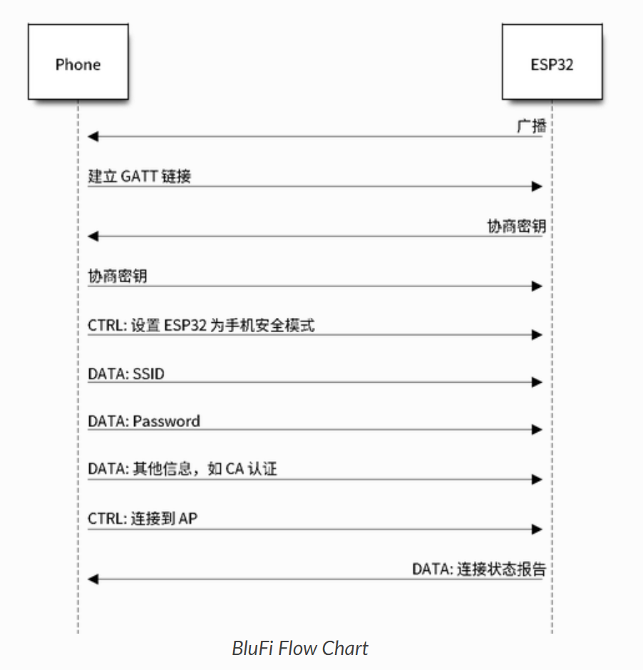
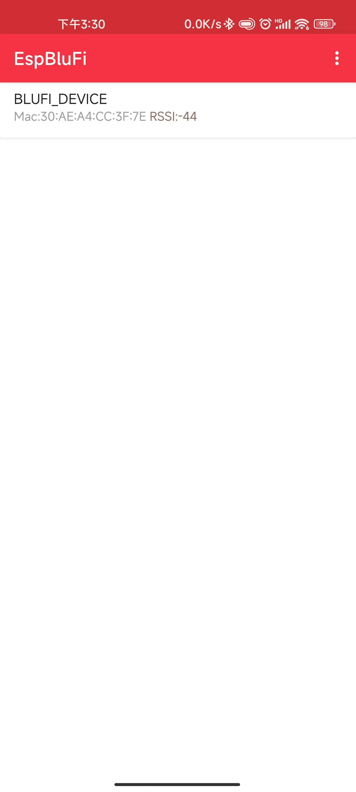
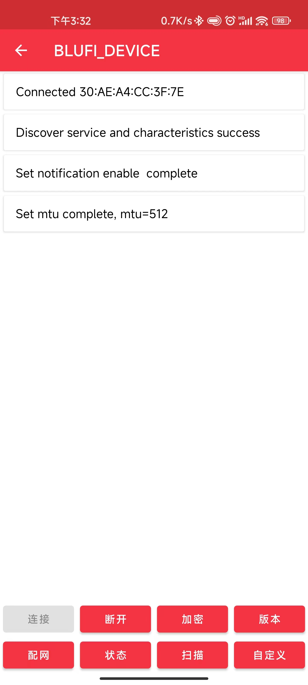

# BluFi 配网实验

## 什么是 BluFi

BluFi 是一款移动 APP，是一种基于蓝牙通道的 Wi-Fi 网络配置工具，适用于 ESP32。

它通过安全协议将 Wi-Fi 的 SSID、密码等配置信息传输到 ESP32，然后 ESP32 可基于这些信息连接到 AP 或建立 SoftAP。

### <span id="getapp">App 获取</span>

Blufi 是完全开源的 app，可通过如下方式装到手机：

- Andriod：[下载](https://github.com/EspressifApp/EspBlufiForAndroid/releases) APK 到手机安装

- Ios：在 app store 中搜索 `espbluefi` 并安装

### BluFi 配网流程

BluFi 配网功能包含配置 SoftAP 和 Station 两部分。其中关键部分包括：数据的分片、加密、校验和验证。

下面以配置 `Station` 为例说明配置步骤。包含：广播、连接、服务发现、协商共享密钥、传输数据、回传连接状态等步骤。

1. ESP32 开启 `GATT Server` 模式，发送带有特定 `advertising data` 的广播。你可以自定义该广播，该广播不属于 BluFi Profile。

2. 使用手机 APP 搜索到该特定广播，手机作为 `GATT Client` 连接 ESP32。你可以决定使用哪款手机 APP。

3. GATT 连接建立成功后，手机会向 ESP32 发送数据帧进行密钥协商（详情见 BluFi 中定义的帧格式 ）。

4. ESP32 收到密钥协商的数据帧后，会按照使用者自定义的协商方法来解析。

5. 手机与 ESP32 进行密钥协商。协商过程可使用 DH/RSA/ECC 等加密算法。

6. 协商结束后，手机端向 ESP32 发送控制帧，用于设置安全模式。

7. ESP32 收到控制帧后，使用共享密钥以及安全配置对通信数据进行加密和解密。

8. 手机向 ESP32 发送 BluFi 中定义的帧格式 中定义的数据帧，包括 SSID、密码等 Wi-Fi 配置信息。

9. 手机向 ESP32 发送 Wi-Fi 连接请求的控制帧。ESP32 收到这个控制帧之后，会认为手机已将必要的信息已经传输完毕，准备连接 Wi-Fi。

10. ESP32 连接到 Wi-Fi 后，发送 Wi-Fi 连接状态报告的控制帧到手机，以报告连接状态。至此配网结束。

> ❗ 注解
>
> ESP32 收到安全模式配置的控制帧后，会根据定义的安全模式进行相关操作。
>
> 进行对称加密和解密时，加密和解密前后的数据长度必须一致，支持原地加密和解密。

下图为 bluefi 配网流程图：



### API 介绍

```c
esp_err_t esp_blufi_register_callbacks( esp_blufi_callbacks_t *callbacks)
```

调用该函数接收 blufi 回调事件。

返回

- ESP_OK - 成功，其他 - 失败

参数

- [in] callbacks: 回调函数

```c
esp_err_t esp_blufi_profile_init(void)
```

调用此函数来初始化 blufi_profile。

返回

- ESP_OK - 成功，其他 - 失败

```c
esp_err_t esp_blufi_profile_deinit(void)
```

调用此函数以取消初始化 blufi_profile。

返回

- ESP_OK - 成功，其他 - 失败

```c
esp_err_t esp_blufi_send_wifi_conn_report( wifi_mode_t opmode , esp_blufi_sta_conn_state_t sta_conn_state , uint8_t softap_conn_num , esp_blufi_extra_info_t * extra_info )
```

调用此函数以发送 wifi 连接报告。

返回

- ESP_OK - 成功，其他 - 失败

参数

- opmode: : wifi 操作模式
- sta_conn_state: : 站是否已经连接

- softap_conn_num: : softap 连接数

- extra_info:: 额外信息，如 sta_ssid、softap_ssid 等。

```c
esp_err_t esp_blufi_send_wifi_list( uint16_t apCount , esp_blufi_ap_record_t *list)
```

调用此函数发送 wifi 列表。

返回

- ESP_OK - 成功，其他 - 失败

参数

- apCount:: wifi 列表计数
- list: : 无线网络列表

```c
uint16_t esp_blufi_get_version(void)
```

获取 BLUFI 配置文件版本。

返回

- 最高 8 位为大版本，最低 8 位为子版本

```c
esp_err_tesp_blufi_send_error_info(esp_blufi_error_state_tstate)
```

调用此函数以发送 blufi 错误信息。

返回

- ESP_OK - 成功，其他 - 失败

参数

- state:: 错误状态

```c
esp_err_tesp_blufi_send_custom_data(uint8_t *data, uint32_t data_len)
```

调用此函数来自定义数据。

返回

- ESP_OK - 成功，其他 - 失败

参数

- data:: 自定义数据值
- data_len:: 自定义数据的长度

### 关键代码解释

在我们的示例代码中，主要分为 3 个部分

1. WIFI 部分事件处理

   主要负责 WIFI 的连接、断开重连、扫描

   ```c
   static void wifi_event_handler(void* arg, esp_event_base_t event_base,
                                   int32_t event_id, void* event_data)
   ```

2. NETIF 部分事件处理
   获取网络 IP 地址，完成 IP 接口搭建（默认 IO 口）；

   ```c
   static void ip_event_handler(void* arg, esp_event_base_t event_base,
                                   int32_t event_id, void* event_data)
   ```

3. BLUFI 配网部分事件处理

   ```c
   static void example_event_callback(esp_blufi_cb_event_t event, esp_blufi_cb_param_t *param)
   ```

## 实验内容

本实验展示了如何使用 Blufi 进行 AP 与 ESP32 的 Wi-Fi 连接配置。

### 软硬件需求

- [bluefi app](#getapp)
- 智能手机
- ESP32 开发板
- USB 线

### 源代码参考

参见[参考资料与源代码](../../reference.rst)

### 配置目标

需要配置目标芯片为 ESP32

```
idf.py set-target esp32
```

### 构建和烧录

构建项目并将其烧写到板上，然后运行监控工具查看串行输出：

**命令行界面：**

```shell
idf.py -p PORT flash monitor
#（要退出串行监视器，请键入Ctrl-]。）
```

**Clion 界面：**

```shell
选择 flash 并运行
选择 monitor 并运行
```

### 示例输出

1. ###### 烧录代码后会有以下输出：

```bash
I (751) wifi_init: WiFi IRAM OP enabled
I (751) wifi_init: WiFi RX IRAM OP enabled
I (761) phy_init: phy_version 4670,719f9f6,Feb 18 2021,17:07:07
W (931) phy_init: saving new calibration data because of checksum failure, mode(0)
I (951) wifi:mode : sta (30:ae:a4:cc:3f:7c)
I (951) wifi:enable tsf
I (951) BTDM_INIT: BT controller compile version [5688ed5]
I (1241) BLUFI_EXAMPLE: BD ADDR: 30:ae:a4:cc:3f:7e

I (1251) BLUFI_EXAMPLE: BLUFI init finish

I (1251) BLUFI_EXAMPLE: BLUFI VERSION 0102
```

2. 手机端会有类似如下的设备出现：



3. 点击属于自己的设备，然后点击连接会有如下界面：



4. 点击下方配网，会有如下界面，选择连接的 WiFi 并输入密码点确定即自动返回主界面配网


5. 若配网成功，APP 端会有类似如下的信息：


6. IDE 的监视器会有类似如下输出：

```bash
I (1273) wifi:AP's beacon interval = 102400 us, DTIM period = 1
I (2183) esp_netif_handlers: sta ip: 192.168.50.57, mask: 255.255.255.0, gw: 192.168.50.1
I (2183) BLUFI_EXAMPLE: BLUFI BLE is not connected yet

I (13553) BLUFI_EXAMPLE: BLUFI ble connect

I (18963) BLUFI_EXAMPLE: BLUFI Set WIFI opmode 1

I (19053) BLUFI_EXAMPLE: Recv STA SSID RT-AX82U

I (19083) BLUFI_EXAMPLE: Recv STA PASSWORD fro12345

I (19083) BLUFI_EXAMPLE: BLUFI requset wifi connect to AP

I (19083) wifi:state: run -> init (0)
I (19083) wifi:pm stop, total sleep time: 15617342 us / 17897403 us

W (19093) wifi:<ba-del>idx
I (19093) wifi:new:<8,0>, old:<8,0>, ap:<255,255>, sta:<8,0>, prof:1
E (19103) wifi:sta is connecting, return error
I (19193) wifi:new:<8,0>, old:<8,0>, ap:<255,255>, sta:<8,0>, prof:1
I (19193) wifi:state: init -> auth (b0)
I (19193) wifi:state: auth -> assoc (0)
I (19203) wifi:state: assoc -> run (10)
I (19223) wifi:connected with RT-AX82U, aid = 19, channel 8, BW20, bssid = f0:2f:74:5d:fe:a8
I (19233) wifi:security: WPA2-PSK, phy: bgn, rssi: -50
I (19243) wifi:pm start, type: 1

W (19253) wifi:<ba-add>idx:0 (ifx:0, f0:2f:74:5d:fe:a8), tid:6, ssn:0, winSize:64
I (19293) wifi:AP's beacon interval = 102400 us, DTIM period = 1
I (20183) esp_netif_handlers: sta ip: 192.168.50.57, mask: 255.255.255.0, gw: 192.168.50.1
W (21043) wifi:<ba-add>idx:1 (ifx:0, f0:2f:74:5d:fe:a8), tid:0, ssn:0, winSize:64
```
