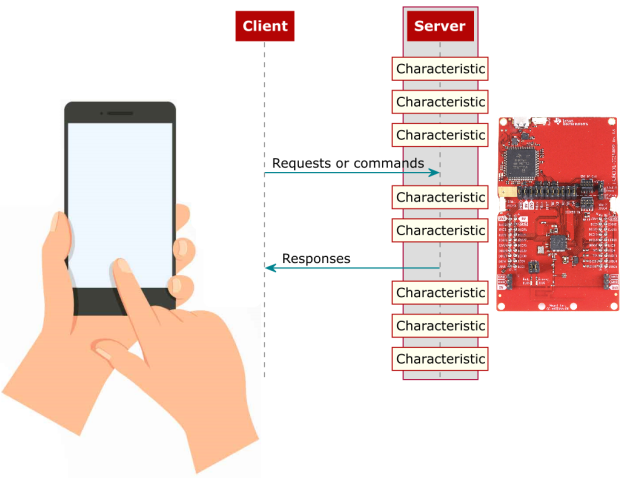

# 基于 GATT 的 BLE HID 设备

## 实验目的

本实验实现基于 GATT 的 BLEHID Device , 即 BLE 的设备模式。

> ❗ 注意
>
> 本实验需要 Android bluebird 协议栈支持，不支持非 Android 手机

## GATT BLE HID 介绍

GATT（Generic Attributes Profile）的缩写，中文是通用属性协议，是已连接的低功耗蓝牙设备之间进行通信的协议。

一旦两个设备建立起了连接，GATT 就开始起作用了，这也意味着，你必需完成前面的 GAP 协议。

GATT 使用了 ATT（Attribute Protocol）协议，ATT 协议把 Service，Characteristic 对应的数据保存在一个查找表中，查找表使用 16bit ID 作为每一项的索引。

从 GATT 的角度来看，处于连接状态时的两个设备，它们各自充当两种角色中的一种：

- 服务端（Server）

 包含被 GATT 客户端读取或写入的特征数据的设备。

- 客户端（Client）

 从 GATT 服务器中读取数据或向 GATT 服务器写入数据的设备。

外围设备（从机）作为 GATT 服务端（Server），它维持了 ATT 的查找表以及 service 和 characteristic 的定义；

客户端和服务器的 GATT 角色独立于外围设备和中央设备的 GAP 角色。外围设备可以是 GATT 客户端或 GATT 服务器，中心可以是 GATT 客户端或 GATT 服务器。


在 ESP-IDF 中，使用经过大量修改后的 BLUEDROID 作为蓝牙主机 (Classic BT + BLE)。BLUEDROID 拥有较为完善的功能，⽀持常用的规范和架构设计，同时也较为复杂，所以在此不再赘述，感兴趣的同学可以前往乐鑫官网 ESP-IDF 编程指南 中查看。

## 实验内容

本例实现了一个 BLE HID 设备配置文件相关功能，其中 HID 设备有 4 个类型：

1. 鼠标
2. 键盘和 LED
3. 消费类设备
4. 供应商设备

用户可以根据自己的应用场景选择不同的类型。BLE HID 配置文件继承和 USB HID 类。

### 文件说明

- `ble_hidd_demo_main.c` 此文件是演示如何使用 HID（您可以将其连接到智能手机充当消费设备，然后可以使用按钮来音量++或音量--等，或连接到 Windows 10 PC 行为作为键盘或鼠标）
- `hidd_le_prf_int.h` 此头文件包含一些与 HID 配置文件相关的定义。

- `esp_hidd_prf_api.h`&`esp_hidd_prf_api.c` 这些文件包含 HID 配置文件的 api 当您使用 HID 配置文件时，您只需添加 esp_hidd_prf_api.h 包含文件并使用 `esp_hidd_prf_api.c` 文件中定义的函数发送 HID 数据。

- `hid_dev.h` & `hid_dev.c` 这些文件定义了 HID 规范相关的定义

- `hid_device_le_prf.c` 该文件是 HID 配置文件定义文件，它包含了 HID 配置文件的主要功能。主要包括如何创建 HID 服务。如果您发送和接收 HID 数据并将数据转换为键盘键，则鼠标和使用者值将转发到应用程序。

### 构建和烧录

构建项目并将其烧写到板上，然后运行监控工具查看串行输出：

#### 命令行界面：

idf.py -p PORT flash monitor （要退出串行监视器，请键入 Ctrl-]。）

#### Clion 界面：

1. 选择 flash 并运行

2. 选择 monitor 并运行


## 示例输出

**假如此时将手机蓝牙连接至 esp32，esp32 将会去控制手机的音量增至最大和减小至最小**

监视器中会有类似如下输出:

```bash
I (0) cpu_start: Starting scheduler on APP CPU.
I (584) BTDM_INIT: BT controller compile version [1342a48]
I (584) system_api: Base MAC address is not set
I (584) system_api: read default base MAC address from EFUSE
I (594) phy_init: phy_version 4670,719f9f6,Feb 18 2021,17:07:07
I (1024) HID_LE_PRF: esp_hidd_prf_cb_hdl(), start added the hid service to the stack database. incl_handle = 40
I (1034) HID_LE_PRF: hid svc handle = 2d
I (5964) HID_LE_PRF: HID connection establish, conn_id = 0
I (5964) HID_DEMO: ESP_HIDD_EVENT_BLE_CONNECT
I (6744) HID_DEMO: remote BD_ADDR: 7767f4abe386
I (6744) HID_DEMO: address type = 1
I (6744) HID_DEMO: pair status = success
I (8024) HID_DEMO: Send the volume
I (16024) HID_DEMO: Send the volume
I (24024) HID_DEMO: Send the volume
I (27784) HID_DEMO: ESP_HIDD_EVENT_BLE_DISCONNECT
```

## 源代码参考

参见[参考资料与源代码](../../reference.rst)
