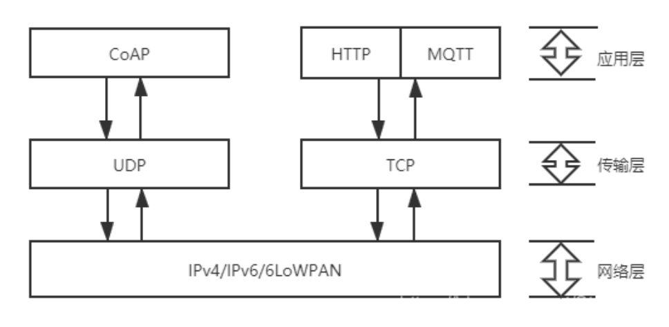
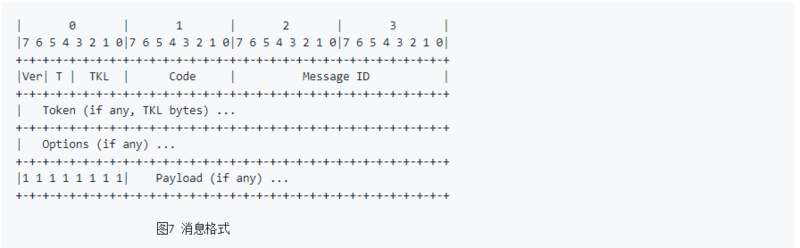

# CoAP over WiFi

## 概述

Coap（Constrained Application Protocol）是一种在物联网世界的类web协议，它的详细规范定义在 RFC 7252。COAP名字翻译来就是“受限应用协议”，顾名思义，使用在资源受限的物联网设备上。物联网设备的ram，rom都通常非常小，运行TCP和HTTP是不可以接受的。


## Coap协议介绍

### Coap协议特点

- COAP协议网络传输层由TCP改为UDP。
- 它基于REST，server的资源地址和互联网一样也有类似url的格式，客户端同样有POST，GET,PUT,DELETE方法来访问server，HTTP做了简化。
- COAP是二进制格式的，HTTP是文本格式的，COAP比HTTP更加紧凑。
- 轻量化，COAP最小长度仅仅4B，一个HTTP的头都几十个B了。
- 支持可靠传输，数据重传，块传输。确保数据可靠到达。
- 支持IP多播，即可以同时向多个设备发送请求。
- 非长连接通信，适用于低功耗物联网场景。

### Coap协议消息类型

COAP协议有4种消息类型：

1. CON—— 需要被确认的请求，如果CON请求被发送，那么对方必须做出响应。这有点像TCP，对方必须给确认收到消息，用以可靠消息传输。
2. NON—— 不需要被确认的请求，如果NON请求被发送，那么对方不必做出回应。这适用于消息会重复频繁的发送，丢包不影响正常操作。这个和UDP很像。用以不可靠消息传输。
3. ACK —— 应答消息，对应的是CON消息的应答。
4. RST —— 复位消息，可靠传输时候接收的消息不认识或错误时，不能回ACK消息，必须回RST消息。

### Coap消息格式

CoAP的消息格式是很紧凑的，默认运行在UDP上（每个CoAP消息都是UDP数据包中的数据部分）。
CoAP也可以运行在DTLS协议上和其它传输协议上，例如SMS，TCP或SCTP（CoAP不支持UDP-lite[RFC3828]和UDP zero checksum[RFC6936]）。

CoAP消息用二进制格式进行编码。 这个消息格式以一个固定4个字节的头部开始。
此后是一个长度在0到8字节之间的Token。Token值之后是0个或多个Type-Length-Value(TLV)格式的选项(Option)。之后到整个数据报的结尾都是payload部分，payload可以为空。



## CoAP Client 示例

这个 CoAP 客户端示例是对 libcoap示例之一的非常简化的改编。

CoAP 客户端示例将您的 ESP32 设备连接到 CoAP 服务器，发送 GET 请求并从 CoAP 服务器获取响应数据。客户端可以扩展为 PUT / POST / DELETE 请求，以及支持观察者扩展RFC7641。

如果 URI 以 coaps:// 而不是 coap:// 为前缀，则 CoAP 客户端将尝试使用 CoAP 服务器所需的定义的预共享密钥 (PSK) 或公钥基础设施 (PKI) 使用 DTLS 协议要知道。

如果 URI 以 coap+tcp:// 为前缀，则 CoAP 将尝试使用 TCP 进行通信。

注意：目前不支持 coaps+tcp://，即使 libcoap 和 MbedTLS 都支持它。

受限应用协议 (CoAP) 是一种专门的 Web 传输协议，用于物联网中的受限节点和受限网络。
该协议专为智能能源和大厦自动化等机器对机器 (M2M) 应用而设计。

### 配置项目

命令行界面

```bash
cd /示例对应的目录
get-idf
idf.py menuconfig
```

Clion界面

选择示例的文件夹并用Clion打开

添加各项配置（参考Clion下ESP-IDF的配置与开发）

选择 menuconfig 并运行

Example Connection Configuration --->

- 在 Example Configuration 下设置 WiFi SSID
- 在 Example Configuration Example  CoAP Client Configuration --->下设置 WiFi 密码
- 设置 CoAP 目标 Uri
- 如果是 PSK，设置 CoAP 预共享密钥以用于连接到服务器
- 如果是 PSK，设置 CoAP PSK 客户端身份（用户名） Component config ---> CoAP Configuration --->
  - 设置加密方法定义，PSK（默认）或 PKI
  - 如果需要，启用 CoAP 调试高分辨率计时器 (esp_timer) --->
  - 用于 esp_timer 的硬件定时器 - 如果需要可更改（QEMU 的 FRC2）

### 构建和烧录

构建项目并将其烧写到板上，然后运行监控工具查看串行输出：

命令行界面：

```bash
idf.py -p PORT flash monitor
```

（要退出串行监视器，请键入Ctrl-]。）

Clion界面：

选择 flash 并运行

选择 monitor 并运行

### 示例输出

前提条件：我们在coap server example上启动一个CoAP server，或者使用默认的coap://californium.eclipseprojects.io。

如果成功，您可以从 CoAP 服务器接收数据，
例如以下日志：

```bash
b...
I (332) wifi: mode : sta (30:ae:a4:04:1b:7c)
I (1672) wifi: n:11 0, o:1 0, ap:255 255, sta:11 0, prof:1
I (1672) wifi: state: init -> auth (b0)
I (1682) wifi: state: auth -> assoc (0)
I (1692) wifi: state: assoc -> run (10)
I (1692) wifi: connected with huawei_cw, channel 11
I (1692) wifi: pm start, type: 1

I (2582) event: sta ip: 192.168.3.89, mask: 255.255.255.0, gw: 192.168.3.1
I (2582) CoAP_client: Connected to AP
I (2582) CoAP_client: DNS lookup succeeded. IP=35.185.40.182
Received:

****************************************************************

CoAP RFC 7252                                  Cf 3.0.0-SNAPSHOT

****************************************************************

This server is using the Eclipse Californium (Cf) CoAP framework
published under EPL+EDL: http://www.eclipse.org/californium/

(c) 2014-2020 Institute for Pervasive Computing, ETH Zurich and others

****************************************************************
...
```

### libcoap 文档

这可以在libcoap 文档中找到。当前的 API 是 4.3.0。

https://libcoap.net/documentation.html

### 故障排除

请确保 Target Url 包含 valid host、 optional port、 optionalpath和以 开头coap://，coaps://或者coap+tcp:// 对于支持 TCP 的 coap 服务器（并非所有都包括 coap+tcp://californium.eclipseprojects.io）。

可以通过运行“idf.py menuconfig -> Component config -> CoAP Configuration”并设置适当的日志级别来启用 CoAP 日志记录。

## CoAP Server示例

这个 CoAP 服务器示例是对libcoap 示例 之一的非常简化的改编 。

CoAP 服务器示例将启动一个守护任务，从 CoAP 客户端接收请求/数据并将数据传输到 CoAP 客户端。

如果传入的请求请求使用 DTLS（连接到端口 5684），则 CoAP 服务器将尝试使用先前定义的预共享密钥 (PSK) 建立 DTLS 会话 - 这必须与 CoAP 的相同客户端正在使用，或公钥基础设施 (PKI)，其中 PKI 信息必须按请求匹配。

注意：当前不支持尝试使用 coaps+tcp:// 的客户端会话，即使 libcoap 和 MbedTLS 都支持它。

受限应用协议 (CoAP) 是一种专门的 Web 传输协议，用于物联网中的受限节点和受限网络。
该协议专为智能能源和大厦自动化等机器对机器 (M2M) 应用而设计。

### 配置项目

命令行界面

```bash
cd /示例对应的目录
get-idf
idf.py menuconfig
```

Clion界面

选择示例的文件夹并用Clion打开

添加各项配置（参考Clion下ESP-IDF的配置与开发）

选择 menuconfig 并运行

Example Connection Configuration --->

- 在 Example Configuration 下设置 WiFi SSID
- 在 Example Configuration Example  CoAP Client Configuration --->下设置 WiFi 密码
- 设置 CoAP 目标 Uri
- 如果是 PSK，设置 CoAP 预共享密钥以用于连接到服务器
- 如果是 PSK，设置 CoAP PSK 客户端身份（用户名） Component config ---> CoAP Configuration --->
  - 设置加密方法定义，PSK（默认）或 PKI
  - 如果需要，启用 CoAP 调试高分辨率计时器 (esp_timer) --->
  - 用于 esp_timer 的硬件定时器 - 如果需要可更改（QEMU 的 FRC2）

### 构建和烧录

构建项目并将其烧写到板上，然后运行监控工具查看串行输出：

命令行界面：

```bash
idf.py -p PORT flash monitor
```

（要退出串行监视器，请键入Ctrl-]。）

Clion界面：

选择 flash 并运行

选择 monitor 并运行

### 示例输出

当前的 CoAP 服务器会启动一个 daemon 任务，
日志如下：

```bash
...
I (332) wifi: mode : sta (30:ae:a4:04:1b:7c)
I (1672) wifi: n:11 0, o:1 0, ap:255 255, sta:11 0, prof:1
I (1672) wifi: state: init -> auth (b0)
I (1682) wifi: state: auth -> assoc (0)
I (1692) wifi: state: assoc -> run (10)
I (1692) wifi: connected with huawei_cw, channel 11
I (1692) wifi: pm start, type: 1

I (2622) event: sta ip: 192.168.3.84, mask: 255.255.255.0, gw: 192.168.3.1
I (2622) CoAP_server: Connected to AP
...
```

如果 CoAP 客户端查询/Espressif资源，CoAP 服务器将返回"Hello World!"
，直到 CoAP 客户端使用不同的数据执行 PUT。

### libcoap 文档

这可以在libcoap 文档中找到。当前的 API 是 4.3.0。

https://libcoap.net/documentation.html

### 故障排除

请确保 CoAP 客户端在 path:/Espressif或fetches 下获取或放置数据/.well-known/core

可以通过运行“idf.py menuconfig -> Component config -> CoAP Configuration”并设置适当的日志级别来启用 CoAP 日志记录
