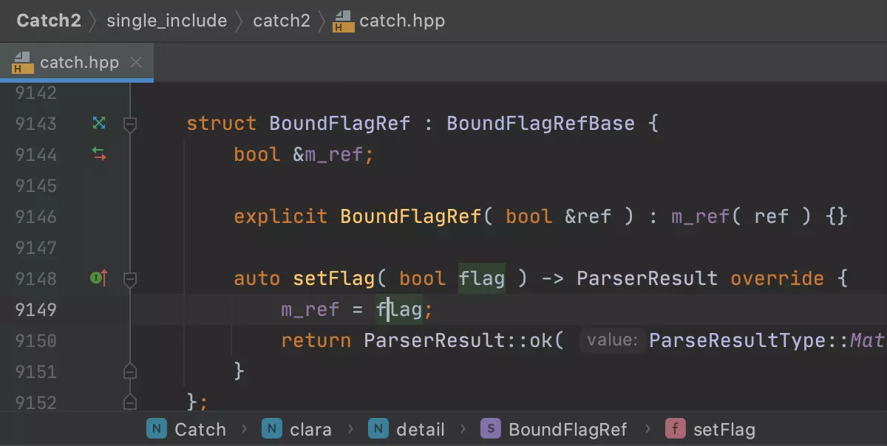
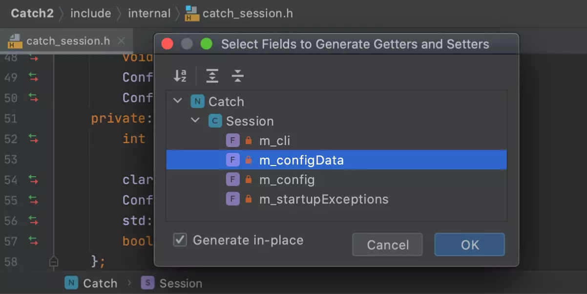
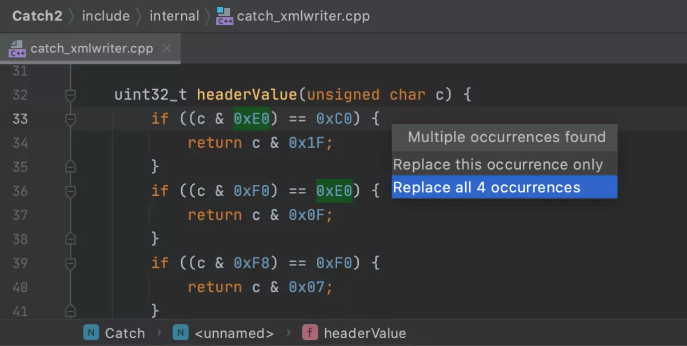
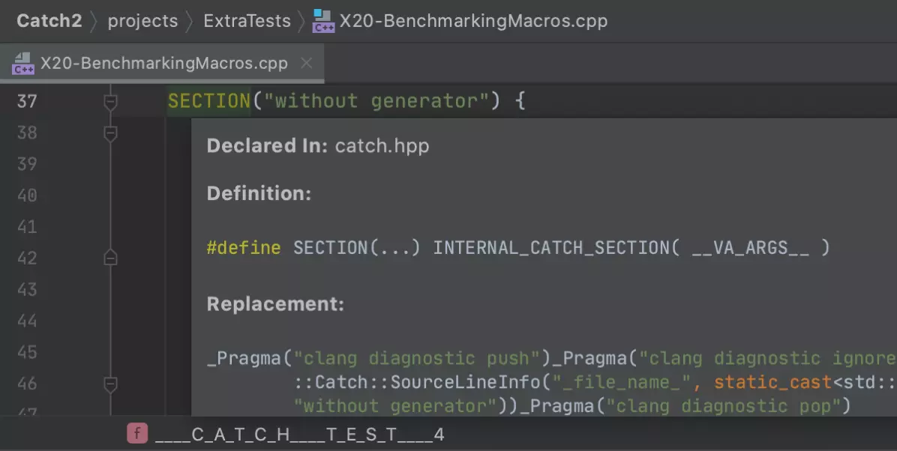
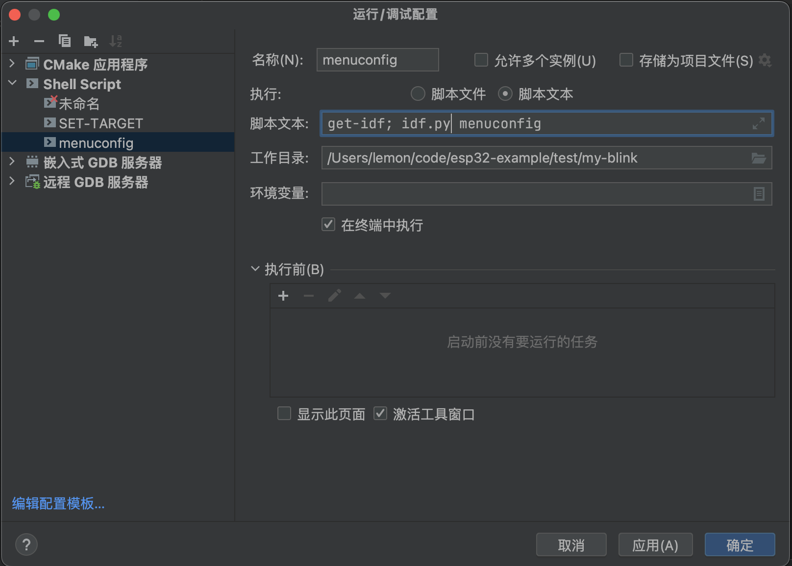
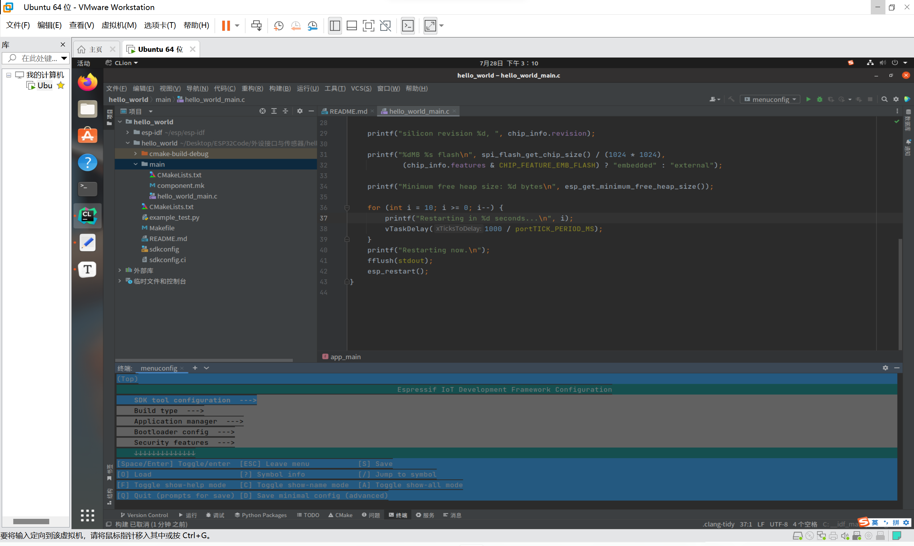
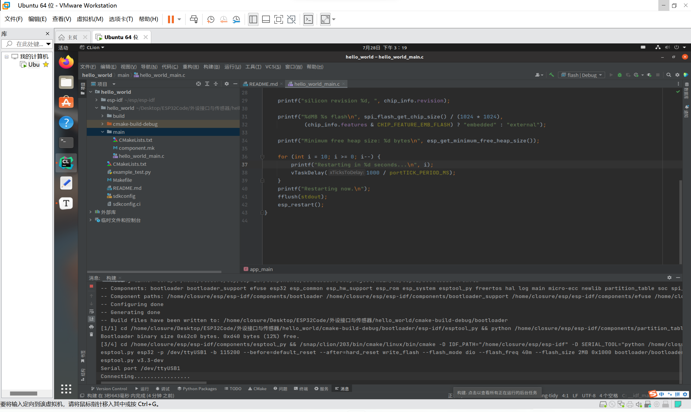
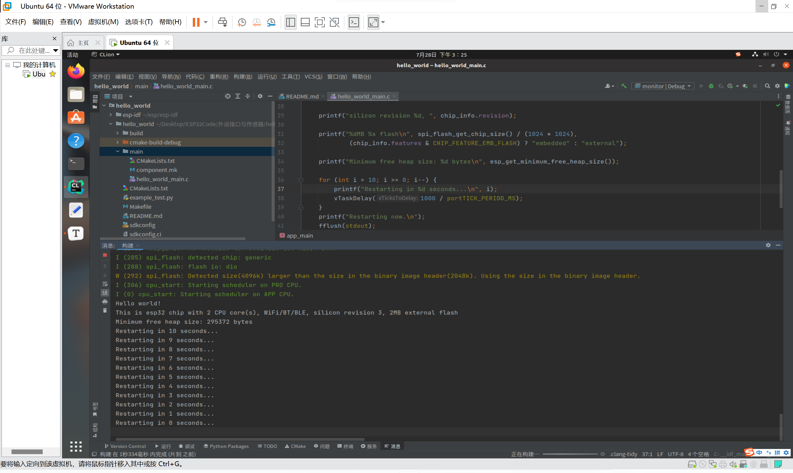
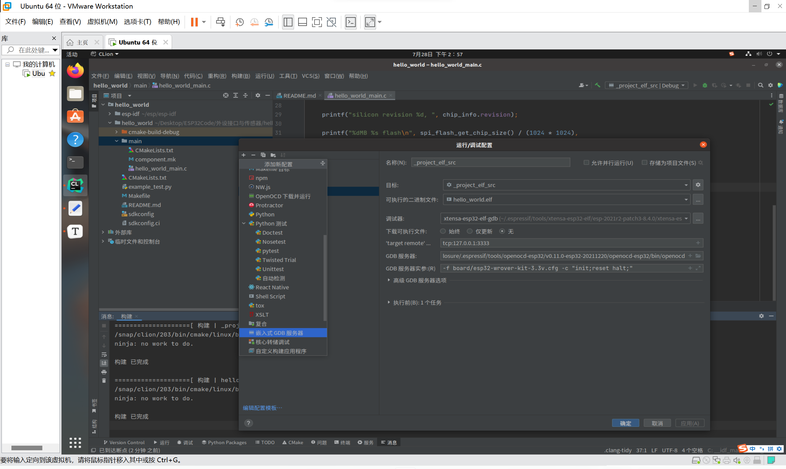

# Clion 下 ESP-IDF 的配置与开发

## clion 简介

clion 是 jetbrain 公司开发的 C/C++ IDE 集成开发工具，具有如下优点：

- 完善的开发环境：

  指 ESP-IDF 工程的建立，配置，编译，调试，量产等基础操作的环境。一个优秀的编程环境可以让开发体验直线上升，工作事半功倍，而 Clion 恰是我们 C 语言开发的优秀编程环境！

- 代码辅助

  使用对 C 和 C++ 有深刻理解的编辑器，您便可以高效地读写代码。 可在智能补全功能中按类型筛选出补全结果。 使用路径导航来跟踪您在范围层次结构内的位置。 借助参数名称提示，深入了解函数调用。 查找符号的上下文用法，或通过键入其名称直接跳转到该符号。 CLion 甚至可以确保您的代码符合编码指南，包括格式、命名等要求。

  

- 代码生成

  立即生成大量样板代码。 使用简单的快捷键重写和实现函数。 生成构造函数和析构函数、getter 和 setter 以及相等、相关和流输出运算符。 使用语句包装代码块，或者从用法生成声明。 创建自定义活动模板以在整个代码库中重用典型代码块，从而节省时间并使样式保持一致。 

- 安全重构

  重命名符号，内联函数、变量或宏，在层次结构中移动成员，更改函数签名，以及提取函数、变量、参数或 typedef。 无论您使用哪种自动重构，都请放心，CLion 能够安全地在整个代码中传播相关变更。

  

- 快速文档

  检查脱字符号下的代码即可了解任何信息：函数签名详细信息、审查评论、预览 Doxygen 样式文档、检查针对缺少显式类型的符号推断出的类型，以及查看正确格式化的最终宏替换。

  

## Clion 及插件安装

### 安装 clion

clion 可以在官方网站获取并安装，在 ubunbu 下，安装 cion 又两种方法，分别如下：

1. 命令行安装

   ```bash
   sudo snap install clion --classic
   ```

2. 在 Ubuntu 自带应用商店 snap 中搜索一键安装

   

### 添加插件

1. 点击`setup | plugin` ，搜索 Chinese，选择 中文语言包 并下载安装
   - 安装完成后会提示重启 IDE，重启后便显示中文
2. 在插件处搜索 Serial，选择 Serial Port Monitor 并下载安装
   - 这是串口调试器插件，集成在 IED 内非常好用


## 实验步骤

要从空白开始实现一个项目，需要两个工具：

- 基于命令行的 `idf.py` 项目管理工具
- 编码，调试使用的 `Clion` 集成开发环境。

### 创建项目

现在，您可以开始准备开发 ESP32 应用程序了。假设我要重头开始创建 hellow-world 工程

```shell
# 进入项目目录
cd ~/code/$GROUPNAME/esp32/

# 获取idf所需的环境和工具
get-idf
# 创建hellow-world工程
idf.py create-project hellow-world
# 检查下目录下发生了什么
tree -L 2
```

> ❗**注意：**
>
> - ESP-IDF 编译系统不支持带有空格的路径！！！

### 连接设备

现在，请将 ESP32 开发板连接到 PC，并查看开发板使用的串口。

我们使用的` ESP-WROVER-KIT` 开发板一般会有如下两个 `ttyUSB` 口：

数字较小的为` JATG` 接口，较大的为串口接口。

```shell
ls -l /dev/ttyUSB*
crw-rw----+ 1 root plugdev 188, 0 7月  27 14:31 /dev/ttyUSB0
crw-rw----+ 1 root plugdev 188, 1 7月  27 14:31 /dev/ttyUSB1
```

此处的用户群组 `plugdev `可能会有出入，具体原因是对`JAGT`进行了 `USB `驱动配置，会在下一章 `ESP-IDFJTAG `调试流程 中提及。

请记住串口名，在下面的步骤中会使用到。

### 设置目标芯片

打开一个新项目后，应首先设置“目标”芯片 。乐鑫有 esp32, esp32-s2, esp32-s3,esp32-c 以及 esp32-h 等多种架构

```shell
# 我们的开发版目标芯片是ESP32
idf.py set-target esp32
# 检查下目录下发生了什么
tree -L 2
```

### 配置项目参数

运行工程配置工具 menuconfig。

```
idf.py menuconfig
```

注意，此操作将清除并初始化项目之前的编译和配置（如有）。 也可以在后续步骤中再 clion 中实现该步骤的设置。

### 在 clion 中打开项目

1. 打开 clion，然后依次`文件` | `打开`
2. 在对话框找到你刚才创建项目的目录
3. 点击`cmakelists.txt`这个文件，点击打开
4. 在弹出的对话框选择`作为项目打开`

### 配置项目环境变量

#### 系统变量

需要配置 esp-idf 的工具到系统环境变量，以便 clion 正确的使用这些工具。执行如下操作

1. `设置` -| `构建、执行、部署` | `工具链`，
2. 在对话框右上角点击 `添加环境` | `来自文件`
3. 选择你的 esp-idf 的环境脚本文件，如：`/home/iot/esp/esp-idf/export.sh`


#### 用户变量

需要添加如下几个用户变量

| 名称     | 值                    |
| -------- | --------------------- |
| ESPBAUD  | 115200                |
| ESPPORT  | /dev/ttyUSB1          |
| IDF_PATH | /home/iot/esp/esp-idf |

> ❗ 注意
>
> ESPBAUD 是波特率，默认 115200；ESPPORT 是串口的引脚，一般为数字较大的那个，具体根据实际情况填写，一般为 1 或 2
>
> IDF_PATH 一般默认如上表填写，实际上是安装的 ESP-IDF 的目录，自行构建环境的同学目录还可能带有-4.4.1 这种版本号

添加过程如下图所示：

1. `设置` | `构建、执行、部署` | `cmake`
2. 点击下方`环境`选项的编辑按钮，在弹出的对话框，点击 `+` 号
3. 填写名称和值


请下载 MOV 文件播放演示。

<video src=“../IMG/config-env.mov"></video>

**注意：在环境文件名下写 export.sh 所在的真实目录**

### 在 Clion 中实现 menuconfig

menuconfig 可以通过 idf.py 实现，也可在 clion 中配置实现，具体配置方法如下：

点击`选择运行/调试配置` 选择`编辑配置`，如下图：找到 Shell Script 进行添加


在弹出对话框中（如下图），点击 + ，选择 Shell Script , 一次选择并填写：

名称：menuconfig

执行：脚本文本

脚本文本填写如下：

```bash
get-idf;idf.py menuconfig
```



以上设置好后，就可以在 clion 中实现 menuconfig 设置，点击`选择运行/调试配置` , 选择`menuconfig`并点击运行按钮，终端框会如下图所示，通过上下键依次设置即可。

如何不需要设置，直接按下 ESC 返回即可。



### 代码编写

在 clion 中进行代码编写，充分发挥 clion 的功能。

### 编译、烧录、监视

右上角`调试配置`工具栏是调试和配置的重要工具，如下图所示，左侧`小锤子`图标代表`构建`，右侧`三角`图标代表`运行`。下拉图标中有各种运行配置（esp-idf 的各种构建目标），其中最重要的就是，`编译`、`烧录`、`监视`运行几个常见配置目标。即： `hello_world(工程名).elf`、`flash`、`monitor`。其他不需要的配置选项，可以在`编辑配置`中 用 `-` 号 删掉。


#### 编译工程文件

选择`hello_world.elf`，点击`构建`运行编译，如果一切正常，编译完成后将生成 .elf 文件。

#### 烧录到设备

选择`flash`，点击`构建`。跟在终端烧录一样，当下方消息框出现如图所示连接中的情况的时候，请按下板子的 boot 按键直到烧录开始再松开。



#### 运行监视器查看串口日志输出

选择`monitor`执行`构建`，就能看到如下图的日志输出啦！

点击 红色方块 即可终止退出。



### JTAG Debug

#### JATG 配置

点 `运行/调试配置` 框左上角`添加新配置`，找到 `嵌入式 GDB 服务器` 进行添加

- 名称： 默认不用更改，也可改为自己想要的名称；
- 目标： 默认不用更改；
- 可执行二进制文件选择对应工程名的 elf 文件。
- 调试器

```bash
/home/Ubuntu用户名/.espressif/tools/xtensa-esp32-elf/esp-2021r2-patch3-8.4.0/xtensa-esp32-elf/bin/xtensa-esp32-elf-gdb
```

- 下载可执行文件：**无**

- 'target remote':

```bash
tcp:127.0.0.1:3333
```

- GDB 服务器：

```bash
/home/Ubuntu用户名/.espressif/tools/openocd-esp32/v0.11.0-esp32-20211220/openocd-esp32/bin/openocd
```

- GDB 服务器实参：

```bash
-f board/esp32-wrover-kit-3.3v.cfg -c "init;reset halt;"
```



#### 调试

先在希望程序中断运行的语句所在行打上断点，在所在行行数数字旁边空的区域单击，即可看见该行高亮并且带有红点

再选择设置好的 JTAGDebug 并点旁边的 ‘’小虫子‘’ 按键进行 Debug，执行后会如下图所示：


我们能清楚的看到变量的情况以及类型等，更复杂的语句还有更多显示。

调试框边上的各个按键同学们可自行查看并学习用法。

点击 红色方块 即可终止退出。

**至此 Clion 下 ESP-IDF 的配置与开发已经完成！**
