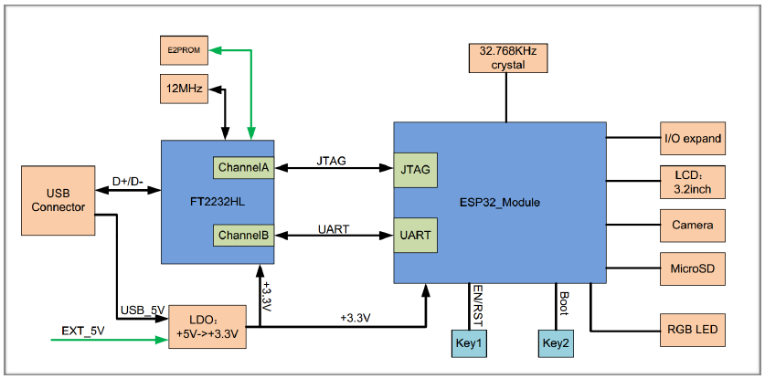
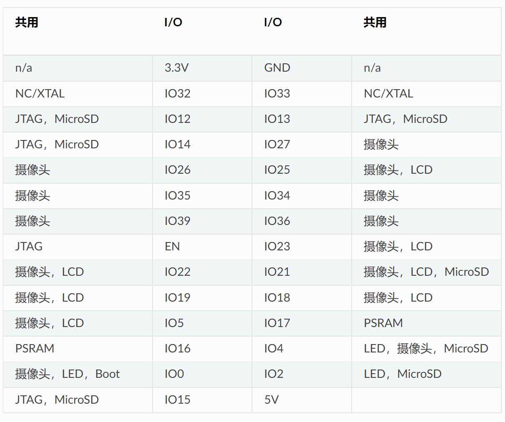
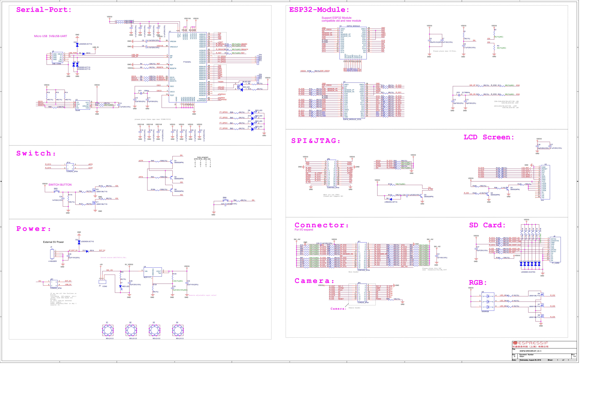
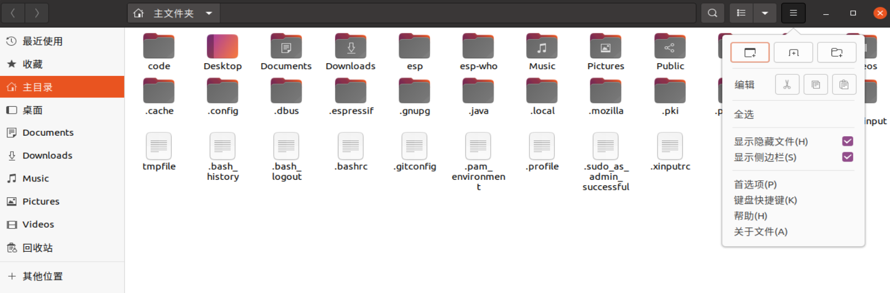

# ESP-IDF 环境配置

## 实验目的

ESP-IDF 是乐鑫官方的物联网开发框架，适用于 ESP32、ESP32-S 和 ESP32-C 系列 SoC。它基于 C/C++ 语言提供了一个自给自足的 SDK，方便用户在这些平台上开发通用应用程序。

相较于 Arduino 等使用 microPython 的平台，ESP-IDF 能最大程度的发挥 ESP32 的全部实力，并且 ESP-IDF 是乐鑫官方推荐的 SDK，同时也是我们电子信息工程的学生应该掌握的开发工具之一。

本实验目的是搭建 ESP-IDF 的开发环境。

> ❗ 注意
>
> 本实验适用于同学们在自己的电脑上从头开始搭建环境，对于实验室电脑，实验环境已经搭建完毕，同学们只需阅读本节内容，了解 ESP-IDF 框架的基本内容即可。

## ESP-WROVER-KIT 开发板简介

### 概述

ESP-WROVER-KIT 是 乐鑫 一款基于 ESP32 的开发板。开发板已集成了如下组件：

- ESP32-WROVER-E 模组

- LCD 屏

- MicroSD 卡槽

此外，ESP-WROVER-KIT 的独特之处在于集成了一款先进多协议 USB 桥接器 (FTDI FT2232HL)，允许开发人员直接通过 USB 接口，使用 JTAG 对 ESP32 进行调试，无需额外的 JTAG 调试器。ESP-WROVER-KIT 可为开发人员提供简单、便捷且极具成本效益的开发体验。

为了便于使用，板上模组的绝大部分管脚均已引出至开发板的引脚。

> ❗ 注意
>
> ESP32 的 GPIO16 和 GPIO17 管脚用作 PSRAM 的片选和时钟信号。默认情况下，为了给用户提供可靠的性能，这两个 GPIO 管脚不引出至开发板引脚。

### 电路框图

ESP-WROVER-KIT 开发板的主要组件和连接方式如下图所示。



### 管脚分配

ESP32 模组的部分管脚/终端已被板上组件占用或用于外部硬件设备。如果某管脚对应的特定硬件未连接，则该管脚可用作他用。比如，摄像头/JP4 排针未连接相应硬件，则这些 GPIO 可用于其他用途。

部分管脚具备多个功能，可供板上组件或外部硬件设备同时使用，比如 GPIO0 和 GPIO2。由于管脚限制，一些外围设备不可同时使用，比如，由于 JTAG 和 SD 卡槽需共用部分管脚，因此一些使用 SD 卡功能的应用无法同时进行 JTAG 调试。

其他情况下，不同外设可同时使用。比如，LCD 屏幕和 SD 卡仅共用一个 GPIO21 管脚，可以同时使用。该管脚可为 LCD 屏幕提供 D/C（数据/控制）信号，并用于读取来自 SD 卡槽的卡检测信号。如无需使用卡检测功能，开发人员还可以通过移除 R167 来禁用该功能。此时，LCD 和 SD 卡槽可同时使用。

#### 管脚复用情况



说明：

- NC/XTAL - 32.768 kHz 晶振

- JTAG - JTAG / JP2

- Boot - Boot 按键 / SW2

- 摄像头 - 摄像头 / JP4

- LED - RGB LED

- MicroSD - MicroSD Card / J4

- LCD - LCD / U5

- PSRAM - ESP32-WROVER-E 的 PSRAM

#### 32.768 kHz 晶振

| ESP32 管脚 |
| ---------- |
| GPIO32     |
| GPIO33     |

默认情况下，管脚 GPIO32 和 GPIO33 已连接至晶振。因此，为了保证信号的完整性，这两个管脚并未连接至 JP1 I/O 连接器。用户可通过将 R11/R23 处的 0 欧电阻移至 R12/R24 处，以将 GP1O32 和 GPIO33 的连接从晶振移至 JP1。

#### SPI Flash / JP2

| ESP32 管脚   |
| ------------ |
| CLK / GPIO6  |
| SD0 / GPIO7  |
| SD1 / GPIO8  |
| SD2 / GPIO9  |
| SD3 / GPIO10 |
| CMD / GPIO11 |

Important

模组的 flash 总线已通过 0 欧电阻 R140 ~ R145 连接至排针 JP2。如果需要将 flash 的工作频率控制在 80 MHz，以达到保证总线信号完整性等目的，建议移除 R140 ~ R145 电阻，将模组的 flash 总线与排针 JP2 断开。

#### JTAG / JP2

| ESP32 管脚    | JTAG 信号 |
| ------------- | --------- |
| EN            | TRST_N    |
| MTMS / GPIO14 | TMS       |
| MTDO / GPIO15 | TDO       |
| MTDI / GPIO12 | TDI       |
| MTCK / GPIO13 | TCK       |

#### 摄像头 / JP4

| ESP32 管脚 | 摄像头信号          |
| ---------- | ------------------- |
| n/a        | 3.3V                |
| n/a        | 地                  |
| GPIO27     | SIO_C / SCCB 时钟   |
| GPIO26     | SIO_D / SCCB 数据   |
| GPIO25     | VSYNC / 垂直同步    |
| GPIO23     | HREF / 水平参考     |
| GPIO22     | PCLK / 像素时钟     |
| GPIO21     | XCLK / 系统时钟     |
| GPIO35     | D7 / 像素数据 Bit 7 |
| GPIO34     | D6 / 像素数据 Bit 6 |
| GPIO39     | D5 / 像素数据 Bit 5 |
| GPIO36     | D4 / 像素数据 Bit 4 |
| GPIO19     | D3 / 像素数据 Bit 3 |
| GPIO18     | D2 / 像素数据 Bit 2 |
| GPIO5      | D0 / 像素数据 Bit 1 |
| GPIO4      | D0 / 像素数据 Bit 0 |
| GPIO0      | RESET / 摄像头复位  |
| n/a        | PWDN / 摄像头断电   |

D0 到 D7 为摄像头的数据总线

#### RGB LED

| ESP32 管脚 | RGB LED |
| ---------- | ------- |
| GPIO0      | 红色    |
| GPIO2      | 绿色    |
| GPIO4      | 蓝色    |

#### MicroSD 卡

| ESP32 管脚    | MicroSD 信号 |
| ------------- | ------------ |
| MTDI / GPIO12 | DATA2        |
| MTCK / GPIO13 | CD / DATA3   |
| MTDO / GPIO15 | CMD          |
| MTMS / GPIO14 | CLK          |
| GPIO2         | DATA0        |
| GPIO4         | DATA1        |
| GPIO21        | Card Detect  |

#### LCD / U5

| ESP32 管脚 | LCD 信号 |
| ---------- | -------- |
| GPIO18     | 复位     |
| GPIO19     | SCL      |
| GPIO21     | D/C      |
| GPIO22     | CS       |
| GPIO23     | SDA      |
| GPIO25     | SDO      |
| GPIO5      | 背光     |

#### 原理图

[下载原理图](https://dl.espressif.com/dl/schematics/ESP-WROVER-KIT_V4_1.pdf)



## 实验准备

### 硬件

- 物联网实验验箱上的 ESP-WROVER-KIT 开发板
- USB 数据线 (A 转 Micro-B)
- 电脑（PC 或 Mac OS）

### 软件

- Ubuntu20.04 Linux 操作系统
- ESP-IDF 开发框架

## 实验步骤

> ❗ 注意如果使用的是我们提供的镜像文件，安装好 VM16PRO 后打开即可。全新安装配置，请按照以下步骤操作。

### 第一步：安装准备

首先是更换国内源，此处不再赘述，可以自行网络学习，Ubuntu20.04 有图形界面进行选择更换，十分简单。

然后更新软件列表，检测出可以更新的软件并进行软件更新，具体终端输入如下：

```bash
sudo apt-get update
sudo apt-get upgrade
```

编译 ESP-IDF 需要以下软件依赖包。

```bash
sudo apt-get install git wget flex bison gperf python3 python3-pip python3-setuptools cmake ninja-build cca
```

### 第二步：获取 ESP-IDF

拉取 ESP-IDF 仓库。打开终端，运行以下命令：

```bash
mkdir -p ~/esp
cd ~/esp
git clone -b v4.4.1 --recursive https://github.com/espressif/esp-idf.git
```

ESP-IDF 将下载至 ~/esp/esp-idf。

> ❗**注意：**
>
> - 此处因 GitHub 在国内下载速度不稳定，想要在自己电脑构建环境的同学们，针对 git clone 的下载问题可以先前往网址下载 zip 再放入虚拟机后解压。
> - 也可以用国内提供的 GITTE 解决。

### 第三步：设置工具

除了 ESP-IDF 框架本身，还需要安装 ESP-IDF 使用的各种工具，比如编译器、调试器、Python 包等。

- 采用 GitHub，执行如下命令

```bash
cd ~/esp/esp-idf
./install.sh esp32
```

- 采用备用资源

在运行`install.sh`时会下载 Github 发布版本中附带的一些工具，如果访问 Github 较为缓慢，则可以设置一个环境变量，实现优先选择 Espressif 提供的下载服务器进行 Github 资源下载。

```bash
cd ~/esp/esp-idf
export IDF_GITHUB_ASSETS="dl.espressif.com/github_assets"
./install.sh
```

### 第四步：设置环境变量

此时，您刚刚安装的工具尚未添加至 PATH 环境变量，无法通过“命令窗口”使用这些工具。因此，必须设置一些环境变量，这可以通过 ESP-IDF 提供的另一个脚本完成。

为了正常使用 ESP-IDF 提供的工具，必须将这些工具所在的目录添加到系统环境变量，可通过终端键入如下命令实现。

```bash
. $HOME/esp/esp-idf/export.sh
```

> ❗**注意：**，命令开始的 “.” 与路径之间应有一个空格！

如果您需要经常运行 ESP-IDF，可以上述脚本命令创建一个别名，具体步骤如下：

1. 复制并粘贴以下命令到 shell 配置文件中（.profile， .bashrc， .zprofile 等）

   ```bash
   alias get-idf='. $HOME/esp/esp-idf/export.sh'
   ```

   注意：这些文件在主目录下，并且需要开启查看隐藏文件

   

2. 通过重启终端窗口或运行 source [path to profile]，如 source ~/.bashrc 来刷新配置文件。

   ```shell
   source ~/.bashrc
   ```

现在您可以在任何终端窗口中运行 get-idf 来设置或刷新 esp-idf 环境。

```shell
get-idf

Detecting the Python interpreter
Checking "python3" ...
Python 3.9.13
"python3" has been detected
Checking Python compatibility
Checking other ESP-IDF version.
.....
Done! You can now compile ESP-IDF projects.
Go to the project directory and run:
idf.py build
```

这里不建议直接将 export.sh 添加到 shell 的配置文件。因为这会导致在每个终端会话中都激活 IDF 虚拟环境（包括无需使用 IDF 的情况），从而破坏使用虚拟环境的目的，并可能影响其他软件的使用。
