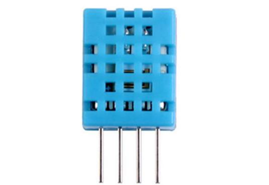
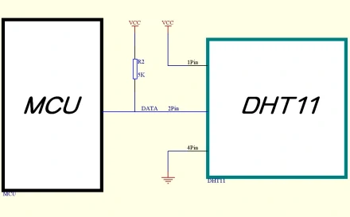
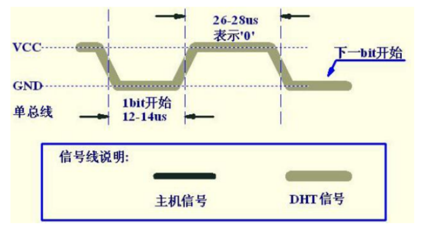
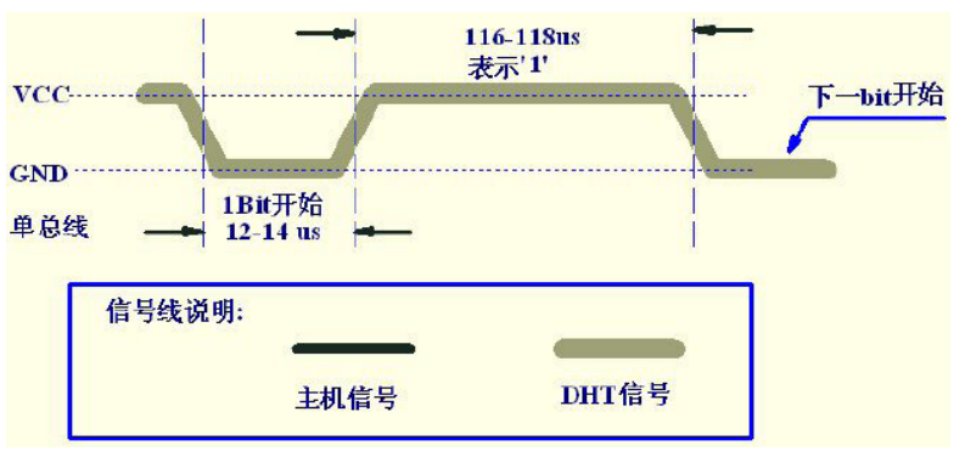

# 温湿度传感器采集

## 实验目的

本实验演示如何从从 DHT11 温湿度传感器读取数据并将读取到的温湿度发送到串口。

## DHT11 接口电路

### DHT11 及其接口

本实验使用的 DHT11 数字温湿度传感器是一款含有已校准数字信号输出的温湿度复合传感器。



DHT11 有 4 个引脚 pin

| 1              | 2                | 3    | 4              |
| -------------- | ---------------- | ---- | -------------- |
| VDD            | DATA             | NC   | GND            |
| 供电 3－5.5VDC | 串行数据，单总线 | 空脚 | 接地，电源负极 |

可见实际只有 3 个需要引出，而信号线只有一条 DATA 线



### DATA 线时序图

先进行通讯，也就是检查有没有 DHT11 模块

首先主机发送开始信号，即：拉低数据线，保持 t1（至少 18ms）时间，然后拉高数据线 t2（20-40us）时间，然后读取 DHT11 的响应，正常的话，DHT11 会拉低数据线，保持 t3 （40-50us）时间，作为响应信号，然后 DHT11 拉高数据线，保持 t4（40-50us）时间后，开始输出数据。


因为 DHT11 会发送 40 位的数据。

数据格式:

8bit 湿度整数数据+8bit 湿度小数数据 +8bi 温度整数数据+8bit 温度小数数据 +8bit 校验和

这 40 位的数据每一位的 0/1 状态又是怎么确定的呢？下图就是数字 0 和 1 的信号表示方法

- 数字 0 时序：



- 数字 1 时序：



## 关键代码注释

读取一个字节

```c
//读取一个字节数据
static void COM(void)    // 温湿写入
{
    uchar i;
    for(i=0;i<8;i++)
    {
        ucharFLAG=2;
        //等待IO口变低，变低后，通过延时去判断是0还是1
        while((getData()==0)&&ucharFLAG++) ets_delay_us(10);
        ets_delay_us(35);//延时35us
        uchartemp=0;

        //如果这个位是1，35us后，还是1，否则为0
        if(getData()==1)
          uchartemp=1;
        ucharFLAG=2;

        //等待IO口变高，变高后，表示可以读取下一位
        while((getData()==1)&&ucharFLAG++)
          ets_delay_us(10);
        if(ucharFLAG==1)
          break;
        ucharcomdata<<=1;
        ucharcomdata|=uchartemp;
    }

}
```

逐个字节读取并返回值

```c
if(!getData())//表示传感器拉低总线
    {
        ucharFLAG=2;
        //等待总线被传感器拉高
        while((!getData())&&ucharFLAG++)
          ets_delay_us(10);
        ucharFLAG=2;
        //等待总线被传感器拉低
        while((getData())&&ucharFLAG++)
          ets_delay_us(10);
        COM();//读取第1字节，
        ucharRH_data_H_temp=ucharcomdata;
        COM();//读取第2字节，
        ucharRH_data_L_temp=ucharcomdata;
        COM();//读取第3字节，
        ucharT_data_H_temp=ucharcomdata;
        COM();//读取第4字节，
        ucharT_data_L_temp=ucharcomdata;
        COM();//读取第5字节，
        ucharcheckdata_temp=ucharcomdata;
        OutputHigh();
        //判断校验和是否一致
        uchartemp=(ucharT_data_H_temp+ucharT_data_L_temp+ucharRH_data_H_temp+ucharRH_data_L_temp);
        if(uchartemp==ucharcheckdata_temp)
        {
            //校验和一致，
            ucharRH_data_H=ucharRH_data_H_temp;
            ucharRH_data_L=ucharRH_data_L_temp;
            ucharT_data_H=ucharT_data_H_temp;
            ucharT_data_L=ucharT_data_L_temp;
            ucharcheckdata=ucharcheckdata_temp;
            //保存温度和湿度
            Humi=ucharRH_data_H;
            Humi_small=ucharRH_data_L;
            Temp=ucharT_data_H;
            Temp_small=ucharT_data_L;
        }
        else
        {
          Humi=100;
          Temp=100;
        }
    }
    else //没用成功读取，返回0
    {
    	Humi=0,
    	Temp=0;
    }
```

## 实验内容

### 源代码参考

参见[参考资料与源代码](../../reference.rst)

### 硬件链接

- ESP32 开发板、microUSB 线、电脑。
- 将 DHT11 传感器通过杜邦线连接到开发板上。

注意传感器插入方向，不要插反！！！

### 代码调试

使用 idf.py 以及 clion 管理项目，编码，build, flash

打开串口调试器，将会收到读取到的温湿度信息

> ❗ 注意：是串口调试器！不是`monitor`！

您将从串口调试器收到以下输出：

```bash
Temp=25.6d℃--Humi=60.3%RH
Temp=25.6d℃--Humi=60.3%RH
Temp=25.9d℃--Humi=61.4%RH
Temp=25.9d℃--Humi=61.4%RH
Temp=25.6d℃--Humi=61.4%RH
Temp=25.6d℃--Humi=60.3%RH
Temp=25.6d℃--Humi=60.3%RH
```
