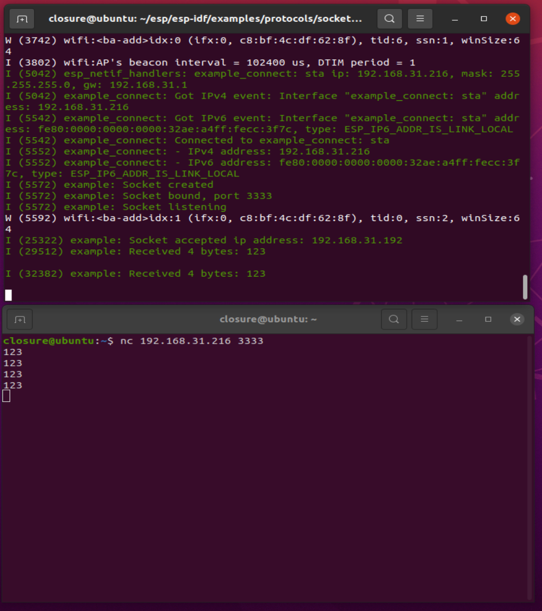
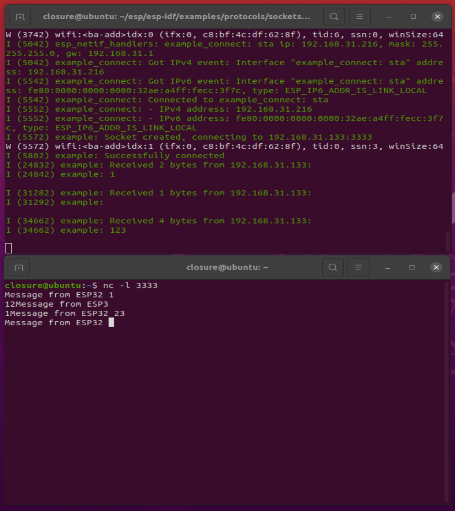

# TCP Server and Client

TCP即传输控制协议（TCP Transmission Control Protocol）,其基本原理是：

1. TCP是面向连接的运输层协议。 这就是说， 应用程序在使用TCP协议之前， 必须先建立TCP连接。 在传送数据完毕后， 必须释放已经建立的TCP连接。 也就是说， 应用进程之间的通信好像在 “ 打电话”：通话前要先拨号建立连接， 通话结束后要挂机释放连接。
2. 每一条TCP连接只能有两个端点（endpoint）， 每一条TCP连接只能是点对点的（一对一 ）。
3. TCP提供可靠交付的服务。 通过TCP连接传送的数据， 无差错、 不丢失、 不重复，并且按序到达。
4. TCP 提供全双工通信。 TCP允许通信双方的应用进程在任何时候都能发送数据。 TCP连接的两端都设有发送缓存和接收缓存， 用来临时存放双向通信的数据。 在发送时，应用程序在把数据传送给TCP的缓存后， 就可以做自己的事， 而TCP在合适的时候把数据发送出去。 在接收时， TCP把收到的数据放入缓存， 上层的应用进程在合适的时候读取缓 存中的数据。
5. 面向字节流。 TCP中的 “ 流” （stream）指的是流入到进程或从进程流出的字节序列。 面向字节流” 的含义是： 虽然应用程序和TCP的交互是一次 一个数据块（大小不等）， 但TCP把应用程序交下来的数据仅仅看成是一连串的无结构的字节流。

## ESP-IDF TCP API详解

### `socket()`

socket这个函数的功能是向内核申请一个套接字

```c
#define socket(domain,type,protocol)   lwip_socket(domain,type,protocol)

int lwip_socket(int domain, int type, int protocol);

#define AF_UNSPEC       0
#define AF_INET         2
#if LWIP_IPV6
#define AF_INET6        10
#else /* LWIP_IPV6 */
#define AF_INET6        AF_UNSPEC

/* Socket 服务类型 (TCP/UDP/RAW) */
#define SOCK_STREAM 1
#define SOCK_DGRAM 2
#define SOCK_RAW 3
```

**函数形参含义如下：**

- **`domain` ：** 表示该套接字使用的协议簇，对于 TCP/IP 协议来说，IPv4为 AF_INET；IPv6为AF_INET6。
- `Type`： 指定了套接字使用的服务类型，可能的类型有 3 种：
  - `SOCK_STREAM`：提供可靠的（即能保证数据正确传送到对方）面向连接的 Socket 服务，多
     用于资料（如文件）传输，如 TCP 协议。
  - `SOCK_DGRAM`：是提供无保障的面向消息的 Socket 服务，主要用于在网络上发广播信息，
     如 UDP 协议，提供无连接不可靠的数据报交付服务。
  - `SOCK_RAW`：表示原始套接字，它允许应用程序访问网络层的原始数据包，这个套接字用得比较少，暂时不用理会它。

- `protocol` ：指定了套接字使用的协议，在 IPv4 中，只有 TCP 协议提供 `SOCK_STREAM` 这种可靠的服务，只有 UDP 协议提供 `SOCK_DGRAM` 服务，对于这两种协议，protocol 的值均为 0。当申请套接字成功的时候，该函数返回一个 int 类型的值，也是 Socket 描述符，用户通过这个值可以索引到一个 Socket 连接结构——`lwip_sock`，当申请套接字失败时，该函数返回-1。

### `sendto()`

这个函数主要是用于 UDP 协议传输数据中，它向另一端的 UDP 主机发送一个 UDP 报文，

- 参数 `dataptr` 指定了要发送数据的起始地址，而 参数size 则指定数据的长度，
- 参数 `flag` 指定了发送时候的一些处理，比如外带数据等，此时我们不需要理会它，一般设置为 0 即可，
- 参数 `to` 是一个指向 `sockaddr` 结构体的指针，在这里需要我们自己提供远端主机的 IP 地址与端口号，并且用 `tolen` 参数指定这些信息的长度，具体如下

```c
#define sendto(s,dataptr,size,flags,to,tolen)  lwip_sendto(s,dataptr,size,flags,to,tolen)
ssize_t lwip_sendto(int s, const void *data, size_t size, int flags,const struct sockaddr *to, socklen_t tolen)
```

### `read()、recv()、recvfrom()`

`read()` 与 `recv()` 函数的核心是调用 `recvfrom()` 函数，`recv()` 与 `read()` 函数用于从 Socket 中接收数据，它们可以是 TCP 协议和 UDP 协议。

```c
#define read(s,mem,len)   lwip_read(s,mem,len)
ssize_t lwip_read(int s, void *mem, size_t len)
{
return lwip_recvfrom(s, mem, len, 0, NULL, NULL);
}

#define recv(s,mem,len,flags)  lwip_recv(s,mem,len,flags)
ssize_t lwip_recv(int s, void *mem, size_t len, int flags)
{
return lwip_recvfrom(s, mem, len, flags, NULL, NULL);
}

#define recvfrom(s,mem,len,flags,from,fromlen)  lwip_recvfrom(s,mem,len,flags,from,fromlen)
ssize_t lwip_recvfrom(int s, void *mem, size_t len, int flags,struct sockaddr *from, socklen_t *fromlen)
```

- **men 参数 ** 记录了接收数据的缓存起始地址，

- **len参数** 用于指定接收数据的最大长度，如果函数能正确接收到数据，将会返回一个接收到数据的长度，否则将返回-1，若返回值为 0，表示连接已经终止，应用程序可以根据返回的值进行不一样的操作。

- **flags 参数**我们暂时可以直接忽略它，设置为 0 即可。
  注意，如果接收的数据大于用户提供的缓存区，那么多余的数据会被直接丢弃。

### `close()`

close() 函数是用于关闭一个指定的套接字，在关闭套接字后，将无法使用对应的套接字描述符索引到连接结构，该函数的本质是对 netconn_delete() 函数的封装（真正处理的函数是 net-conn_prepare_delete()），如果连接是 TCP 协议，将产生一个请求终止连接的报文发送到对端主机中，如果是 UDP 协议，将直接释放 UDP 控制块的内容，具体如下

```c
#define close(s)   lwip_close(s)
int lwip_close(int s)
```

### `connect()`

connect这个函数用于客户端中，将 Socket 与远端 IP 地址、端口号进行绑定，在 TCP 客户端连接中，调用这个函数将发生握手过程（会发送一个 TCP 连接请求），并最终建立新的 TCP 连接，而对于 UDP协议来说，调用这个函数只是在 UDP 控制块中记录远端 IP 地址与端口号，而不发送任何数据，参数信息与 bind() 函数是一样的

```c
#define connect(s,name,namelen)  lwip_connect(s,name,namelen)
intlwip_connect(int s,const struct sockaddr *name,socklen_t namelen);
```

### `send()`

send() 函数可以用于 UDP 协议和 TCP 连接发送数据。在调用 send() 函数之前，必须使用 connect()函数将远端主机的 IP 地址、端口号与 Socket 连接结构进行绑定。对于 UDP 协议，send() 函数将调用 lwip_sendto() 函数发送数据，而对于 TCP 协议，将调用 netconn_write_partly() 函数发送数据。相对于 sendto() 函数，参数基本是没啥区别的，但无需我们设置远端主机的信息，更加方便操作，因此这个函数在实际中使用也是很多的，具体

```c
#define send(s,dataptr,size,flags)   lwip_send(s,dataptr,size,flags)
ssize_t lwip_send(int s, const void *data, size_t size, int flags)
```

### `bind()`

bind该函数用于服务器端绑定套接字与网卡信息

```c
#define bind(s,name,namelen)   lwip_bind(s,name,namelen)
int lwip_bind(int s,const struct sockaddr *name,socklen_t namelen);
```

**参数 s** 是表示要绑定的 Socket 套接字，注意了，这个套接字必须是从 socket() 函数中返回的索引，否则将无法完成绑定操作。

**参数 name** 是一个指向 sockaddr 结构体的指针，其中包含了网卡的 IP 地址、端口号等重要的信息，LwIP 为了更好描述这些信息，使用了 sockaddr 结构体来定义了必要的信息的字段，它常被用于Socket API 的很多函数中，我们在使用 bind() 的时候，只需要直接填写相关字段即可，sockaddr 结构体如下

参数 s 是表示要绑定的 Socket 套接字，注意了，这个套接字必须是从 socket() 函数中返回的索引，否则将无法完成绑定操作。
参数 name 是一个指向 sockaddr 结构体的指针，其中包含了网卡的 IP 地址、端口号等重要的信息，LwIP 为了更好描述这些信息，使用了 sockaddr 结构体来定义了必要的信息的字段，它常被用于Socket API 的很多函数中，我们在使用 bind() 的时候，只需要直接填写相关字段即可，sockaddr 结构体如下

```c
struct sockaddr {
  u8_t        sa_len;        /*长度*/
  sa_family_t sa_family;     /*协议簇*/
  char        sa_data[14];   /* 连续的 14 字节信息 */
};
```

我们需要填写的 IP 地址与端口号等信息，都在 sa_data 连续的 14 字节信息里面，但是这个数据对我们不友好，因此 LwIP还定义了另一个对开发者更加友好的结构体——sockaddr_in，我们一般也是用这个结构体

```c
struct sockaddr_in
{
	u8_t sin_len;
	sa_family_t sin_family;
	in_port_t sin_port;
	struct in_addr sin_addr;
	#define SIN_ZERO_LEN 8
	char sin_zero[SIN_ZERO_LEN];
};
```

这个结构体的前两个字段是与 sockaddr 结构体的前两个字段一致，而剩下的字段就是 sa_data 连续的 14 字节信息里面的内容，只不过从新定义了成员变量而已，sin_port 字段是我们需要填写的端口号信息，sin_addr 字段是我们需要填写的 IP 地址信息，剩下 sin_zero 区域的 8 字节保留未用。
但在本章实验中为了兼容IPv6，所以初始定义时都是使用sockaddr_in6结构体，如下所示

```c
struct sockaddr_in6 {
  u8_t            sin6_len;      /* length of this structure    */
  sa_family_t     sin6_family;   /* AF_INET6                    */
  in_port_t       sin6_port;     /* Transport layer port #      */
  u32_t           sin6_flowinfo; /* IPv6 flow information       */
  struct in6_addr sin6_addr;     /* IPv6 address                */
  u32_t           sin6_scope_id; /* Set of interfaces for scope */
};
```


如果使用的是IPv4则会强制转化为sockaddr_in

```c
struct sockaddr_in6 dest_addr;
if (addr_family == AF_INET)
{
   struct sockaddr_in *dest_addr_ip4 = (struct sockaddr_in *)&dest_addr;
}
```

### `listen()`

该函数只能在 TCP 服务器中使用，让服务器进入监听状态，等待远端的连接请求，LwIP 中可以接收多个客户端的连接，因此参数 backlog 指定了请求队列的大小，具体如下

```c
#define listen(s,backlog)   lwip_listen(s,backlog)
intlwip_listen(int s, int backlog);
```

**参数 s** 是表示要绑定的 Socket 套接字，注意了，这个套接字必须是从 socket() 函数中返回的索引，否则将无法完成绑定操作。

**参数 backlog**指定服务器可连接客户端的数量。

### `accept()`

accept() 函数用于 TCP 服务器中，等待着远程主机的连接请求，并且建立一个新的 TCP 连接，在调用这个函数之前需要通过调用 listen() 函数让服务器进入监听状态。accept() 函数的调用会阻塞应用线程直至与远程主机建立 TCP 连接。同时函数返回一个 int 类型的套接字描述符，根据它能索引到连接结构，如果连接失败则返回-1，具体如下

```c
#define accept(s,addr,addrlen)   lwip_accept(s,addr,addrlen)
int  lwip_accept(int s,struct sockaddr *addr,socklen_t *addrlen)
```

**参数 s** 是表示要绑定的 Socket 套接字，注意了，这个套接字必须是从 socket() 函数中返回的索引，否则将无法完成绑定操作。

**参数 addr** 是一个返回结果参数，其实就是远程主机的地址与端口号等信息，当新的连接已经建立后，远端主机的信息将保存在连接句柄中，它能够唯一的标识某个连接对象。

### `setsockopt()`

看名字就知道，这个函数是用于设置套接字的一些选项的，参数 level 有多个常见的选项，如：
• SOL_SOCKET：表示在 Socket 层。
• IPPROTO_TCP：表示在 TCP 层。
• IPPROTO_IP：表示在 IP 层。
参数 optname 表示该层的具体选项名称，比如：

1. 对于 SOL_SOCKET 选项，可以是 SO_REUSEADDR（允许重用本地地址和端口） 、SO_SNDTIMEO（设置发送数据超时时间）、SO_SNDTIMEO（设置接收数据超时时间）、SO_RCVBUF（设置发送数据缓冲区大小）等等。
2. 对于 IPPROTO_TCP 选项，可以是 TCP_NODELAY（不使用 Nagle 算法）、TCP_KEEPALIVE
   （设置 TCP 保活时间）等等。
3. 对于 IPPROTO_IP 选项，可以是 IP_TTL（设置生存时间）、IP_TOS（设置服务类型）等等。

```c
#define setsockopt(s,level,optname,opval,optlen) \
lwip_setsockopt(s,level,optname,opval,optlen)
int
lwip_setsockopt(int s,
int level,
int optname,
const void *optval,
socklen_t optlen)
```


## 实验内容

包含以下两个实验：

1. ESP32作TCP server，网络调试助手`Netcat`作TCP client
2. ESP32作TCP client，网络调试助手`Netcat`做TCP server

### 网络调试助手`netcat`

Netcat，也称为nc，是一个网络工具，用于在计算机网络上进行数据传输和调试。它可以在不同计算机之间建立连接，并允许通过TCP或UDP协议发送和接收数据。

Netcat具有多种用途和功能，例如：
1. 端口扫描：通过指定目标IP地址和端口范围，可以使用Netcat来扫描目标主机上开放的端口。
2. 文件传输：Netcat可以在两台计算机之间传输文件，作为简单的文件传输工具使用。
3. 远程控制：通过建立反向连接或反向shell，可以使用Netcat来远程控制另一台计算机。
4. 网络调试：Netcat可以用于测试网络连接、发送和接收数据，以及检查网络服务的可用性。

Netcat的命令行界面简单易用，具有许多选项和参数，可以根据需要进行配置和定制。它在计算机安全领域、系统管理和网络开发中广泛使用，并被认为是一种功能强大的网络工具。

输入：`nc -h`查看使用帮助。

### 所需硬件

 ESP32开发板、microUSB 线、电脑。

### 配置项目

**命令行界面**

```bash
cd /示例对应的目录
get-idf
idf.py menuconfig
```

**Clion界面**

- 选择示例的文件夹并用Clion打开

- 添加各项配置（参考Clion下ESP-IDF的配置与开发）

- 选择 menuconfig 并运行

- 配置WIFI连接热点，PC和ESP32连接到同一个AP接入点，即必须在同一个网络中。

- 设置WiFi SSID

- 设置WiFi Password

- 选择 示例名.elf|Debug  并运行


### 构建和烧录

构建项目并将其烧写到板上，然后运行监控工具查看串行输出：

**命令行界面：**

```bash
idf.py -p PORT flash monitor
```

（要退出串行监视器，请键入Ctrl-]。）

**Clion界面：**

- 选择 flash 并运行

- 选择 monitor 并运行


### 交互操作与输出

- **ESP32作TCP server，网络调试助手作TCP client时**

在烧录完成代码开始运行并打开监视器后，新打开一个终端，输入

```bash
nc esp32-ipaddr 3333
# esp32-ipaddr esp32链接wifi后自身的ip地址 
# 你设置的端口，默认为3333
```

然后即可向ESP32发送字符，ESP32收到后会在监视器中显示，如图：



- **ESP32作TCP client，网络调试助手做TCP server**，

请在配置时设置ip和端口，并且保证ip为电脑的ip，使用以下代码查看,如果报错提示未安装安装即可，

请以`ifconfig`或`ip -4 a`获取本机ip地址，请以自己的为准！！！

```bash
@ubuntu:~$ ifconfig
ens33: flags=4163<UP,BROADCAST,RUNNING,MULTICAST>  mtu 1500
        inet 192.168.131.133  netmask 255.255.255.3  broadcast 192.168.31.255
        inet6 fe80::68cbe0:7248  prefixlen 64  scopeid 0x20<link>
        ether 00:0c:29:82:fd:0e  txqueuelen 1000  (以太网)
        RX packets 950  bytes 225709 (225.7 KB)
        RX errors 0  dropped 0  overruns 0  frame 0
        TX packets 669  bytes 83405 (83.4 KB)
        TX errors 0  dropped 0 overruns 0  carrier 0  collisions 0

lo: flags=7<UP,LOOPBACK,RUNNING>  mtu 
        inet 127.0.0.1  netmask 255.0.0.0
        inet6 ::1  prefixlen 128  scopeid 0x10<host>
        loop  txqueuelen 1000  (本地环回)
        RX packets 206  bytes 18250 (18.2 KB)
        RX errors 0  dropped 0  overruns 0  frame 0
        TX packets 206  bytes 18250 (18.2 KB)
        TX errors 0  dropped 0 overruns 0  carrier 0  collisions 0
```

在烧录完成后，开始运行并打开监视器，新打开一个终端，输入

```bash
nc -l 3333
#（对应自设置的端口，默认3333）
```

然后即可收到ESP32发送的字符，ESP32也能收到电脑端发送的并会在监视器中显示，如图。




## 源代码参考

参见[参考资料与源代码](../../reference.rst)

