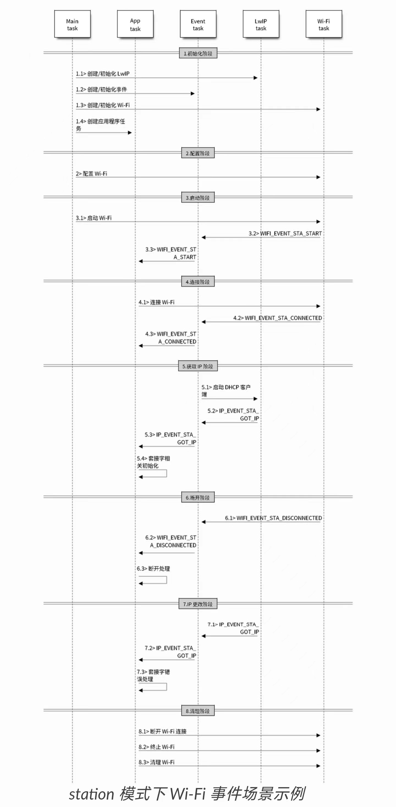

# Station 模式

## 实验目的

Station(基站)模式，又称 STA 模式或 Client 模式。

本实验目的是将 ESP32 设备连接到附近的 AP 接入点。

## 内容详解

### 设置 WiFi 接入点参数

WiFi 连接接入点 AP 的主要参数有：接入点 SSID，接入点密码，以及最大连接次数, 如下图，宏定义在`station_example_main.c`中，可直接在在文件中修改，也可使用 `idf.py menuconfig`中修改

```c
#define EXAMPLE_ESP_WIFI_SSID      CONFIG_ESP_WIFI_SSID			//WiFi接入点名
#define EXAMPLE_ESP_WIFI_PASS      CONFIG_ESP_WIFI_PASSWORD		//WiFi接入点密码
#define EXAMPLE_ESP_MAXIMUM_RETRY  CONFIG_ESP_MAXIMUM_RETRY		//最大重连次数
```

```c
wifi_config_t wifi_config = {
    .sta = {
        .ssid = EXAMPLE_ESP_WIFI_SSID,
        .password = EXAMPLE_ESP_WIFI_PASS,
        /* Setting a password implies station will connect to all security modes including WEP/WPA.
         * 设置密码意味着工作站将连接到所有安全模式，包括 WEP/WPA。
         * However these modes are deprecated and not advisable to be used. Incase your Access point
         * doesn't support WPA2, these mode can be enabled by commenting below line
         * 但是，这些模式已被弃用，不建议使用。以防万一您的接入点不支持 WPA2，这些模式可以通过下面的注释来启用*/
  .threshold.authmode = WIFI_AUTH_WPA2_PSK,
    },
```

其中主要用到了 wifi_sta_config_t 这个结构体，它的内容如下所示

```c
typedef struct {
    uint8_t ssid[32];//SSID
    uint8_t password[64];//密码
    bool bssid_set;//是否设置目标AP的MAC地址，一般设为0；只有用户需要查看AP的MAC地址时才设为1
    uint8_t bssid[6];//目标AP的MAC地址
    uint8_t channel;//目标AP的通道，如果未知设为0；范围是1-13
} wifi_sta_config_t;
```

### API

WIFI 的 API 定义在`esp_wifi.h`头文件中，希望深入了解的同学可以自行前往该头文件进行阅读并理解 WiFi 深层次的知识。

- WiFi 驱动可以看成是黑盒，它对高层代码一无所知，比如 TCPIP 栈、应用程序任务、事件任务等，它所能做的就是接收来自高层的 API 调用或将事件队列发布到指定的队列，由 API `esp_wifi_init()` 初始化。
- 事件任务是一个守护任务，它接收来自 WiFi 驱动程序或其他子系统的事件，例如作为 TCPIP 栈，事件任务在接收到事件时会调用默认的回调函数。例如在接收到事件 `SYSTEM_EVENT_STA_CONNECTED` 时，它会调用 `tcpip_adapter_start()` 来启动 DHCP 客户端在它的默认处理程序中。
- 应用可以通过 API `esp_event_init`注册自己的事件回调函数，然后应用回调函数将在默认回调之后调用。此外，如果应用程序不想执行回调，在事件任务中，它需要做的是在应用回调函数中将相关事件发布到应用任务。
- 应用程序任务（代码）通常将所有这些东西混合在一起，它调用 API 来初始化系统/WiFi 和必要时处理事件。

下图为 station 模式下的宏观场景，其中包含不同阶段的具体描述：



## Wi-Fi station 模式示例

此示例说明如何使用 ESP 的 Wi-Fi 驱动程序将 Wi-Fi Station 连接到接入点。

请同学们使用手机开热点并设置密码，将热点名称和密码输入到 ESP32 初始化。或使用实验室 WiFi 热点：

```shell
SSID:	iot
PASS: iot@Gdpu3721
```

### 配置 WiFi 接入点参数

打开项目配置功能：`idf.py menuconfig`

在`Example Configuration`菜单中：

- 设置 WiFi SSID。
- 设置 WiFi Password。
- 设置 Maxmum Retry

可选：如果需要，请根据您的要求更改其他选项。

### 构建和烧录

构建项目并将其烧写到板上，然后运行监控工具查看串行输出，两种方法：

1. 在终端中进入命令行界面：

`idf.py -p PORT flash monitor` （要退出串行监视器，请键入 Ctrl-]。）

2. 在 Clion 进入视窗界面：
   1. 选择 flash 并运行
   2. 选择 monitor 并运行

### 示例输出

请注意，输出，特别是输出的顺序，可能会因环境而异。

如果站连接到 AP 成功，控制台输出：

```
I (589) wifi station: ESP_WIFI_MODE_STA
I (599) wifi: wifi driver task: 3ffc08b4, prio:23, stack:3584, core=0
I (599) system_api: Base MAC address is not set, read default base MAC address from BLK0 of EFUSE
I (599) system_api: Base MAC address is not set, read default base MAC address from BLK0 of EFUSE
I (629) wifi: wifi firmware version: 2d94f02
I (629) wifi: config NVS flash: enabled
I (629) wifi: config nano formating: disabled
I (629) wifi: Init dynamic tx buffer num: 32
I (629) wifi: Init data frame dynamic rx buffer num: 32
I (639) wifi: Init management frame dynamic rx buffer num: 32
I (639) wifi: Init management short buffer num: 32
I (649) wifi: Init static rx buffer size: 1600
I (649) wifi: Init static rx buffer num: 10
I (659) wifi: Init dynamic rx buffer num: 32
I (759) phy: phy_version: 4180, cb3948e, Sep 12 2019, 16:39:13, 0, 0
I (769) wifi: mode : sta (30:ae:a4:d9:bc:c4)
I (769) wifi station: wifi_init_sta finished.
I (889) wifi: new:<6,0>, old:<1,0>, ap:<255,255>, sta:<6,0>, prof:1
I (889) wifi: state: init -> auth (b0)
I (899) wifi: state: auth -> assoc (0)
I (909) wifi: state: assoc -> run (10)
I (939) wifi: connected with #!/bin/test, aid = 1, channel 6, BW20, bssid = ac:9e:17:7e:31:40
I (939) wifi: security type: 3, phy: bgn, rssi: -68
I (949) wifi: pm start, type: 1

I (1029) wifi: AP's beacon interval = 102400 us, DTIM period = 3
I (2089) esp_netif_handlers: sta ip: 192.168.77.89, mask: 255.255.255.0, gw: 192.168.77.1
I (2089) wifi station: got ip:192.168.77.89
I (2089) wifi station: connected to ap SSID:myssid password:mypassword
```

站点连接 AP 失败时的控制台输出：

```
I (589) wifi station: ESP_WIFI_MODE_STA
I (599) wifi: wifi driver task: 3ffc08b4, prio:23, stack:3584, core=0
I (599) system_api: Base MAC address is not set, read default base MAC address from BLK0 of EFUSE
I (599) system_api: Base MAC address is not set, read default base MAC address from BLK0 of EFUSE
I (629) wifi: wifi firmware version: 2d94f02
I (629) wifi: config NVS flash: enabled
I (629) wifi: config nano formating: disabled
I (629) wifi: Init dynamic tx buffer num: 32
I (629) wifi: Init data frame dynamic rx buffer num: 32
I (639) wifi: Init management frame dynamic rx buffer num: 32
I (639) wifi: Init management short buffer num: 32
I (649) wifi: Init static rx buffer size: 1600
I (649) wifi: Init static rx buffer num: 10
I (659) wifi: Init dynamic rx buffer num: 32
I (759) phy: phy_version: 4180, cb3948e, Sep 12 2019, 16:39:13, 0, 0
I (759) wifi: mode : sta (30:ae:a4:d9:bc:c4)
I (769) wifi station: wifi_init_sta finished.
I (889) wifi: new:<6,0>, old:<1,0>, ap:<255,255>, sta:<6,0>, prof:1
I (889) wifi: state: init -> auth (b0)
I (1889) wifi: state: auth -> init (200)
I (1889) wifi: new:<6,0>, old:<6,0>, ap:<255,255>, sta:<6,0>, prof:1
I (1889) wifi station: retry to connect to the AP
I (1899) wifi station: connect to the AP fail
I (3949) wifi station: retry to connect to the AP
I (3949) wifi station: connect to the AP fail
I (4069) wifi: new:<6,0>, old:<6,0>, ap:<255,255>, sta:<6,0>, prof:1
I (4069) wifi: state: init -> auth (b0)
I (5069) wifi: state: auth -> init (200)
I (5069) wifi: new:<6,0>, old:<6,0>, ap:<255,255>, sta:<6,0>, prof:1
I (5069) wifi station: retry to connect to the AP
I (5069) wifi station: connect to the AP fail
I (7129) wifi station: retry to connect to the AP
I (7129) wifi station: connect to the AP fail
I (7249) wifi: new:<6,0>, old:<6,0>, ap:<255,255>, sta:<6,0>, prof:1
I (7249) wifi: state: init -> auth (b0)
I (8249) wifi: state: auth -> init (200)
I (8249) wifi: new:<6,0>, old:<6,0>, ap:<255,255>, sta:<6,0>, prof:1
I (8249) wifi station: retry to connect to the AP
I (8249) wifi station: connect to the AP fail
I (10299) wifi station: connect to the AP fail
I (10299) wifi station: Failed to connect to SSID:myssid, password:mypassword
```


## 源代码参考

参见[参考资料与源代码](../../reference.rst)
