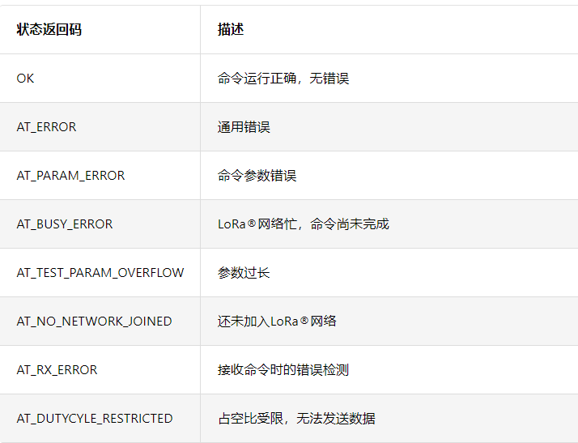
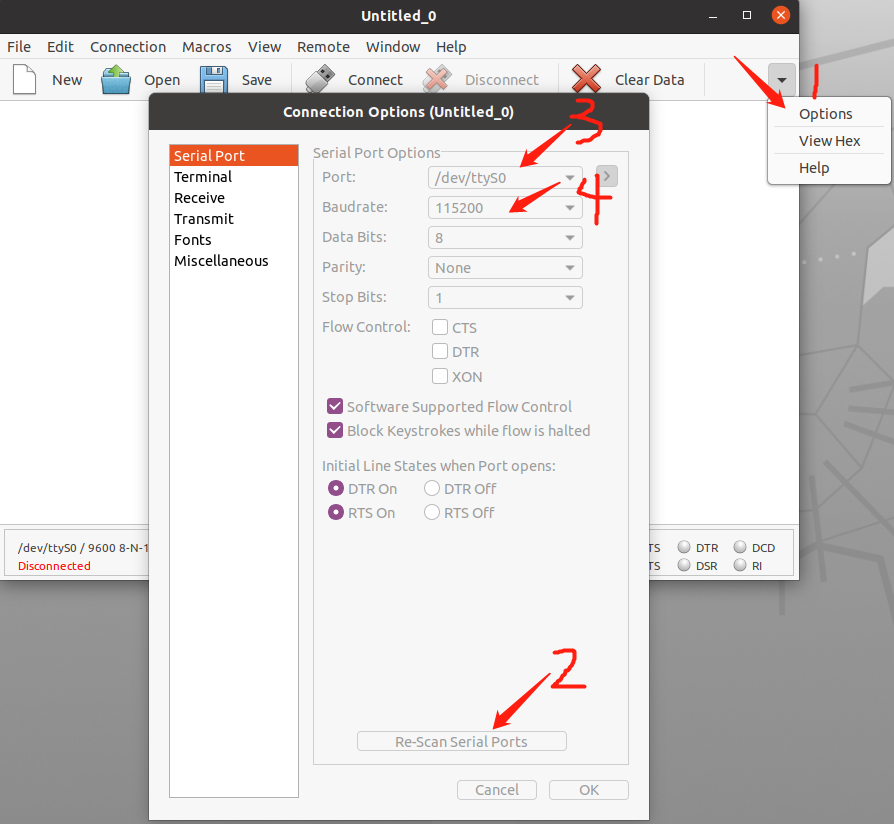
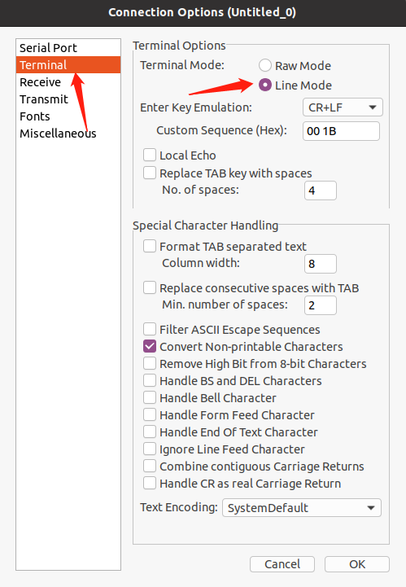
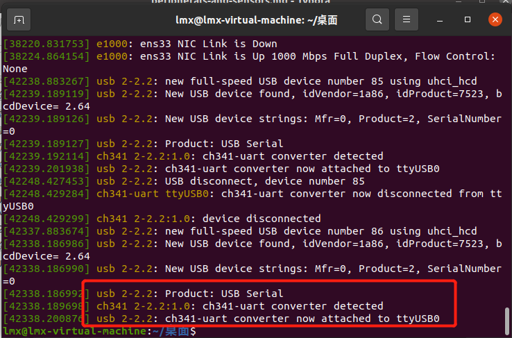
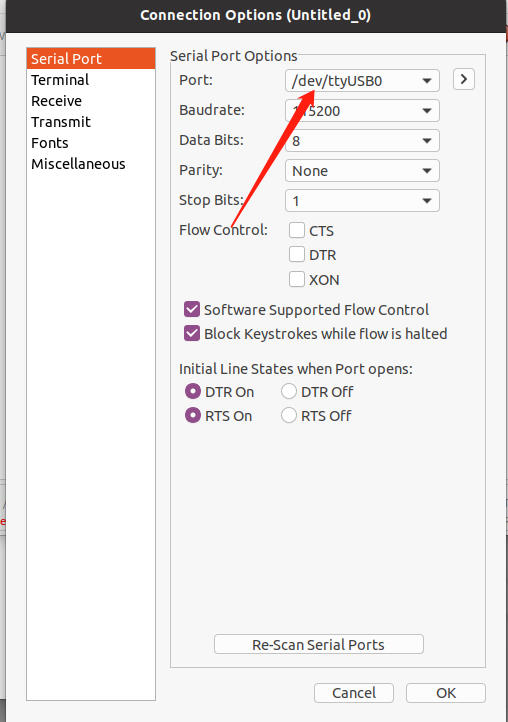
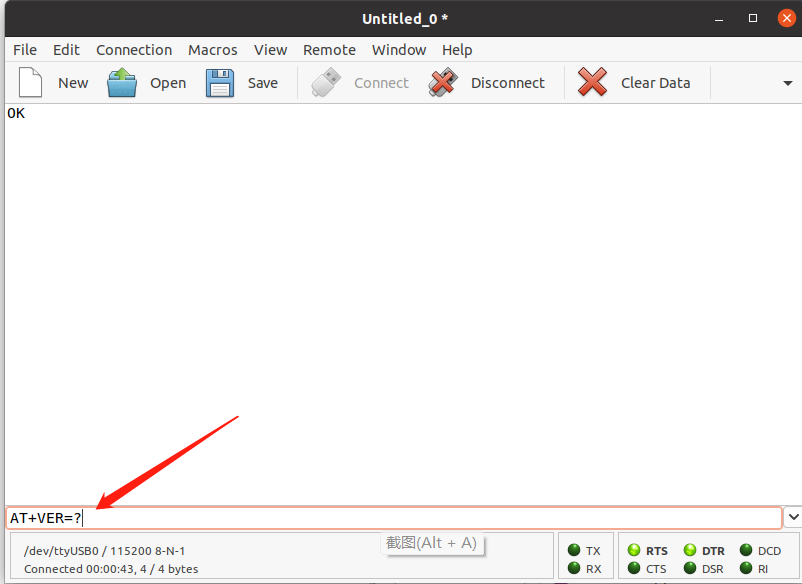
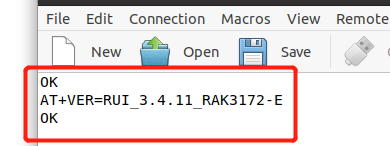

# LoRa AT指令操作

目前的 AT （Attention）指令着重应用在蜂窝模块（NB-IOT、2G/3G/4G等）、WiFi 模块、BLE 模块、LoRa模块中，目的是为了简化嵌入式设备联网的复杂度。

实验箱上的LoRa模块（RAK3172模块）集成了STM32WLE5CC MCU芯片，是专为简化LoRaWAN和LoRa® P2P（点对点）通信而设计的设备。使用UART接口发送AT命令，可轻松完成模块配置，将LoRa技术集成到项目中。可通过AT命令配置LoRa P2P和LoRaWAN通信所需的参数。也可以使用任何带有UART接口的微控制器来配置RAK3172模块。本章节我们将利用RAK3172模块来初步了解如何使用AT指令。参考链接:link: [RAK3172 WisDuo LPWAN模块](https://docs.rakwireless.com.cn/Product-Categories/WisDuo/RAK3172-Module/Overview/)


## 实验目的

- 了解实验箱上的RAK3172模块
- 学习AT指令的使用

## 准备工作

- ubuntu系统中安装CoolTerm和ch340驱动
- 初步了解AT指令语法

> 1. 命令输入：命令以 “AT"开头， 以<CR><LF>（即\r\n）结束，本文中的命令介绍都省略了“\r\n”。AT命令的标准格式“AT+XXX”，其中"XXX"表示命令。
>
>    **四种可用的命令操作：**
>
>    AT+XXX?，结尾为“?”，用于获取XXX命令的帮助，例如**AT+DEVEUI？**
>
>    AT+XXX，结尾没有“?”、“=?”和“<value>”，执行命令，例如**ATZ**
>
>    AT+XXX=?，结尾为“=?”，获取XXX命令的取值，例如**AT+CFS=?**
>
>    AT+XXX=<value>与，结尾为<value>，用于给XXX命令赋值，例如**AT+SEND=2:Hello**
>
> 2. 命令应答：命令输出通过UART端口返回。返回格式分为两部分：返回值和状态返回码。
>
>    <value><CR><LF>
>
>    <CR><LF><Status><CR><LF>
>
>    :exclamation:注意：<CR>代表“回车”，<LF>代表“换行”
>
>    - 运行 “AT+XXX?”或“AT+XXX=?” 命令时，将返回<value><CR><LF>和<CR><LF><Status><CR><LF>。“AT+XXX”和“AT+XXX=<value>”命令，没有返回值，只返回状态返回码。
>    - 每个命令(除了用于MCU复位的ATZ命令)都会返回一个状态字符串，格式为前后都是<CR><LF>的<CR><LF><Status><CR><LF>。可能的状态:
>
>    
>
> 关于AT指令的介绍到此为止，更详细的说明请参考RAK文档:link: [RAK3172 WisDuo LPWAN模块](https://docs.rakwireless.com.cn/Product-Categories/WisDuo/RAK3172-Module/Overview/)

### 硬件

- LoRa模块
- USB 数据线

### 软件

- CoolTerm

## 相关电路原理

实验所用的LoRa模块上有两个串口，串口1有USB转TTL芯片（ch340），可以用usb线直接与电脑连接进行通信，串口2用于与其他带有UART接口的微控制器来配置RAK3172模块。

## 实验步骤

- 通过USB接口与电脑通信，注意跳线帽的接法


- CoolTerm的设置，Port号可能不一样，根据实际情况进行设置，波特率为115200





> :exclamation:注意：在官方Linux内核版本中自Kernel2.6就默认包含了对USB转串口芯片CH340/CH341/CH9341/CH343芯片的驱动支持，其驱动所在位置：/lib/modules/5.15.0-46-generic/kernel/drivers/usb/serial，但并没有设置成开机加载，所以需要先加载CH340串口驱动。
>
> ```shell
> sudo modprobe ch341
> ```
>
> 然后查看系统工作情况。
>
> ```shell
> dmesg
> ```
>
> 
>
> 可以看到ch340驱动加载成功

- 选择ttyUSB0，点击**Connect**，不出意外的话会提示error，原因是使用USB端口时需要权限，普通用户没有权限，需要设置ttyUSB0的权限，但这样子会在电脑重启后又恢复系统默认的权限，还要重新设置，永久解决方法请自行百度了解。

```shell
sudo chmod 777 /dev/ttyUSB0
```




- 发送AT指令

在下面的输入框中输入AT指令，不用带\r\n，因为设置里面默认发送时自动加上\r\n，



该命令将返回LoRa模块的固件版本，如图为RUI_3.4.11_RAK3172-E，OK为状态返回码，命令运行正确，无错误就会返回OK。



## 常用AT指令

AT指令有很多，接下来列举在使用RAK3172模块时，常用的AT指令。

> AT+VER：固件版本，此命令允许用户访问固件的版本。
>
> AT+NJM：LoRa网络加入模式，此命令允许用户访问和配置网络加入模式。
>
> AT+BAND：区域频段，此命令用于访问和配置区域频段。
>
> AT+MASK：设置信道掩码，打开或关闭信道，此命令通过设置十六进制信道掩码来配置设备的信道。
>
> AT+CLASS：LoRaWAN®节点工作模式，此命令允许用户访问和配置LoRaWAN®节点工作模式。
>
> AT+DEVEUI：设备EUI，此命令允许用户访问和配置全局终端设备ID。
>
> AT+APPEUI：应用程序标识符，此命令允许用户访问和配置全局应用程序标识符。
>
> AT+APPKEY：应用程序密钥，此命令允许用户访问和配置应用程序密钥。
>
> AT+CFM：确认模式，此命令允许用户访问和配置设备的负载类型。
>
> AT+JOIN：加入LoRa® 网络，此命令向LoRa®网络发出加入请求。
>
> AT+SEND：发送数据，此命令提供了在专用端口号上发送数据的格式。
>
> AT+NWM：LoRa®网络工作模式，此命令允许用户访问和配置LoRa®网络工作模式，切换到P2P或LoRaWAN，0：P2P，1：LoRaWAN。
>
> AT+P2P：P2P参数统一配置，此命令允许用户访问和配置P2P模式所有参数。
>
> AT+PSEND：P2P发送数据，此命令提供P2P发送数据的格式。
>
> ATE：设置命令回显，此命令设置命令回显打开或关闭。
>
> AT+DEVEUI：设备EUI，此命令允许用户访问和配置全局终端设备ID。
>
> AT+NJS：LoRa® 网络加入状态，此命令允许用户访问LoRa®网络连接的当前状态。

其余AT指令请参考:link: [RAK3172 WisDuo LPWAN模块](https://docs.rakwireless.com.cn/Product-Categories/WisDuo/RAK3172-Module/Overview/)
