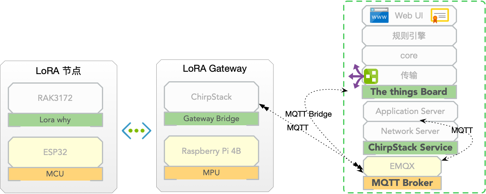

# 基于ESP32的LoRaWan节点通信

## 实验目的

- lora节点与lorawan网关之间的通信
- chirpstack平台管理与应用
- chirpstack与thingsboard集成

## 实验方案

### 所需软硬件

- lora节点：ESP32+ RAK3172
- LORA 网关： RaspberryPi4 + RAK2275 + Chirpstack Gateway Bridge
- Chirpstack 平台

### 网络方案

## chirpstack

ChirpStack 是一个开源的物联网 (IoT) 应用和设备管理平台，旨在简化和加强物联网解决方案的开发和管理。它提供了一个端到端的解决方案，包括设备管理、应用程序开发、数据管理和集成。

ChirpStack 通过使用 LoRaWAN® 网络协议来连接和管理物联网设备。LoRaWAN 是一种低功耗、长距离无线通信协议，非常适用于物联网应用。ChirpStack 支持与多种 LoRaWAN 网络服务器进行集成，例如 Semtech 的 LoRa Server 和其他兼容的网络服务器。

ChirpStack 提供了一套功能强大的工具和界面，帮助开发者管理物联网设备。它包括以下主要组件：

1. 网关管理器 (Gateway Bridge)：用于与物联网网关进行通信，接收从设备发送的数据，并将其传递给网络服务器。
2. 网络服务器 (Network Server)：处理从设备和网关收到的数据，并负责验证和解析数据包。它还提供设备管理、设备活动监控和安全认证等功能。
3. 应用服务器 (Application Server)：提供应用程序开发和集成的功能。它可以接收从设备发送的数据，并根据开发者定义的规则进行处理、存储和转发数据。开发者可以使用应用服务器来构建自定义的 IoT 应用程序和集成其他系统。
4. 用户界面 (User Interface)：ChirpStack 提供了一个用户友好的界面，用于管理设备、应用程序和网络服务器的各个方面。开发者可以使用界面来监控设备的状态、配置应用程序和进行故障排除。

ChirpStack 的开源性质使得开发者可以自由地定制和扩展平台的功能，以满足特定的物联网解决方案需求。它支持多种操作系统和硬件平台，使得部署和集成变得更加灵活和可靠。

总而言之，ChirpStack 是一个功能强大的开源物联网平台，通过集成 LoRaWAN 网络协议，提供了完整的设备管理、应用程序开发和数据管理解决方案，帮助开发者构建可靠和可扩展的物联网应用。

## 实验步骤

chirpstack地址：http://8.134.62.44:8081

### 添加网关

进入到chirpstack UI ，然后：

> `Gateways|Add gateway`
>
> - name 
> - Gateway ID (如何获取 Gateway ID)
> - Submit

### 添加设备描述

进入到[chirpstack UI](http://8.134.62.44:8081) ，然后：

- `Device profiles | Add device profile` ，填写入下内容：
  - Name
  
  - Regin：CN470
  
  - MAC Version：LoraWan 1.0.3
  
  - Regional parameters revision: A
  
  - ADR algorithm: Default
  
- Submit

### 添加应用

进入到[chirpstack UI](http://8.134.62.44:8081) ，然后：

1. `Applications | Add application`
   - name 
   - Description
2. `Submit`

### 在应用中添加设备

进入到[chirpstack UI](http://8.134.62.44:8081) ，然后：

1. `Application|「选择应用」|Add device|`

   1. 填写你的设备
   2. 填写Device EUI ,由`at+deveui=?`获取。
   3. 选择已经设置好的Device profile
   4. submit
   5. 填写 `application key`，由 `at+appkey=?` 获取

2. 加入Lorawan网络

   1. `at+join`

3. 发送数据

   1. `at+send=`
   2. 例如：`at+send=25:018806765ff2960a0003e8`

4. 接受数据

   `at+recv=?`

5. 编码实现以上 join，send，receive过程。

### 集成到ThingsBoard

1. 进入thingsboard[管理页面](http://8.134.62.44:8080)，添加设备，命名与上面在chirpstack的命名一致
2. 获取该设备的访问令牌，即TOCKEN。
3. 返回到[chirpstack管理页面](http://8.134.62.44:8081)，添加应用集成
   - 进入菜单 `Applications | [设备所在的应用名称] | Integrations`，找到Thingsboard，
   - 填写ThingsBoard server 为：http://8.134.62.44:8080
4. 在[chirpstack管理页面](http://8.134.62.44:8081)，添加上述设备访问令牌
   1. 进入相应的设备页面
   2. `Configuration | Variables | + add Variables`
   3. 填写如下键值对：
      - key:	ThingsBoardAccessToken
      - Value: 刚才在thingsboard中复制的访问令牌
5. 设置完成后，发送数据，在thingsboard设备的最新遥测数据中可观察到刚才发送的数据

