# IDE环境搭建

Keil 操作简单，容易上手，而且可以很方便地进行调试，但这种比较古老的 IDE（ UI、编译速度、代码补全等方面）显然是不太讨如今追求颜值和实际开发体验的同学们喜欢的（大概:clown_face::clown_face:）。用过:link: [Jetbrains](https://www.jetbrains.com/) 系 IDE（例如PyCharm）的同学肯定会被它强大的代码补全、界面风格、各种插件、流畅性等众多优点所吸引，毫无疑问这些是能够极大提高开发效率的。而其中的 CLion 就是专门面向 C/C++ 开发的跨平台 IDE。本篇文章将介绍如何把 STM32 的开发环境部署到 CLion 中。

代码的话普遍用的都是 ST 的标准库，然后自己开发逻辑部分，或者在一些方便的地方直接操作寄存器。直接操作寄存器能提高代码的执行效率，但是很难移植，为此， ST 开发了一款可以快速 demo 的平台 STM32CubeMX ，通过这个软件配合 ST 的 HAL 库，可以快速的搭建工程，并能生成跨芯片平台的工程。HAL 库更容易移植，应用起来更加方便，ST 也正在加大对HAL库的支持，并渐渐放弃标准库。因此，掌握 HAL 库的使用是很有必要的。


## 实验目的

搭建 Ubuntu20.04 系统下 STM32CubeMX + CLion 开发环境

## 准备工作

STM32CubeMX 安装包、CLion 安装包

> :exclamation: 注意
>
> 如果想自行尝试在虚拟机中搭建完整的开发环境，要先正确配置虚拟机，例如进行换源等操作。另外，还需要一个 CLion 账号，可以在官网通过学生邮箱或者学信网信息申请一年免费使用。

### 硬件

- 物联网实验箱

- 能运行 Ubuntu20.04 的PC

### 软件

- Ubuntu20.04 镜像文件
- STM32CubeMX
- VMware
- CLion

## 相关电路原理

LED2 的一端接 GND，另一端接 STM32 的 GPIO，当 GPIO 设置为高电平时，灯亮，反之，灯灭。


## 引脚定义与相关API

- 引脚定义：LED2 与 STM32 的 PB14 相连
- 相关 API：

```c
/**
  * @brief  Set or clear the selected data port bit.
  *
  * @note   This function uses GPIOx_BSRR and GPIOx_BRR registers to allow atomic read/modify
  *         accesses. In this way, there is no risk of an IRQ occurring between
  *         the read and the modify access.
  *
  * @param  GPIOx where x can be (A..H) to select the GPIO peripheral for STM32L4 family
  * @param  GPIO_Pin specifies the port bit to be written.
  *         This parameter can be any combination of GPIO_Pin_x where x can be (0..15).
  * @param  PinState specifies the value to be written to the selected bit.
  *         This parameter can be one of the GPIO_PinState enum values:
  *            @arg GPIO_PIN_RESET: to clear the port pin
  *            @arg GPIO_PIN_SET: to set the port pin
  * @retval None
  */
void HAL_GPIO_WritePin(GPIO_TypeDef* GPIOx, uint16_t GPIO_Pin, GPIO_PinState PinState)
    
/**
  * @brief This function provides minimum delay (in milliseconds) based
  *        on variable incremented.
  * @note In the default implementation , SysTick timer is the source of time base.
  *       It is used to generate interrupts at regular time intervals where uwTick
  *       is incremented.
  * @note This function is declared as __weak to be overwritten in case of other
  *       implementations in user file.
  * @param Delay  specifies the delay time length, in milliseconds.
  * @retval None
  */
__weak void HAL_Delay(uint32_t Delay)
```

## 实验步骤

### 安装openocd

```bash
sudo apt install openocd
```

> :exclamation: 注意
>
> Ubuntu 的 apt 源里可以安装 openocd，但是版本是0.10，不支持 stlink V3，我们实验箱中的开发板上板载stlink V2，如果同学们以后要用 stlink V3，需要从源码编译安装 openocd 的最新版本，具体步骤请自行了解

### 安装arm编译器

```bash
sudo apt install gcc-arm-none-eabi
```

### 安装STM32CubeMX

- 下载地址：在:link: [官网下载地址](https://www.st.com/zh/development-tools/stm32cubemx.html) 下载 Linux 版本

- 安装过程网上很多，不再一一赘述

  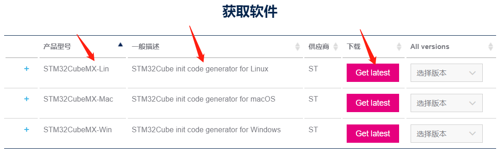

### 安装CLion

- 下载地址：:link:[官网下载地址](https://www.jetbrains.com/zh-cn/clion/download/#section=linux)

- CLion 现在也以 snap 软件包的形式提供。如果您使用 Ubuntu 16.04 或更高版本，可以使用命令行安装

```bash
sudo snap install clion --classic
```

- 安装Chinese插件和Serial Port Monitor插件

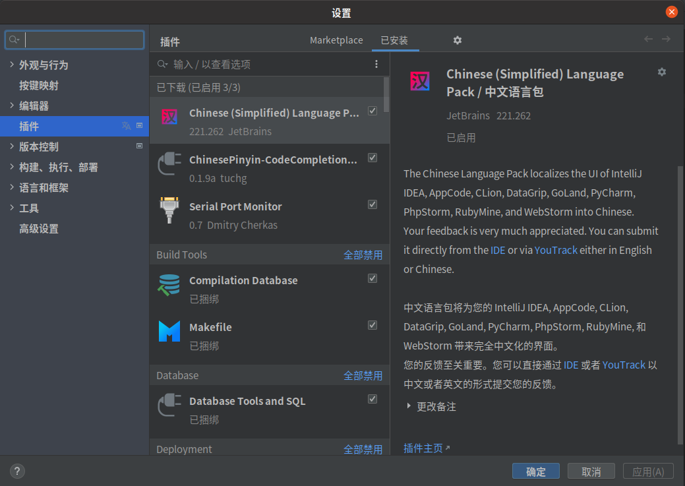

### 新建工程

#### STM32CubeMX创建工程

- 打开 STM32CubeMX （位于/home/lmx/STM32CubeMX ），点击**ACCESS TO BOARD SELECTOR**（实验箱中的是 ST 官方的开发板）
- 选择 **B-L475E-IOT01A1** 开发板，点击**Start Project**，弹出的对话框中选择 **Yes**（即初始化外设为默认模式）

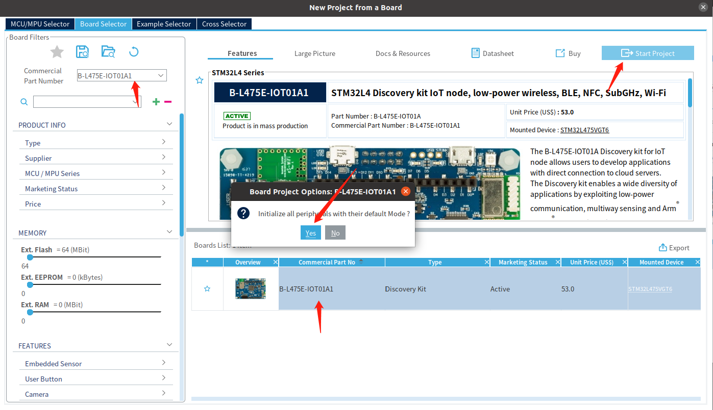

- 在新弹出的界面中点击 **Project Manager**，输入工程名称以及工程路径（建议新建如图工程路径），并选择为**STM32CubeIDE**，其余保持默认

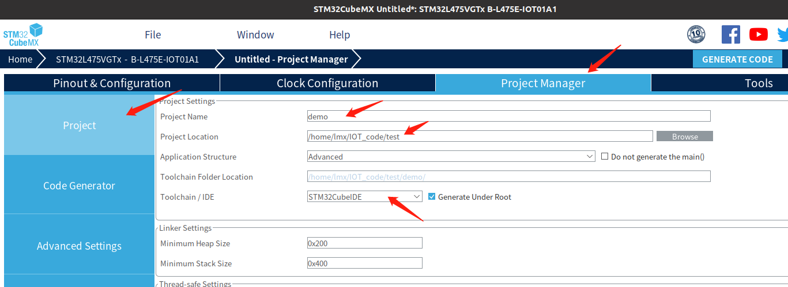

- 在 **Code Generator** 中进行如下配置，点击 **GENERATE CODE** 生成工程

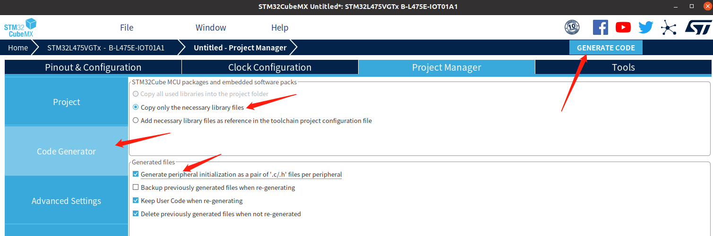

- 在弹出的对话框中点击 **Close** 关闭对话框

> :exclamation: 注意
>
> 在实际开发中，我们可能会需要修改 STM32 的配置（Pinout & Configuration、Clock Configuration等），在每次修改完点 **GENERATE CODE** 之后，弹窗直接点Close，Clion里面会自动更新文件。

#### CLion配置

- 打开CLion（Ubuntu 桌面左下角），**打开**工程

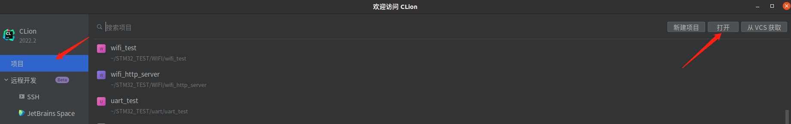

- 选择在 STM32CubeMX 创建的工程（.ioc 文件），点击**确定**

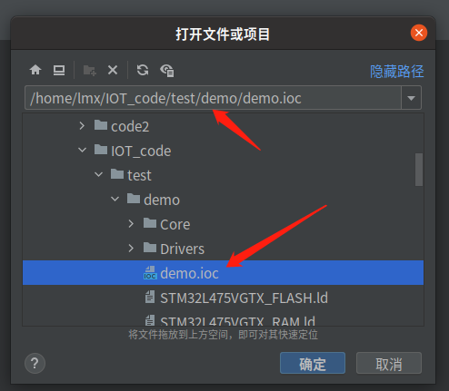

- 在弹出的对话框中点击**作为项目打开**
- 在弹出的选择面板配置文件对话框中点击**复制到项目并使用**

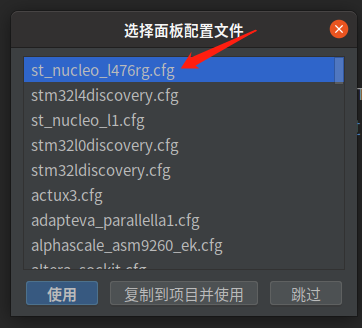

> .cfg 文件用于设置仿真器的类型和接口、指定Flash大小、芯片类型、下载速度等，内容如下：
>
> ```
> # This is a ST NUCLEO L476RG board with a single STM32L476RGT6 chip.
> # http://www.st.com/web/catalog/tools/FM116/SC959/SS1532/LN1847/PF261636
> 
> source [find interface/stlink-v2-1.cfg]
> 
> transport select hla_swd
> 
> source [find target/stm32l4x.cfg]
> 
> # use hardware reset
> reset_config srst_only srst_nogate
> ```
>
> 文件中描述的开发板为 ST NUCLEO L476RG board，与我们实际使用的开发板不同，但是该文件主要针对仿真器的类型，两块开发板的仿真器都是 stlink，因此可以通用。默认的 .cfg 文件没有设置下载速度等，感兴趣的同学请自行了解:slightly_smiling_face:

### 成为点灯大师

在学习 STM32 标准库，ZigBee，ESP32，Linux开发板，FPGA的时候，我们的第一个Demo肯定是点灯。因此，我们通过点亮LED灯来测试辛苦配置好的环境是否能用~

- 原理分析：在硬件原理图中，我们可以看到 LED2 连接到 STM32 的 PB14 引脚上，且另一边接 GND，因此，我们只需将 PB14 设置为高电平即可点亮 LED 灯


- 代码编写：在 main.c 文件中的编写以下代码

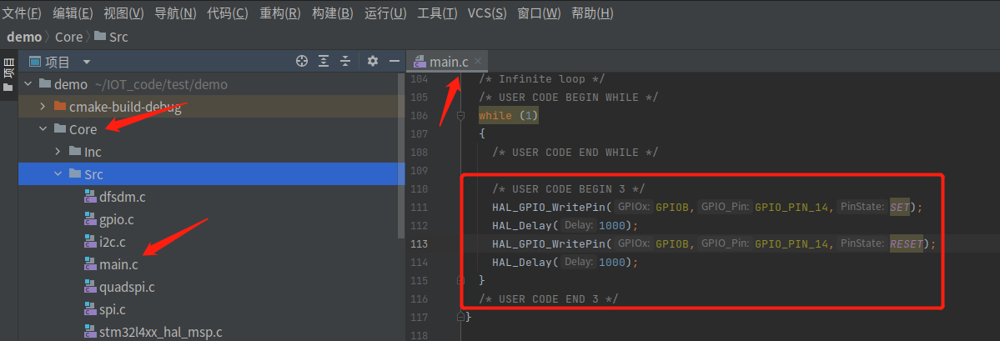

```c
  /* USER CODE BEGIN WHILE */
  while (1)
  {
    /* USER CODE END WHILE */

    /* USER CODE BEGIN 3 */
    HAL_GPIO_WritePin(GPIOB,GPIO_PIN_14,SET);
    HAL_Delay(1000);
    HAL_GPIO_WritePin(GPIOB,GPIO_PIN_14,RESET);
    HAL_Delay(1000);
  }
  /* USER CODE END 3 */
```

> :exclamation: 注意
>
> 通过STM32CubeMX生成的工程必须在特定的位置编写自己的代码，例如上述代码编写在 /* USER CODE BEGIN 3 */  和
>
>  /* USER CODE END 3 */ 之间，防止在我们修改完STM32 的配置（Pinout & Configuration、Clock Configuration 等），点 **GENERATE CODE** 之后，STM32CubeMX 把不在这些位置编写的用户代码清空。

- 连接 PC 与开发板，编译并下载程序（从左到右分别为只编译、编译并下载、调试）


- 编译下载成功

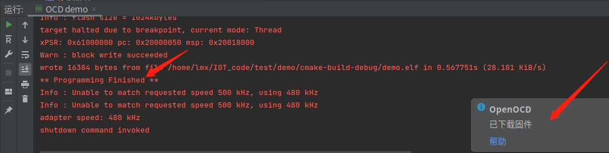

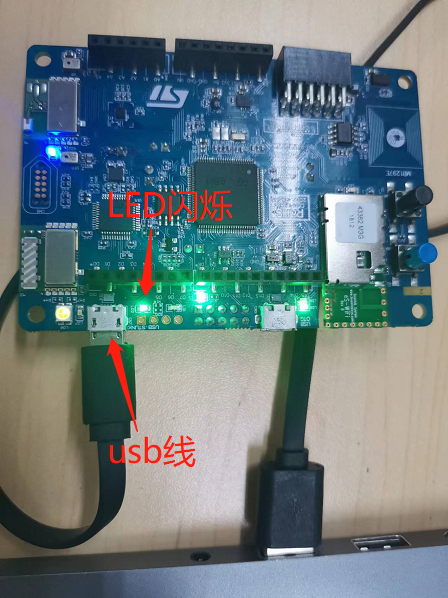

至此，环境配置已经完成，以后就可以愉快地进行 STM32 开发了。相比于在 keil 下用标准库开发，使用 STM32CubeMX + CLion 是不是非常方便快捷呢！