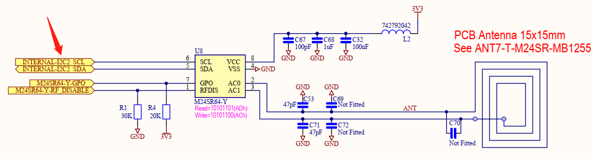
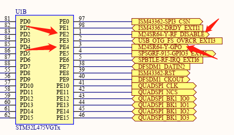
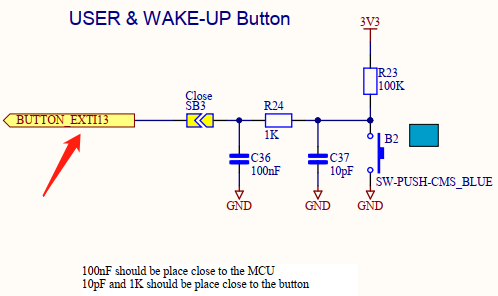
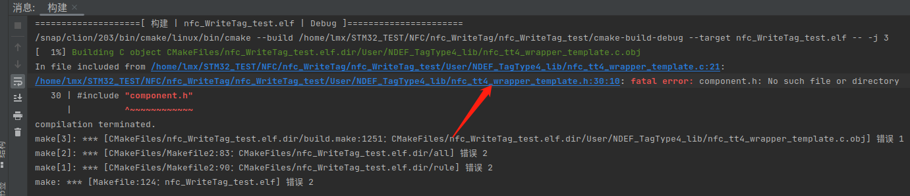
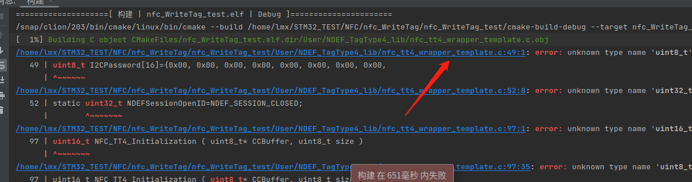
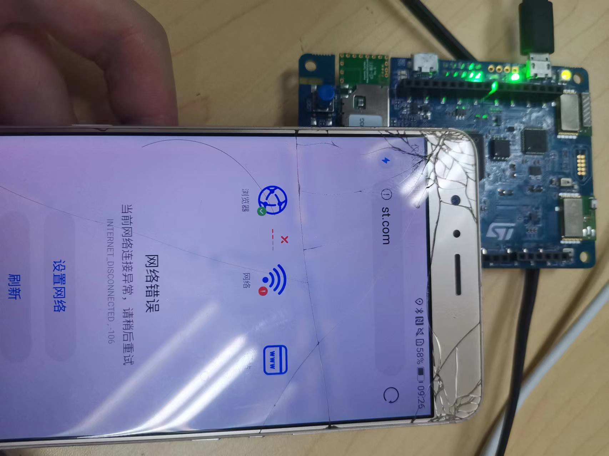
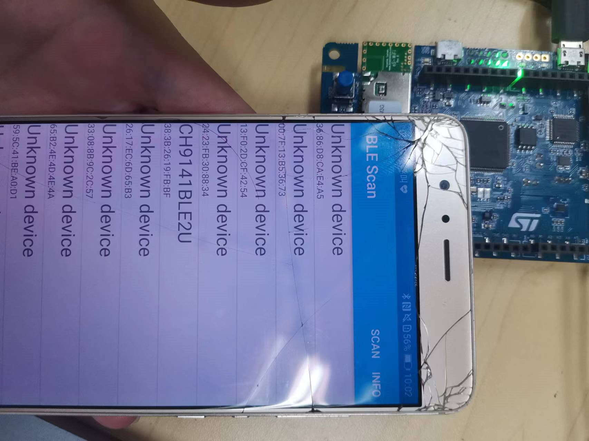

# NFC 写卡实验

NFC是一种短距离的高频无线通信技术，允许电子设备之间进行非接触式点对点数据传输，详细说明还是自己参考维基百科吧[Near-field communication(NFC)](https://en.wikipedia.org/wiki/Near-field_communication) 


## 实验目的

- NFC 向手机写 AAR NDEF 信息

- NFC 向手机写 NDEF 信息

## 准备工作

- 有 NFC 功能的手机
- 手机安装 ST BLE Profile 软件

> :exclamation: 注意
>
> 手机要开启 NFC，若最终的实验现象跟文档演示的不符，例如扫 NFC 后出现某个软件，则需要把该软件的 NFC 功能关闭，例如扫了之后出现京东 APP，则需把京东 APP 的 NFC 权限关闭。

### 硬件

- 物联网实验箱
- USB 数据线
- mobile phone

### 软件

- CLion
- STM32CubeMX
- ST BLE Profile.apk

## 相关电路原理

- STM32 与 NFC 的硬件连接





- STM32 与 USER 按键硬件连接



## 引脚定义与相关API

- 引脚定义

PE2 配置为 GPIO_Output， PE4 配置为 GPIO_Output，PB10 配置为 SCL引脚，PB11 配置为 SDA引脚

- 相关API

```c
/**
  * @brief  This fonction write NDEF file from data given in the URI structure
  * @param  pURI : pointer on URI structure to prepare NDEF
  * @retval SUCCESS : NDEF URI stored
  * @retval ERROR : Not able to store NDEF URI
  */
uint16_t TT4_WriteURI(sURI_Info *pURI)

/**
  * @brief  This fonction write NDEF file from data given in the SMS structure
  * @param  pSMS : pointer on SMS structure to prepare NDEF
  * @retval SUCCESS : NDEF SMS stored
  * @retval ERROR : Not able to store NDEF SMS
  */
uint16_t TT4_WriteSMS(sSMSInfo *pSMS)

/**
  * @brief  This fonction write NDEF file from data given in the eMail structure
  * @param  pEmailStruct : pointer on eMail structure to prepare NDEF
  * @retval SUCCESS : NDEF eMail stored
  * @retval ERROR : Not able to store NDEF eMail
  */
uint16_t TT4_WriteEmail(sEmailInfo *pEmailStruct)

/**
  * @brief  This fonction add AAR (Android Application Record) in the tag
  * @param  pAAR : pointer on structure that contain AAR information
  * @retval SUCCESS : AAR added
  * @retval ERROR : Not able to add AAR
  */
uint16_t TT4_AddAAR(sAARInfo *pAAR)
```

## 实验步骤

### <a id="1">写NDEF信息</a>

#### STM32CubeMX创建工程

- 以开发板为模板生成工程，保持默认设置，不修改任何引脚配置和时钟配置

#### 代码编写及运行结果

- 添加需要的 .c 和 .h 文件

新建 User 文件夹，

将 **/home/lmx/STM32Cube/Repository/STM32Cube_FW_L4_V1.17.2/Projects/B-L475E-IOT01A/Applications/NFC/Common** 路径下的

**M24SR** 和 **NDEF_TagType4_lib** 文件夹和

**/home/lmx/STM32Cube/Repository/STM32Cube_FW_L4_V1.17.2/Projects/B-L475E-IOT01A/Applications/NFC/WriteTag/Inc** 路径下的

**nfc_config.h**和 **VcardCSL1.h** 文件添加到新建的 **User** 文件夹下。

再将 **BSP** 文件夹添加到工程文件夹的 **~/Drivers** 目录下（这么长的路径都看晕了是吧:dizzy_face::dizzy_face:，熟悉命令行操作的同学话建议直接命令行解决）

> 顺便复习一下 Linux 的 cp 命令 ，cp 命令的基本格式如下：
>
> ```bash
> [root@localhost ~]# cp [选项] 源文件 目标文件
> ```
>
> 选项：
>
> - -a：相当于 -d、-p、-r 选项的集合，这几个选项我们一一介绍；
> - -d：如果源文件为软链接（对硬链接无效），则复制出的目标文件也为软链接；
> - -i：询问，如果目标文件已经存在，则会询问是否覆盖；
> - -l：把目标文件建立为源文件的硬链接文件，而不是复制源文件；
> - -s：把目标文件建立为源文件的软链接文件，而不是复制源文件；
> - -p：复制后目标文件保留源文件的属性（包括所有者、所属组、权限和时间）；
> - -r：递归复制，用于复制目录；
> - -u：若目标文件比源文件有差异，则使用该选项可以更新目标文件，此选项可用于对文件的升级和备用。
>
> 觉得太长的话，只需要记住常用的 -r，-a 选项就足够了，更详细的用法请自行了解。

完成后是这样子的。


- 修改 ~/Core/Src/stm32l4xx_it.c 文件

1. 包含头文件

```c
/* USER CODE BEGIN Includes */
#include "stm32l475e_iot01.h"
/* USER CODE END Includes */
```

2. 添加中断服务程序

若 EXTI15_10_IRQHandler 报错，把 stm32l4xx_it.c 文件原来的 EXTI15_10_IRQHandler 函数整段删除

```c
/* USER CODE BEGIN 1 */
void EXTI4_IRQHandler(void)
{
    HAL_GPIO_EXTI_IRQHandler(NFC_GPIO_GPO_PIN);
}

void EXTI15_10_IRQHandler(void)
{
    HAL_GPIO_EXTI_IRQHandler(USER_BUTTON_PIN);
}
/* USER CODE END 1 */
```

- 修改 ~/Core/Inc/stm32l4xx_it.h 文件

```c
/* USER CODE BEGIN EFP */
void EXTI15_10_IRQHandler(void);
void EXTI4_IRQHandler(void);     /* NFC Gpo pin */
/* USER CODE END EFP */
```

- 修改 main.c 文件

1. 添加需要的头文件

```c
/* Private includes ----------------------------------------------------------*/
/* USER CODE BEGIN Includes */
#include "string.h"
#include "stdio.h"
#include "stdbool.h"
#include "stm32l475e_iot01.h"
#include "lib_TT4_interface.h"
#include "m24sr.h"
#include "VcardCSL1.h"
/* USER CODE END Includes */
```

2. 添加所需变量和函数声明

```c
/* Private typedef -----------------------------------------------------------*/
/* USER CODE BEGIN PTD */
typedef struct
{
    void   (*DemoFunc)(void);
    uint8_t DemoName[20];
    uint32_t DemoIndex;
}BSP_DemoTypedef;

/* USER CODE END PTD */

/* Private define ------------------------------------------------------------*/
/* USER CODE BEGIN PD */
#define COUNT_OF_EXAMPLE(x)    (sizeof(x)/sizeof(BSP_DemoTypedef))
/* USER CODE END PD */

/* Private macro -------------------------------------------------------------*/
/* USER CODE BEGIN PM */
static void AARwrite_demo(void);
static void URIwrite_demo(void);
static void Vcardwrite_demo(void);
static void Vcardwrite_demo2(void);
static void SMSwrite_demo(void);
static void EMAILwrite_demo(void);
static void Toggle_Led2(uint32_t freq);
static void SystemClock_Config(void);
/* USER CODE END PM */

/* Private variables ---------------------------------------------------------*/

/* USER CODE BEGIN PV */
uint8_t UserPressButton = 0;
uint8_t DemoIndex = 0;
BSP_DemoTypedef  NFC_examples[]={
        {URIwrite_demo, "URI", 0},
        {SMSwrite_demo, "SMS", 1},
        {EMAILwrite_demo, "EMAIL", 2},
        {Vcardwrite_demo, "vCARD", 3},
        {Vcardwrite_demo2, "vCARD2", 4},
        //{AARwrite_demo, "AAR", 5},
};


/* Field to fill for the SMS demonstration */
char PhoneNumber[] = {"+33612345678\0"};
char Message[] = {"This SMS was generated automatically by tapping your phone near BM1297\0"};
char Instruction[] = {"This is an example of NFC generated SMS using BM1297 board\0"};
/* Field to fill for the Vcard demonstration */
char FirstName[] = {"Help Desk\0"};
char Title[] = {"Customer support\0"};
char Org[] = {"STMicroelectronics\0"};
char HomeAddress[] = {"\0"};
char WorkAddress[] = {"190 avenue Celestin Coq 13106 ROUSSET FRANCE\0"};
char HomeTel[] = {"\0"};
char WorkTel[] = {"\0"};
char CellTel[] = {"+33 6 11 22 33 44\0"};
char HomeEmail[] = {"\0"};
char WorkEmail[] = {"customer.service@st.com \0"};

/* Field to fill for the Email demonstration */
char EmailAdd[] = {"customer.service@st.com\0"};
char Subject[] = {"M24SR S/N 754FHFGJF46G329 WARRANTY\0"};
char EmailMessage[] = {"this is a demonstration to illustrate an automatic warranty activation email\0"};
char Information[] = {"automatic warranty\0"};
/* USER CODE END PV */

/* Private function prototypes -----------------------------------------------*/
void SystemClock_Config(void);
/* USER CODE BEGIN PFP */
static void AARwrite_demo(void);
/* USER CODE END PFP */
```

3. 修改 mian() 函数

```c
int main(void)
{
  /* USER CODE BEGIN 1 */
    GPIO_InitTypeDef  gpioinitstruct = {0};
  /* USER CODE END 1 */

  /* MCU Configuration--------------------------------------------------------*/

  /* Reset of all peripherals, Initializes the Flash interface and the Systick. */
  HAL_Init();

  /* USER CODE BEGIN Init */

  /* USER CODE END Init */

  /* Configure the system clock */
  SystemClock_Config();

  /* USER CODE BEGIN SysInit */

  /* USER CODE END SysInit */

  /* Initialize all configured peripherals */
  /*
  MX_GPIO_Init();
  MX_DFSDM1_Init();
  MX_I2C2_Init();
  MX_QUADSPI_Init();
  MX_SPI3_Init();
  MX_USART1_UART_Init();
  MX_USART3_UART_Init();
  MX_USB_OTG_FS_PCD_Init();*/
  /* USER CODE BEGIN 2 */
    BSP_LED_Init(LED2);
    __HAL_RCC_GPIOA_CLK_ENABLE();
    gpioinitstruct.Pin   = GPIO_PIN_5;
    gpioinitstruct.Mode  = GPIO_MODE_OUTPUT_PP;
    gpioinitstruct.Pull  = GPIO_NOPULL;
    gpioinitstruct.Speed = GPIO_SPEED_FREQ_HIGH;
    HAL_GPIO_Init(GPIOA, &gpioinitstruct);
    BSP_PB_Init(BUTTON_USER, BUTTON_MODE_EXTI);
    while (TT4_Init() != SUCCESS);
    BSP_LED_On(LED2);
  /* USER CODE END 2 */

  /* Infinite loop */
  /* USER CODE BEGIN WHILE */
  while (1)
  {
    /* USER CODE END WHILE */

    /* USER CODE BEGIN 3 */
      UserPressButton = 0;
      NFC_examples[DemoIndex++].DemoFunc();

      /* Toggle LEDs (different speed between each Test) */
      while (!UserPressButton) Toggle_Led2(80*(DemoIndex+1));
      /* If all Demo has been already executed, Reset DemoIndex to restart BSP example*/
      if(DemoIndex >= COUNT_OF_EXAMPLE(NFC_examples))
      {
          DemoIndex = 0;
      }
  }
  /* USER CODE END 3 */
}
```

4. 在 mian.c 文件下面添加所需的函数定义

```c
/* USER CODE BEGIN 4 */
static void URIwrite_demo(void)
{
    sURI_Info URI;

    /* Prepare URI NDEF message content */
    strcpy(URI.protocol,URI_ID_0x01_STRING);
    strcpy(URI.URI_Message,"st.com");
    strcpy(URI.Information,"\0");

    /* First write NDEF */
    while (TT4_WriteURI(&URI) != SUCCESS);
}

static void SMSwrite_demo(void)
{
    uint16_t status = ERROR;
    sSMSInfo SMSStruct;
    sSMSInfo *pSMSStruct;

    pSMSStruct = &SMSStruct;

    memcpy(pSMSStruct->PhoneNumber, PhoneNumber, strlen(PhoneNumber)+1);
    memcpy(pSMSStruct->Message, Message, strlen(Message)+1);
    memcpy(pSMSStruct->Information, Instruction, strlen(Instruction)+1);

    status = TT4_WriteSMS ( pSMSStruct );

    if(status != SUCCESS)
    {
        Error_Handler();
    }
}

static void EMAILwrite_demo(void)
{
    uint16_t status = ERROR;
    sEmailInfo EmailStruct;
    sEmailInfo *pEmailStruct;

    pEmailStruct = &EmailStruct;

    memcpy(pEmailStruct->EmailAdd, EmailAdd, strlen(EmailAdd)+1);
    memcpy(pEmailStruct->Subject, Subject, strlen(Subject)+1);
    memcpy(pEmailStruct->Message, EmailMessage, strlen(EmailMessage)+1);
    memcpy(pEmailStruct->Information, Information, strlen(Information)+1);

    status = TT4_WriteEmail ( pEmailStruct );

    if(status != SUCCESS)
    {
        Error_Handler();
    }
}

static void Vcardwrite_demo(void)
{
    uint16_t status = ERROR;

    /* USee a NDEF file Vcard with a default Jpeg embedded */
    status = TT4_WriteNDEF((uint8_t*)uVcardCSL1);
    if(status != SUCCESS)
    {
        Error_Handler();
    }
}

static void Vcardwrite_demo2(void)
{
    uint16_t status = ERROR;
    sVcardInfo VcardStruct;
    sVcardInfo *pVcardStruct;

    pVcardStruct = &VcardStruct;

    memcpy(pVcardStruct->FirstName, FirstName, strlen(FirstName)+1);
    memcpy(pVcardStruct->Title, Title, strlen(Title)+1);
    memcpy(pVcardStruct->Org, Org, strlen(Org)+1);
    memcpy(pVcardStruct->HomeAddress, HomeAddress, strlen(HomeAddress)+1);
    memcpy(pVcardStruct->WorkAddress, WorkAddress, strlen(WorkAddress)+1);
    memcpy(pVcardStruct->HomeTel, HomeTel, strlen(HomeTel)+1);
    memcpy(pVcardStruct->WorkTel, WorkTel, strlen(WorkTel)+1);
    memcpy(pVcardStruct->CellTel, CellTel, strlen(CellTel)+1);
    memcpy(pVcardStruct->HomeEmail, HomeEmail, strlen(HomeEmail)+1);
    memcpy(pVcardStruct->WorkEmail, WorkEmail, strlen(WorkEmail)+1);

    status = TT4_WriteVcard ( &VcardStruct );
    if(status != SUCCESS)
    {
        Error_Handler();
    }
}

static void AARwrite_demo(void)
{
    uint16_t status = ERROR;
    uint8_t NULL_NDEF[2] = {0,0};
    sAARInfo AAR_struct;
    sAARInfo *pAAR;

    pAAR = &AAR_struct;

    /* to set only AAR force NDEF size to 0 before */
    TT4_WriteNDEF(NULL_NDEF);
    memcpy(pAAR->PakageName, "com.stm.bluetoothlevalidation", strlen("com.stm.bluetoothlevalidation")+1);


    /* Add AAR record */
    status = TT4_AddAAR(pAAR);
    if(status != SUCCESS)
    {
        Error_Handler();
    }
}

/**
  * @brief  Toggle LEDs
  * @param  None
  * @retval None
  */
static void Toggle_Led2(uint32_t freq)
{
    BSP_LED_Toggle(LED2);
    HAL_Delay(freq);
}

/* Public functions ---------------------------------------------------------*/

/**
  * @brief EXTI line detection callback.
  * @param GPIO_Pin: Specifies the pins connected EXTI line
  * @retval None
  */
void HAL_GPIO_EXTI_Callback(uint16_t GPIO_Pin)
{
    if(GPIO_Pin == NFC_GPIO_GPO_PIN)
    {
        M24SR_GPO_Callback();
    }

    if (USER_BUTTON_PIN == GPIO_Pin)
    {
        while (BSP_PB_GetState(BUTTON_USER) == RESET);
        UserPressButton = 1;
    }
}
/* USER CODE END 4 */
```

- 修改 CMakeLists.txt 文件

1. 在56行中添加 "User/*.*"

```cmake
file(GLOB_RECURSE SOURCES "Core/*.*" "Drivers/*.*" "User/*.*")
```

2. 在最下方添加以下代码

```cmake
include_directories(
        Drivers/BSP/B-L475E-IOT01
        Drivers/BSP/Components/Common
        Drivers/BSP/Components/m24sr
        User
        User/M24SR
        User/NDEF_TagType4_lib
        // 其他include目录
        // 需要哪个外设就包含进去，例如用于相对湿度和温度测量的电容式数字传感器：Drivers/BSP/Components/hts221
)


file(GLOB_RECURSE SOURCES
        "Drivers/BSP/B-L475E-IOT01/*.*"
        "Drivers/BSP/Components/Common/*.*"
        "Drivers/BSP/Components/m24sr/*.*"
        "User/M24SR/*.*"
        "User/NDEF_TagType4_lib/*.*"
        // *.*表示通配符，也就是这个文件夹里的所有文件都会被编译
        // 需要哪个外设就包含进去，例如用于相对湿度和温度测量的电容式数字传感器："Drivers/BSP/Components/hts221/*.*"
        )
```

- 编译并运行后，定位到有错误的文件，具体为 nfc_tt4_wrapper_template.h 和 nfc_tt4_wrapper_template.c 文件，将两文件的内容全部删除





- 再次编译运行，这时候可以看到开发板上的 LD2 绿灯闪烁。手机开启 NFC，靠近开发板，第一次可以看到手机自动跳转到 ST 官网。每次按下开发板上的 USER 按键切换后，会写入不同的信息，有以下三种，手机都会有不同的情况。

> This example writes a different message each time the USER BUTTON is pressed:
>  - URI:    the "www.st.com" website is opened by the browser
>  - SMS:    an SMS is prepeaed on the smartphone and ready to be sent to +33612345678
>  - EMAIL:  an email is prepeaed on the smartphone and ready to be sent to customer.service@st.com



### 写AAR NDEF信息

看到这里同学们就会有疑问了，这个 NDEF 和 AAR NDEF 有什么区别呢:confused:？其实 AAR NDEF 只是一种特殊的 NDEF，详细说明请自行了解。

:link:[AAR NDEF介绍](https://old.gototags.com/nfc/ndef/android-application/)

#### 代码编写及运行结果

- 可以直接在 <a href="#1">写NDEF信息</a> 的基础上进行代码修改，将 NFC_examples[] 修改为以下形式

```c
BSP_DemoTypedef  NFC_examples[]={
        //{URIwrite_demo, "URI", 0},
        //{SMSwrite_demo, "SMS", 1},
        //{EMAILwrite_demo, "EMAIL", 2},
        //{Vcardwrite_demo, "vCARD", 3},
        //{Vcardwrite_demo2, "vCARD2", 4},
        {AARwrite_demo, "AAR", 0},
};
```

- 手机自动打开 ST BLE Profile 软件（要提前安装在手机上，如果手机没有，会跳转到谷歌商城下载，考虑到网络原因，请提前用提供的 apk 安装）



