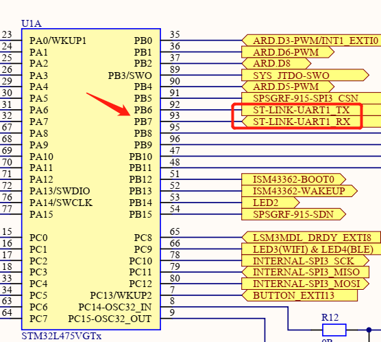

# 外设与传感器

常见的STM32外设有 GPIO、TIM、USART、ADC、DAC、SPI、I2C、EXIT、RTC、SysTIck、WDG、DMA、FLASH、FSMC 等。

B-L475E-IOT01A 上板载许多传感器，包括但不限于以下传感器（更具体描述的请参考 ST 官方文档 :clap:）：

- 用于相对湿度和温度测量的电容式数字传感器（HTS221）
- 高性能3轴磁力计（LIS3MDL）
- 3D加速度计和3D陀螺仪（LSM6DSL）
- 260-1260 hPa绝对数字输出气压计（LPS22HB）

在上一章节，我们使用 STM32 的 GPIO 点亮了 LED 灯，在后续章节，我们会利用 STM32 的串口来与 LoRa 节点通信。因此，本章节我们将学习如何使用 STM32 的 UART（USART 与 UART的区别请自行了解）与 I2C 外设，以及如何获取以 I2C 为通信方式的传感器数据。


## 实验目的

- 实现 UART 阻塞式发送数据以及重定向 printf() 函数
- 实现 UART 中断式接收数据
- 实现 I2C 接收传感器数据

## 准备工作

- CLion 中安装 Serial Port Monitor 插件

### 硬件

- 物联网实验箱
- USB 数据线

### 软件

- CLion
- STM32CubeMX

## 相关电路原理

- STM32 与 USB STLINK 接口




> :exclamation: 注意
>
> 开发板上一共有两片 STM32，其中一片是 STM32F103，另一片是 STM32L475，其中 STM32F103 里烧录了 stlink 固件，是作为仿真器来使用的。那这个时候好（hào）事儿的同学就会有疑问了，你这原理图上 STM32L4 的串口1怎么是 PB6 和 PB7 ，STM32 的串口1不是 PA9 和 PA10 吗？:thinking:其实是因为如果以开发板为模板生成工程的话，在默认的配置里，是把 PB6 和 PB7 重映射为串口1的，而 PA9，PA10 默认配置为 OTG 功能，打开 .ioc 文件就可以发现。
>
> 

- STM32 与 I2C 传感器接口


结合两张图可以看出，这四个传感器都与 STM32 的 I2C2 相连，即STM32 的 PB10 和 PB11。除此之外，每一个传感器的 INT 或 DRDY 引脚连接到 STM32 的 GPIO 上（有关 I2C 的主从模式、中断和非中断模式请自行了解）。


## 引脚定义与相关API

### UART实验引脚定义与相关API

- 引脚定义

PB6 配置为 TX 引脚，PB7 配置为 RX 引脚

- 相关API

```c
/**
  * @brief Receive an amount of data in interrupt mode.
  * @note   When UART parity is not enabled (PCE = 0), and Word Length is configured to 9 bits (M1-M0 = 01),
  *         the received data is handled as a set of u16. In this case, Size must indicate the number
  *         of u16 available through pData.
  * @param huart UART handle.
  * @param pData Pointer to data buffer (u8 or u16 data elements).
  * @param Size  Amount of data elements (u8 or u16) to be received.
  * @retval HAL status
  */
HAL_StatusTypeDef HAL_UART_Receive_IT(UART_HandleTypeDef *huart, uint8_t *pData, uint16_t Size)


/**
  * @brief Send an amount of data in blocking mode.
  * @note   When UART parity is not enabled (PCE = 0), and Word Length is configured to 9 bits (M1-M0 = 01),
  *         the sent data is handled as a set of u16. In this case, Size must indicate the number
  *         of u16 provided through pData.
  * @note When FIFO mode is enabled, writing a data in the TDR register adds one
  *       data to the TXFIFO. Write operations to the TDR register are performed
  *       when TXFNF flag is set. From hardware perspective, TXFNF flag and
  *       TXE are mapped on the same bit-field.
  * @param huart   UART handle.
  * @param pData   Pointer to data buffer (u8 or u16 data elements).
  * @param Size    Amount of data elements (u8 or u16) to be sent.
  * @param Timeout Timeout duration.
  * @retval HAL status
  */
HAL_StatusTypeDef HAL_UART_Transmit(UART_HandleTypeDef *huart, const uint8_t *pData, uint16_t Size, uint32_t Timeout)


/**
  * @brief This function provides minimum delay (in milliseconds) based
  *        on variable incremented.
  * @note In the default implementation , SysTick timer is the source of time base.
  *       It is used to generate interrupts at regular time intervals where uwTick
  *       is incremented.
  * @note This function is declared as __weak to be overwritten in case of other
  *       implementations in user file.
  * @param Delay  specifies the delay time length, in milliseconds.
  * @retval None
  */
__weak void HAL_Delay(uint32_t Delay)


/**
  * @brief Return the UART handle state.
  * @param  huart Pointer to a UART_HandleTypeDef structure that contains
  *               the configuration information for the specified UART.
  * @retval HAL state
  */
HAL_UART_StateTypeDef HAL_UART_GetState(const UART_HandleTypeDef *huart)


/**
  * @brief  Rx Transfer completed callback.
  * @param  huart UART handle.
  * @retval None
  */
__weak void HAL_UART_RxCpltCallback(UART_HandleTypeDef *huart)
{
  /* Prevent unused argument(s) compilation warning */
  UNUSED(huart);

  /* NOTE : This function should not be modified, when the callback is needed,
            the HAL_UART_RxCpltCallback can be implemented in the user file.
   */
}
```


### I2C实验引脚定义与相关API

- 引脚定义

PB10 配置为 SCL引脚，PB11 配置为 SDA引脚

- 相关API

```c
/**
  * @功能  串口显示 LPS22HB pressure sensor 的值
  */
void Pressure_Test(void)

/**
  * @功能  串口显示 HTS221 humidity sensor 的值
  */
void Humidity_Test(void)

/**
  * @功能  串口显示 HTS221 temperature sensor 的值
  */
void Temperature_Test(void)

/**
  * @功能  串口显示 LSM6DSL accelerometer sensor 的值
  */
void Accelero_Test(void)

/**
  * @功能  串口显示 LIS3MDL gyroscope sensor 的值
  */
void Gyro_Test(void)

/**
  * @功能  串口显示 LIS3MDL magnetometer sensor 的值
  */
void Magneto_Test(void)
```


## 实验步骤

### <a id="1">UART与电脑通信</a>

#### STM32CubeMX创建工程

- 在 **Pinout & Configuration** 中使能 USART1 的中断，**Mode**为 **Asynchronous**（异步方式，简称UART）


- 配置完点击 **GENERATE CODE** 生成工程


#### 代码编写及运行结果

##### UART阻塞式发送数据

在 main.c 中编写以下代码，编写完成后点击右上角的绿色三角形编译并下载程序，串口终端打印出hello world!


```c
HAL_UART_Transmit(&huart1,"hello world!\r\n",14,0xffff);
HAL_Delay(1000);    //延时一秒
```

> :exclamation: 注意
>
> Serial Monitor 各个按键和选项的功能请自行了解，由于串口波特率默认配置为115200，因此在这里也需要把 Baudrate 设置为115200，Port name 要选择为对应的端口。
>
> 

##### <a id="2">重定向printf()函数</a>

printf 是指格式化输出函数，主要功能是向标准输出设备按规定格式输出信息。printf 是C语言标准库函数，定义于头文件 <stdio.h>，输出的字符串除了可以是字母、数字、空格和一些数字符号以外，还可以使用一些转义字符表示特殊的含义 。

学习标准库的时候，在 **Keil** 里面为了使用printf函数我们需要重定向fputc函数：

```c
int fputc (int ch, FILE *f)
{
    (void)HAL_UART_Transmit(&huart1, (uint8_t *)&ch, 1, 1000);
    return ch;
}
```

其中的 FILE 定义在 stdio.h 头文件中，所以需要在项目中包含这个头文件，但是经过测试发现，Keil 里面包含的是 MDK\ARM\ARMCC\include 这个目录下的stdio.h，而在 Clion 中是不会链接到这个文件的。因此如果在 CLion 中也按之前的方法进行重定向，会发现 printf 没有任何输出。在 CLion 中链接的是 GNU-Tools-ARM-Embedded\arm-none-eabi\include里面的stdio.h，如果仍然想使用 printf 函数功能，则需要进行如下操作：

- 在~/Core/Src/usart.c中添加以下代码

```c
/* USER CODE BEGIN 1 */
#ifdef __GNUC__
/* With GCC/RAISONANCE, small printf (option LD Linker->Libraries->Small printf
   set to 'Yes') calls __io_putchar() */
#define PUTCHAR_PROTOTYPE int __io_putchar(int ch)
#else
#define PUTCHAR_PROTOTYPE int fputc(int ch, FILE *f)
#endif /* __GNUC__ */
/**
  * @brief  Retargets the C library printf function to the USART.
  * @param  None
  * @retval None
  */
PUTCHAR_PROTOTYPE
{
    /* Place your implementation of fputc here */
    /* e.g. write a character to the EVAL_COM1 and Loop until the end of transmission */
    HAL_UART_Transmit(&huart1, (uint8_t *)&ch, 1, 0xFFFF);
	//HAL_UART_Transmit(&huart2, (uint8_t *)&ch, 1, 0xFFFF);	//串口2
    return ch;
}
/* USER CODE END 1 */
```

可以发现，这段代码最终也是调用 HAL_UART_Transmit()，因此这里的 printf() 也是阻塞式发送数据。

- 在~/Core/Src/main.c中添加头文件

```c
/* USER CODE BEGIN Includes */
#include "stdio.h"
/* USER CODE END Includes */
```

- 在~/Core/Src/main.c的 while(1) 循环中添加以下代码

```c
/* USER CODE BEGIN 3 */
printf("hello, pansiwen!(#^.^#)\r\n"); //必须要以\r\n结尾
HAL_Delay(1000);
```

- 编译下载程序后，终端打印出字符串，非常方便 :watermelon:！


##### UART中断式接收数据

因为中断接收函数 HAL_UART_Receive_IT() 只能触发一次接收中断，所以我们需要在中断回调函数中再调用一次中断接收函数

具体流程：

1. 初始化串口（相关调用代码已经通过 STM32CubeMX 自动生成）
2. 在 main 中第一次调用接收中断函数
3. 进入接收中断，接收完数据  进入中断回调函数
4. 修改 HAL_UART_RxCpltCallback() 中断回调函数，处理接收的数据
5. 回调函数中要调用一次 HAL_UART_Receive_IT() 函数，使得程序可以重新触发接收中断

函数流程图：

HAL_UART_Receive_IT(中断接收函数) :point_right::point_right: USART1_IRQHandler(中断服务函数) :point_right::point_right: HAL_UART_IRQHandler(中断处理函数) :point_right::point_right: UART_Receive_IT(接收函数) :point_right::point_right: HAL_UART_RxCpltCallback(中断回调函数)

HAL_UART_RxCpltCallback() 函数就是用户要重写在main.c里的回调函数。（关于回调函数的定义请自行了解）

- main.c 文件中添加需要的 c 库头文件，定义变量

```c
/* Private includes ----------------------------------------------------------*/
/* USER CODE BEGIN Includes */
#include "stdio.h"
#include <string.h>

#define RXBUFFERSIZE  256     //最大接收字节数
char RxBuffer[RXBUFFERSIZE];   //接收数据
uint8_t aRxBuffer;			//接收中断缓冲
uint8_t Uart1_Rx_Cnt = 0;		//接收缓冲计数
/* USER CODE END Includes */
```

- 在 mian.c 文件中的 main() 主函数里的串口初始化后，while() 循环开始前，先调用一次 HAL_UART_Receive_IT() 中断接收函数

```c
/* USER CODE BEGIN 2 */
HAL_UART_Receive_IT(&huart1, (uint8_t *)&aRxBuffer, 1);
/* USER CODE END 2 */
```

- 在 main.c 文件下方添加 HAL_UART_RxCpltCallback() 中断回调函数

```c
/* USER CODE BEGIN 4 */
//可接收不定长度的数据，以\r\n为结束位，收到的数据存在RxBuffer中
void HAL_UART_RxCpltCallback(UART_HandleTypeDef *huart)
{
    /* Prevent unused argument(s) compilation warning */
    UNUSED(huart);
    /* NOTE: This function Should not be modified, when the callback is needed,
             the HAL_UART_TxCpltCallback could be implemented in the user file
     */

    if(Uart1_Rx_Cnt >= 255)  //溢出判断
    {
        Uart1_Rx_Cnt = 0;
        memset(RxBuffer,0x00,sizeof(RxBuffer));
        HAL_UART_Transmit(&huart1, (uint8_t *)"数据溢出", 10,0xFFFF);

    }
    else
    {
        RxBuffer[Uart1_Rx_Cnt++] = aRxBuffer;   //接收数据转存
		//0x0A 是 \r 的 ASCII码，0x0D 是 \n 的 ASCII码
        if((RxBuffer[Uart1_Rx_Cnt-1] == 0x0A)&&(RxBuffer[Uart1_Rx_Cnt-2] == 0x0D)) //判断结束位，以\r\n结尾为一组数据
        {
            HAL_UART_Transmit(&huart1, (uint8_t *)&RxBuffer, Uart1_Rx_Cnt,0xFFFF); //将收到的信息发送出去
            while(HAL_UART_GetState(&huart1) == HAL_UART_STATE_BUSY_TX);//检测UART发送结束
            Uart1_Rx_Cnt = 0;
            memset(RxBuffer,0x00,sizeof(RxBuffer)); //清空数组
        }
    }

    HAL_UART_Receive_IT(&huart1, (uint8_t *)&aRxBuffer, 1);   //再次调用中断接收函数
}
/* USER CODE END 4 */
```

- 编译下载程序后，在终端输入想要发送给 STM32 的字符串，点击 **Send** 


> :exclamation:注意
>
> 要在 CLion的 SerialMonitor 中，右边选择 Both NL & CR，即自动添加回车换行，也可以在要发送的字符串后面添加 \r\n，例如：123\r\n

### I2C获取传感器数据

#### STM32CubeMX创建工程

- 创建过程与:link:<a href="#1">UART与电脑通信</a>部分一致
- 在工程中完成:link:<a href="#1">重定向printf()函数</a>部分

> :exclamation:注意
>
> 在这一步同学们通常会有三种选择，一是直接用上面完成的工程，二是完全新创建一个工程，三是复制一份上面的工程，然后编辑复制后的工程。如果是第三种情况，可能会有编译错误问题，解决方法：
>
> 1. 如果移动了工程文件夹或者复制了工程文件夹，最好打开.ioc文件重新 **Generate** 一下再编译，可以解决很多错误
> 2. 遇到任何 CMake 相关的报错，一般是由于缓存没有更新引起的，可以在 CLion 中选 **工具-CMake-重置缓存并重新加载项目** 即可解决:ok_hand:。

#### 代码编写及运行结果

- 添加 BSP 源文件

在工程中新建~/sensor_test/Drivers/BSP文件夹，将/home/lmx/STM32Cube/Repository/STM32Cube_FW_L4_V1.17.2/Drivers/BSP中的B-L475E-IOT01和Components文件夹复制到新建的文件夹中。

- 添加对应头文件和函数

在工程中的 ~Core/Inc/main.h 文件夹中添加用到的头文件和函数

```c
/* Includes ------------------------------------------------------------------*/
#include "stm32l4xx_hal.h"
#include "stm32l475e_iot01.h"
#include "stm32l475e_iot01_accelero.h"
#include "stm32l475e_iot01_magneto.h"
#include "stm32l475e_iot01_gyro.h"
#include "stm32l475e_iot01_tsensor.h"
#include "stm32l475e_iot01_psensor.h"
#include "stm32l475e_iot01_hsensor.h"
#include "stm32l475e_iot01_qspi.h"
#include <stdio.h>
/* Private includes ----------------------------------------------------------*/


/* Exported functions prototypes ---------------------------------------------*/
void QSPI_demo(void);
void QSPI_MemoryMapped_demo(void);
void Temperature_Test(void);
void Humidity_Test(void);
void Pressure_Test(void);
void Gyro_Test(void);
void Magneto_Test(void);
void Accelero_Test(void);

uint32_t Serial_Scanf(uint32_t value);
void Error_Handler(void);

/* USER CODE BEGIN EFP */
```

- 修改工程目录下的 CMakeLists.txt 文件

在文件最后增加以下代码，然后 **点击重新加载变更**

```cmake
include_directories(
        Drivers/BSP/B-L475E-IOT01
        Drivers/BSP/Components/Common
        // 其他include目录
        // 需要哪个外设就包含进去，例如用于相对湿度和温度测量的电容式数字传感器：Drivers/BSP/Components/hts221
)


file(GLOB_RECURSE SOURCES
        "Drivers/BSP/B-L475E-IOT01/*.*"
        "Drivers/BSP/Components/Common/*.*"
        // *.*表示通配符，也就是这个文件夹里的所有文件都会被编译
        // 需要哪个外设就包含进去，例如用于相对湿度和温度测量的电容式数字传感器："Drivers/BSP/Components/hts221/*.*"
        )
```

> :exclamation: 注意
>
> 在 Keil 中，我们需要哪个 .c 或 .h文件，通常是直接添加进工程文件夹中，然后在软件的图形化界面中手动选择即可。在 CLion 是基于 CMake 来管理项目的，组织编译规则都是基于 CMakeLists.txt 文件。如果熟悉 CMake 会觉得很方便很强大，不熟悉的也没事，CLion 会自动生成 CMakeLists.txt 文件，基本不需要额外修改什么，只需要知道怎么在这个文件里面添加源码目录和 include 文件夹的路径就行了（感兴趣的同学可以自行了解 CMake 以及 CMake 与Makefile 的区别和联系:smiley:）。

- 添加 ~User/sensor.c 文件

在实际开发中，为了方便管理，通常将完全由用户编写的代码独立成一个文件夹，新建~/sensor_test/User 文件夹，在该文件夹中新建 sensor.c 文件。

1. 新建 User 目录


2. 新建 .c 文件


3. 选择 .c 文件，输入名称，取消勾选


4. sensor.c 文件中输入以下代码

```c
/* Includes ------------------------------------------------------------------*/
#include "main.h"

/* Private typedef -----------------------------------------------------------*/
/* Private define ------------------------------------------------------------*/
/* Private macro -------------------------------------------------------------*/
/* Private variables ---------------------------------------------------------*/
int16_t pDataXYZ[3] = {0};
float pGyroDataXYZ[3] = {0};

/* Private function prototypes -----------------------------------------------*/
/* Private functions ---------------------------------------------------------*/

/**
  * @brief  Test of LPS22HB pressure sensor.
  */
void Pressure_Test(void)
{
    float press_value = 0;
    BSP_PSENSOR_Init();
    press_value = BSP_PSENSOR_ReadPressure();
    printf("PRESSURE is = %.2f mBar \n", press_value);
}

/**
  * @brief  Test of HTS221 humidity sensor.
  */
void Humidity_Test(void)
{
    float humidity_value = 0;
    BSP_HSENSOR_Init();
    humidity_value = BSP_HSENSOR_ReadHumidity();
    printf("HUMIDITY is = %.2f %%\n", humidity_value);
}

/**
  * @brief  Test of HTS221 and LPS22HB temperature sensors.
  */
void Temperature_Test(void)
{
    float temp_value = 0;
    BSP_TSENSOR_Init();
#ifdef USE_LPS22HB_TEMP
    printf("\n*** Type n or N to get a first Temperature data from LPS22HB sensor ***\n\n");
#else /* USE_HTS221_TEMP */
    //printf("\n*** Type n or N to get a first Temperature data from HTS221 sensor ***\n\n");
#endif
    //printf("\n*** Type q or Q to quit Temperature Test ***\n\n");
    temp_value = BSP_TSENSOR_ReadTemp();
    printf("TEMPERATURE is = %.2f \n", temp_value);
}

/**
  * @brief  Test of LSM6DSL accelerometer sensor.
  */
void Accelero_Test(void)
{
    BSP_ACCELERO_Init();
    BSP_ACCELERO_AccGetXYZ(pDataXYZ);
    printf("ACCELERO_X = %d \n", pDataXYZ[0]);
    printf("ACCELERO_Y = %d \n", pDataXYZ[1]);
    printf("ACCELERO_Z = %d \n", pDataXYZ[2]);
}

/**
  * @brief  Test of LIS3MDL gyroscope sensor.
  */
void Gyro_Test(void)
{
    BSP_GYRO_Init();
    BSP_GYRO_GetXYZ(pGyroDataXYZ);
    printf("GYRO_X = %.2f \n", pGyroDataXYZ[0]);
    printf("GYRO_Y = %.2f \n", pGyroDataXYZ[1]);
    printf("GYRO_Z = %.2f \n", pGyroDataXYZ[2]);
}

/**
  * @brief  Test of LIS3MDL magnetometer sensor.
  */
void Magneto_Test(void)
{
    BSP_MAGNETO_Init();
    BSP_MAGNETO_GetXYZ(pDataXYZ);
    printf("MAGNETO_X = %d \n", pDataXYZ[0]);
    printf("MAGNETO_Y = %d \n", pDataXYZ[1]);
    printf("MAGNETO_Z = %d \n", pDataXYZ[2]);
}
```

5. 修改 CMakeLists.txt 文件


6. 修改 main.c 文件

在while() 循环中添加以下代码

```c
/* USER CODE BEGIN 3 */
printf(".......................\r\n");
Temperature_Test();
Humidity_Test();
Pressure_Test();
Magneto_Test();
Gyro_Test();
Accelero_Test();
HAL_Delay(1000);
```

- 编译下载程序后，打开 Serial Monitor 终端


可适当晃动实验箱，让数据明显变化:smirk:。
