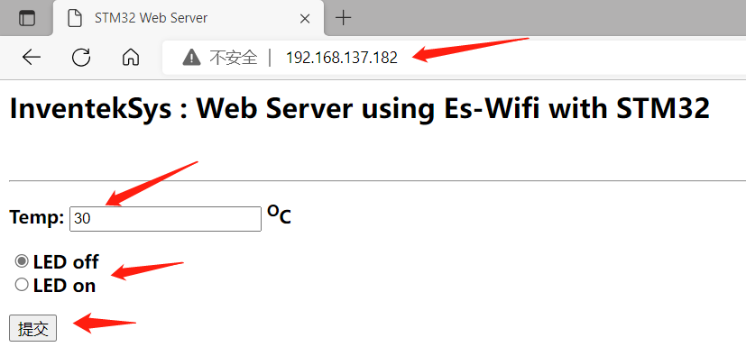
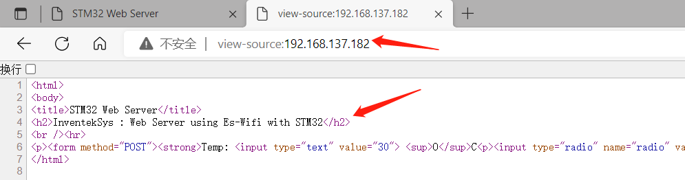

# HTTP over WiFi

TCP 协议是传输层协议，主要解决数据如何在网络中传输，而 HTTP 是应用层协议，主要解决如何包装数据。本章节将在开发板上的 WiFi 模块（已集成 TCP 协议）的基础上实现 HTTP 协议，从而实现 Web 接收开发板发送的温度传感器的数据，开发板接收 Web 端发送的控制 LED 灯命令。


## 实验目的

- 了解 TCP 和 HTTP 协议的区别和联系
- 实现 HTTP over WiFi

## 准备工作

- 手机或PC端的任意浏览器

### 硬件

- 物联网实验箱
- USB 数据线

### 软件

-   CLion
- STM32CubeMX

- 手机或PC端的任意浏览器

## 相关电路原理

- WiFi模块、LED 灯、温度传感器的相关电路原理与前面相关章节一致


## 引脚定义与相关API

- 引脚定义

WiFi模块、LED 灯、温度传感器的引脚定义与前面相关章节一致

- 相关API


## 实验步骤

### STM32CubeMX创建工程

- 以开发板为模板生成工程，保持默认设置，不修改任何引脚配置和时钟配置

### 代码编写及运行结果

- 在 **TCP over WiFi** 章节的基础上，修改 mian.c 文件

1. 相关宏定义

```c
/* Private define ------------------------------------------------------------*/
/* USER CODE BEGIN PD */
#define SSID     "LMX"
#define PASSWORD "luo010607"
#define PORT           80

#define TERMINAL_USE


#define WIFI_WRITE_TIMEOUT 10000
#define WIFI_READ_TIMEOUT  10000
#define SOCKET                 0


#ifdef  TERMINAL_USE
#define LOG(a) printf a
#else
#define LOG(a)
#endif

/* USER CODE END PD */
```

2. 变量和函数声明

```c
/* Private variables ---------------------------------------------------------*/
/* USER CODE BEGIN PV */
#if defined (TERMINAL_USE)
extern UART_HandleTypeDef hDiscoUart;
#endif /* TERMINAL_USE */

static  uint8_t http[1024];
static  uint8_t  IP_Addr[4];
static  int     LedState = 0;

/* Private function prototypes -----------------------------------------------*/
#if defined (TERMINAL_USE)
#ifdef __GNUC__
/* With GCC, small printf (option LD Linker->Libraries->Small printf
   set to 'Yes') calls __io_putchar() */
#define PUTCHAR_PROTOTYPE int __io_putchar(int ch)
#else
#define PUTCHAR_PROTOTYPE int fputc(int ch, FILE *f)
#endif /* __GNUC__ */
#endif /* TERMINAL_USE */

static  WIFI_Status_t SendWebPage(uint8_t ledIsOn, uint8_t temperature);
static  int wifi_server(void);
static  int wifi_start(void);
static  int wifi_connect(void);
static  bool WebServerProcess(void);

/* USER CODE END PV */
```

3. 修改 mian() 函数

```c
  /* USER CODE BEGIN 2 */
    BSP_LED_Init(LED2);
    /* WIFI Web Server demonstration */
#if defined (TERMINAL_USE)
    /* Initialize all configured peripherals */
    hDiscoUart.Instance = DISCOVERY_COM1;
    hDiscoUart.Init.BaudRate = 115200;
    hDiscoUart.Init.WordLength = UART_WORDLENGTH_8B;
    hDiscoUart.Init.StopBits = UART_STOPBITS_1;
    hDiscoUart.Init.Parity = UART_PARITY_NONE;
    hDiscoUart.Init.Mode = UART_MODE_TX_RX;
    hDiscoUart.Init.HwFlowCtl = UART_HWCONTROL_NONE;
    hDiscoUart.Init.OverSampling = UART_OVERSAMPLING_16;
    hDiscoUart.Init.OneBitSampling = UART_ONE_BIT_SAMPLE_DISABLE;
    hDiscoUart.AdvancedInit.AdvFeatureInit = UART_ADVFEATURE_NO_INIT;


    BSP_COM_Init(COM1, &hDiscoUart);
    BSP_TSENSOR_Init();

    printf("****** WIFI Web Server demonstration****** \n\n");

#endif /* TERMINAL_USE */

    wifi_server();
  /* USER CODE END 2 */
```

4. 函数定义

```c
/* USER CODE BEGIN 4 */
/**
  * @brief  Send HTML page
  * @param  None
  * @retval None
  */

static int wifi_start(void)
{
    uint8_t  MAC_Addr[6];

    /*Initialize and use WIFI module */
    if(WIFI_Init() ==  WIFI_STATUS_OK)
    {
        LOG(("ES-WIFI Initialized.\n"));
        if(WIFI_GetMAC_Address(MAC_Addr) == WIFI_STATUS_OK)
        {
            LOG(("> eS-WiFi module MAC Address : %02X:%02X:%02X:%02X:%02X:%02X\n",
                    MAC_Addr[0],
                    MAC_Addr[1],
                    MAC_Addr[2],
                    MAC_Addr[3],
                    MAC_Addr[4],
                    MAC_Addr[5]));
        }
        else
        {
            LOG(("> ERROR : CANNOT get MAC address\n"));
            return -1;
        }
    }
    else
    {
        return -1;
    }
    return 0;
}


int wifi_connect(void)
{

    wifi_start();

    LOG(("\nConnecting to %s , %s\n",SSID,PASSWORD));
    if( WIFI_Connect(SSID, PASSWORD, WIFI_ECN_WPA2_PSK) == WIFI_STATUS_OK)
    {
        if(WIFI_GetIP_Address(IP_Addr) == WIFI_STATUS_OK)
        {
            LOG(("> es-wifi module connected: got IP Address : %d.%d.%d.%d\n",
                    IP_Addr[0],
                    IP_Addr[1],
                    IP_Addr[2],
                    IP_Addr[3]));
        }
        else
        {
            LOG((" ERROR : es-wifi module CANNOT get IP address\n"));
            return -1;
        }
    }
    else
    {
        LOG(("ERROR : es-wifi module NOT connected\n"));
        return -1;
    }
    return 0;
}

int wifi_server(void)
{
    bool StopServer = false;

    LOG(("\nRunning HTML Server test\n"));
    if (wifi_connect()!=0) return -1;


    if (WIFI_STATUS_OK!=WIFI_StartServer(SOCKET, WIFI_TCP_PROTOCOL, 1, "", PORT))
    {
        LOG(("ERROR: Cannot start server.\n"));
    }

    LOG(("Server is running and waiting for an HTTP  Client connection to %d.%d.%d.%d\n",IP_Addr[0],IP_Addr[1],IP_Addr[2],IP_Addr[3]));

    do
    {
        uint8_t RemoteIP[4];
        uint16_t RemotePort;


        while (WIFI_STATUS_OK != WIFI_WaitServerConnection(SOCKET,1000,RemoteIP,&RemotePort))
        {
            LOG(("Waiting connection to  %d.%d.%d.%d\n",IP_Addr[0],IP_Addr[1],IP_Addr[2],IP_Addr[3]));

        }

        LOG(("Client connected %d.%d.%d.%d:%d\n",RemoteIP[0],RemoteIP[1],RemoteIP[2],RemoteIP[3],RemotePort));

        StopServer=WebServerProcess();

        if(WIFI_CloseServerConnection(SOCKET) != WIFI_STATUS_OK)
        {
            LOG(("ERROR: failed to close current Server connection\n"));
            return -1;
        }
    }
    while(StopServer == false);

    if (WIFI_STATUS_OK!=WIFI_StopServer(SOCKET))
    {
        LOG(("ERROR: Cannot stop server.\n"));
    }

    LOG(("Server is stop\n"));
    return 0;
}


static bool WebServerProcess(void)
{
    uint8_t temp;
    uint16_t  respLen;
    static   uint8_t resp[1024];
    bool    stopserver=false;

    if (WIFI_STATUS_OK == WIFI_ReceiveData(SOCKET, resp, 1000, &respLen, WIFI_READ_TIMEOUT))
    {
        LOG(("get %d byte from server\n",respLen));

        if( respLen > 0)
        {
            if(strstr((char *)resp, "GET")) /* GET: put web page */
            {
                temp = (int) BSP_TSENSOR_ReadTemp();
                if(SendWebPage(LedState, temp) != WIFI_STATUS_OK)
                {
                    LOG(("> ERROR : Cannot send web page\n"));
                }
                else
                {
                    LOG(("Send page after  GET command\n"));
                }
            }
            else if(strstr((char *)resp, "POST"))/* POST: received info */
            {
                LOG(("Post request\n"));

                if(strstr((char *)resp, "radio"))
                {
                    if(strstr((char *)resp, "radio=0"))
                    {
                        LedState = 0;
                        BSP_LED_Off(LED2);
                    }
                    else if(strstr((char *)resp, "radio=1"))
                    {
                        LedState = 1;
                        BSP_LED_On(LED2);
                    }
                    temp = (int) BSP_TSENSOR_ReadTemp();
                }
                if(strstr((char *)resp, "stop_server"))
                {
                    if(strstr((char *)resp, "stop_server=0"))
                    {
                        stopserver = false;
                    }
                    else if(strstr((char *)resp, "stop_server=1"))
                    {
                        stopserver = true;
                    }
                }
                temp = (int) BSP_TSENSOR_ReadTemp();
                if(SendWebPage(LedState, temp) != WIFI_STATUS_OK)
                {
                    LOG(("> ERROR : Cannot send web page\n"));
                }
                else
                {
                    LOG(("Send Page after POST command\n"));
                }
            }
        }
    }
    else
    {
        LOG(("Client close connection\n"));
    }
    return stopserver;

}

/**
  * @brief  Send HTML page
  * @param  None
  * @retval None
  */
static WIFI_Status_t SendWebPage(uint8_t ledIsOn, uint8_t temperature)
{
    uint8_t  temp[50];
    uint16_t SentDataLength;
    WIFI_Status_t ret;

    /* construct web page content */
    strcpy((char *)http, (char *)"HTTP/1.0 200 OK\r\nContent-Type: text/html\r\nPragma: no-cache\r\n\r\n");
    strcat((char *)http, (char *)"<html>\r\n<body>\r\n");
    strcat((char *)http, (char *)"<title>STM32 Web Server</title>\r\n");
    strcat((char *)http, (char *)"<h2>InventekSys : Web Server using Es-Wifi with STM32</h2>\r\n");
    strcat((char *)http, (char *)"<br /><hr>\r\n");
    strcat((char *)http, (char *)"<p><form method=\"POST\"><strong>Temp: <input type=\"text\" value=\"");
    sprintf((char *)temp, "%d", temperature);
    strcat((char *)http, (char *)temp);
    strcat((char *)http, (char *)"\"> <sup>O</sup>C");

    if (ledIsOn)
    {
        strcat((char *)http, (char *)"<p><input type=\"radio\" name=\"radio\" value=\"0\" >LED off");
        strcat((char *)http, (char *)"<br><input type=\"radio\" name=\"radio\" value=\"1\" checked>LED on");
    }
    else
    {
        strcat((char *)http, (char *)"<p><input type=\"radio\" name=\"radio\" value=\"0\" checked>LED off");
        strcat((char *)http, (char *)"<br><input type=\"radio\" name=\"radio\" value=\"1\" >LED on");
    }

    strcat((char *)http, (char *)"</strong><p><input type=\"submit\"></form></span>");
    strcat((char *)http, (char *)"</body>\r\n</html>\r\n");

    ret = WIFI_SendData(0, (uint8_t *)http, strlen((char *)http), &SentDataLength, WIFI_WRITE_TIMEOUT);

    if((ret == WIFI_STATUS_OK) && (SentDataLength != strlen((char *)http)))
    {
        ret = WIFI_STATUS_ERROR;
    }

    return ret;
}


#if defined (TERMINAL_USE)
/**
  * @brief  Retargets the C library printf function to the USART.
  * @param  None
  * @retval None
  */
PUTCHAR_PROTOTYPE
{
    /* Place your implementation of fputc here */
    /* e.g. write a character to the USART1 and Loop until the end of transmission */
    HAL_UART_Transmit(&hDiscoUart, (uint8_t *)&ch, 1, 0xFFFF);

    return ch;
}
#endif /* TERMINAL_USE */

#ifdef USE_FULL_ASSERT

/**
   * @brief Reports the name of the source file and the source line number
   * where the assert_param error has occurred.
   * @param file: pointer to the source file name
   * @param line: assert_param error line source number
   * @retval None
   */
void assert_failed(uint8_t* file, uint32_t line)
{
  /* USER CODE BEGIN 6 */
  /* User can add his own implementation to report the file name and line number,
    ex: printf("Wrong parameters value: file %s on line %d\r\n", file, line) */
  /* USER CODE END 6 */

}
#endif

/**
  * @brief  EXTI line detection callback.
  * @param  GPIO_Pin: Specifies the port pin connected to corresponding EXTI line.
  * @retval None
  */
void HAL_GPIO_EXTI_Callback(uint16_t GPIO_Pin)
{
    switch (GPIO_Pin)
    {
        case (GPIO_PIN_1):
        {
            SPI_WIFI_ISR();
            break;
        }
        default:
        {
            break;
        }
    }
}

/**
  * @brief  SPI3 line detection callback.
  * @param  None
  * @retval None
  */
void SPI3_IRQHandler(void)
{
    HAL_SPI_IRQHandler(&hspi);
}
/* USER CODE END 4 */
```

- 编译下载代码后，等待开发板连接上 wifi，然后在手机或 PC 端打开浏览器输入开发板的 IP 地址

1. 网页上显示温度传感器的值，并且可控制开发板上 LED 的亮灭，实现了数据的收发



2. 在浏览器顶部输入 <u>view-source:http://192.168.137.182/</u>，可查看页面源代码



可以看到，跟开发板中的代码是相对应的

